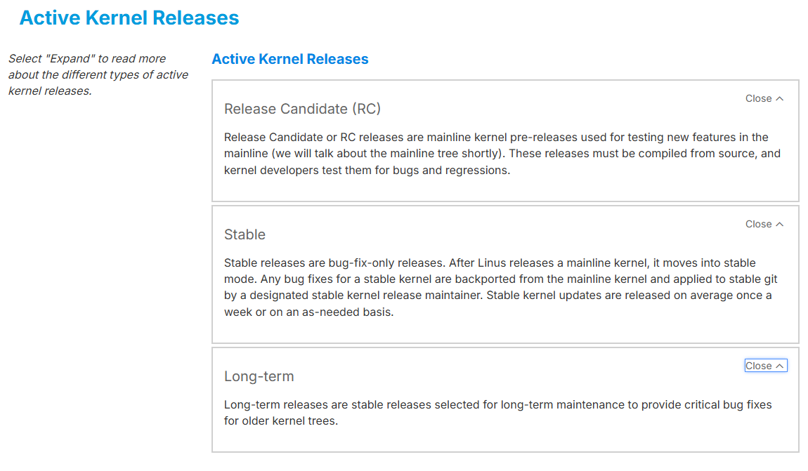

# การ Update Kernel ubuntu
- Kernel version ล่าสุด  (3 กันยายน 2025)

[https://kernel.org/](https://kernel.org/)

## ชนิดของ kernel




## Explore git.kernel.org
[https://git.kernel.org/](https://git.kernel.org/)


## Ubuntu 24.04  (8 cpu)


### Step 1: Check Current kernel Version
```
$ uname -r
6.8.0-55-generic
```

### Step 2: Update Package list
```
sudo apt update -y
```

### Step 3: Upgrade Package
```
sudo apt upgrade -y
uname -r
```


### Step 4: Reboot
```
$ sudo reboot
```
- Check version อีกครั้ง  จะได้ว่า ``apt upgrade`` ทำการ update kernel
```
$ uname -r
6.8.0-79-generic
```

### Step 5: ติดตั้ง mainline kernel 6.16 โดย ติดตั้งจาก unofficial PPA
```
$ sudo apt  install pkexec -y
$ sudo add-apt-repository ppa:cappelikan/ppa
$ sudo apt update && sudo apt install mainline -y
$ sudo apt upgrade -y
```
- ให้ Run คำสั่ง ข้างล่างเพื่อ Update kernel (6.16.4)
```
$ mainline check
$ sudo mainline install-latest
$ sudo update-grub
$ sudo reboot
```

```
$ uname -r
```


- kernel verion  (6.16.4-061604.202508281650) 3/9/2025

- **Reboot** เพื่อโหลด Kernel
```
sudo reboot
```

### Step6 Check Version
```
$ uname -r
6.16.4-061604-generic

$ sudo apt install linux-headers-$(uname -r)

$ ls /usr/src/linux-headers-$(uname -r)/
```
- kernel release number ``major#.minor#[.patchlevel][-EXTRAVERSION]``
  
- release version และ การ Release ของ linux kernel
  


- ตำแหน่งที่ติดตั้ง kernel source
  
### Step 7 kernel และ grub
- ตำแหน่งที่ เก็บ kernel  /boot


- ตรวจสอบ Grub entry
```bash
# Search for menu entries
sudo grep  --color  -i "menuentry" /boot/grub/grub.cfg

# Search for the Linux kernel versions listed
sudo grep --color -i "linux" /boot/grub/grub.cfg | grep -i "vmlinuz"

# Search for the specific version you just updated to
sudo grep --color -i "6.16" /boot/grub/grub.cfg
```
---
## ขั้นตอน สำคัญ Build Kernel
- ติดตั้ง โปรแกรมเพิ่มให้รองรับการ compile kernel ก่อน
```
$ sudo apt install -y build-essential libncurses-dev bison \
flex libssl-dev libelf-dev fakeroot bc
$ sudo apt install -y dwarves
```

### Clone Linux kernel และ บริหารจัดการ Branch จาก Git
- สร้าง Folder ``/usr/src/build`` ่ เพื่อรองรับการ Clone source code จาก Git
- clone source code
```
sudo su -
mkdir /usr/src/build
cd /usr/src/build
git clone --depth 1 git://git.kernel.org/pub/scm/linux/kernel/git/torvalds/linux.git
cd linux
git branch
```
- option การ Clone ของ Git ``--depth 1``  เฉพาะ master
- ``[git://](git://git.kernel.org/pub/scm/linux/kernel/git/torvalds/linux.git)`` ใช้  git protocol
- ``git@github.com:torvalds/linux.git``  ใช้ ssh protocol
  

### copy  config ล่าสุดเพื่อบันทึก เป็น .config
```
# uname -r
(result)
6.16.4-061604-generic

# cp -v /boot/config-$(uname -r) .config
(result)
'/boot/config-6.16.4-061604-generic' -> '.config'

# yes '' | make oldconfig
# sed -i "s|CONFIG_LOCALVERSION_AUTO=.*|CONFIG_LOCALVERSION_AUTO=n|" .config
# make clean
```

!!! note
    option ``yes ''`` หมายถึงการยอมรับทั้งหมด

```bash title="remove + from custombuild"
vim scripts/localversion

                        if $short; then
                                #echo "+" #comment this line
                                return
                        fi
```

### ต่อไปเป็นการ Disable kernel parameter
- ref จาก Debian Community [https://wiki.debian.org/BuildADebianKernelPackage](https://wiki.debian.org/BuildADebianKernelPackage)  
- ภายใน ``scripts/`` มี script เพื่อการตั้งค่า configuration
- สำรวจ scripts ก่อน
```
ls -l scripts/
```
- การ disable คือ กำหนด ให้เป็นค่าว่าง ""
```
scripts/config --set-str SYSTEM_TRUSTED_KEYS ""
scripts/config --set-str SYSTEM_REVOCATION_KEYS  ""
```

### ต่อไปเป็นการ Build kernel
1. - ก่อนการ Build ให้เราตั้งชื่อ kernel ที่ต้องการ Build
1. make menuconfig
    1. Genral setup --> Local Version --> กด Enter เพื่อตั้งขื่อ  ``-Nipa``
    1. กด tab เพื่อเลื่อน Cusrsor ไปยัง เมนู Save และ กด Enter


- กด ``ok``
  
- **แบบที่ 1** ไม่จับเวลา ไม่มี log
```
# make -j$(nproc)
# make -j$(nproc) modules_install
# make -j$(nproc) install

```

- **แบบที่ 2** สามารถรวมคำสั่งพร้อมการจับเวลา และ สร้าง log (แนะนำวิธีนี้)  
    - ต้องการ จับเวลาว่าใช้เวลาไปเท่าไหร่ด้วย nproc=8 ทำให้มีความเร็วเมื่อมีการ Build kernel
```bash title="build kernel"
# time make -j$(nproc) 2>&1 | tee build-0.log
# time make -d modules_install install 2>&1 | tee make-install-0.log
```

- one line command
```
time make -j$(nproc) 2>&1 | tee build-0.log && time make -d modules_install install 2>&1 | tee make-install-0.log
```

- สร้าง deb package
```bash title="build package"
# sudo apt install debhelper-compat libdw-dev
# grep CONFIG_LOCALVERSION .config
# time make -j$(nproc) deb-pkg
```

- เมื่อสิ้นสุดจะได้ .deb files อยู่ที่  (../)
```bash title="list package"
cd  ../
ls -l
```
Screen output:  

<sub>(time make -j$(nproc) 2>&1 | tee build-0.log)<sub>

อธิบายค่าแต่ละค่า ของ output time:

- real (91m10): เวลาจริงทั้งหมดที่กระบวนการใช้ ตั้งแต่เริ่มจนจบ (นี่คือเวลาที่คุณรอ)
- user (559m58): เวลารวมที่ CPU ใช้ในการประมวลผลใน user mode
- sys (10646): เวลารวมที่ CPU ใช้ในการประมวลผลใน kernel mode

สังเกตว่า:

- user + sys (559m + 106m = 665m) มากกว่า real (91m) มาก
- นี่แสดงว่ากระบวนการของคุณใช้ multi-core/parallel processing อย่างมีประสิทธิภาพ โดยใช้หลาย CPU core พร้อมกัน ทำให้ประมวลผลเสร็จเร็วกว่าเวลาที่ CPU ใช้จริงๆ


<sub>(time make -d modules_install install 2>&1 | tee make-install-0.log)<sub>


### update bootloader สำหรับการยอมรับ Kernel ใหม่
```
sudo update-grub
```

### Reboot เพื่อใช้ Kernel ใหม่
```
sudo reboot
```


1. ``2>&1`` means "redirect standard error to the same place as standard output." This ensures that both regular progress messages and error messages are treated as a single stream of data.
2. tee build.log: The tee command is named after a T-splitter in plumbing. It takes the input it receives and splits it into two directions:
    1. It prints the output to the screen (standard output), so you can watch the build progress in real time.
    2. It saves a copy of the output to the specified file, build.log.


สรุปคำสั่ง 

-  `modules_install` เป็นการติดตั้ง **"ไดรเวอร์และส่วนประกอบเสริม"** 
-  ส่วน `install` เป็นการติดตั้ง **"แกนหลักของเคอร์เนลและตั้งค่าการบูต"** 

---

### **1. `sudo make modules_install` (ติดตั้งส่วนประกอบเสริม)**

คำสั่งนี้มีหน้าที่นำ **โมดูล (Modules)** ทั้งหมดที่คอมไลพ์เสร็จแล้วไปติดตั้งในไดเรกทอรีของระบบ (`/lib/modules/<เวอร์ชันเคอร์เนลใหม่>`)

* **โมดูลคืออะไร?** เปรียบเสมือน **ไดรเวอร์** สำหรับอุปกรณ์ต่างๆ เช่น ไดรเวอร์การ์ดจอ, Wi-Fi, Bluetooth, เสียง หรือระบบไฟล์ต่างๆ
* **ทำไมต้องติดตั้ง?** เพื่อให้เคอร์เนลตัวใหม่ที่คุณกำลังจะใช้งาน สามารถเรียกใช้ไดรเวอร์เหล่านี้เพื่อสื่อสารกับฮาร์ดแวร์ในเครื่องคอมพิวเตอร์ของคุณได้

**สรุปหน้าที่:** คัดลอกไฟล์ไดรเวอร์ทั้งหมดไปไว้ในที่ที่ระบบปฏิบัติการพร้อมเรียกใช้งาน


---

### **2. `sudo make install` (ติดตั้งแกนหลัก)**

หลังจากติดตั้งส่วนประกอบเสริมแล้ว คำสั่งนี้จะทำการติดตั้ง **แกนหลัก (core) ของเคอร์เนล** และทำให้ระบบพร้อมที่จะบูตเข้าเคอร์เนลตัวใหม่นี้ได้

โดยคำสั่งนี้จะทำงานหลักๆ 2-3 อย่าง:
1.  **คัดลอกไฟล์เคอร์เนลหลัก:** นำไฟล์เคอร์เนลที่คอมไพล์เสร็จแล้ว (เช่น `vmlinuz-...`) ไปไว้ที่ไดเรกทอรี `/boot` ซึ่งเป็นที่เก็บไฟล์สำหรับบูตเครื่อง
2.  **คัดลอกไฟล์ที่เกี่ยวข้อง:** นำไฟล์อื่นๆ ที่จำเป็น เช่น `System.map` และ `.config` ไปไว้ที่ `/boot` ด้วย
3.  **อัปเดต Bootloader:** ขั้นตอนที่สำคัญที่สุดคือ **สั่งอัปเดต GRUB (Bootloader) โดยอัตโนมัติ** เพื่อเพิ่มรายชื่อเคอร์เนลตัวใหม่เข้าไปในเมนูตอนเปิดเครื่อง

**สรุปหน้าที่:** ติดตั้งไฟล์เคอร์เนลตัวหลักและอัปเดตเมนูบูตเพื่อให้คุณสามารถเลือกใช้งานเคอร์เนลใหม่ตอนเปิดเครื่องได้


### **เปรียบเทียบง่ายๆ**

ถ้าการคอมไพล์เคอร์เนลเหมือนการ **"สร้างรถยนต์คันใหม่"**:
* `make modules_install` คือการ **"ติดตั้งอุปกรณ์เสริม"** เช่น ระบบเครื่องเสียง, แอร์, GPS เข้าไปในรถ
* `make install` คือการ **"นำรถไปจอดในโรงรถและทำกุญแจให้"** เพื่อให้คุณพร้อมที่จะสตาร์ทและขับรถคันนั้นได้


### List Kernel Module
```
# lsmod
```

