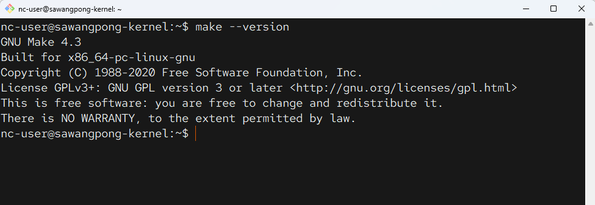
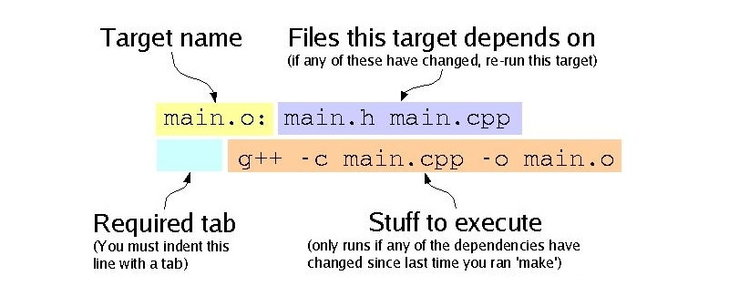
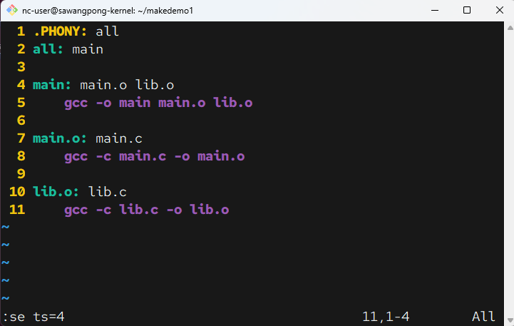
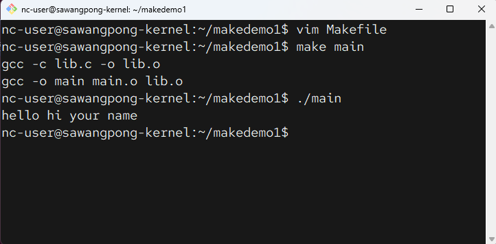
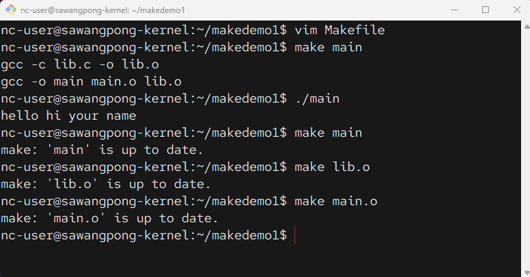
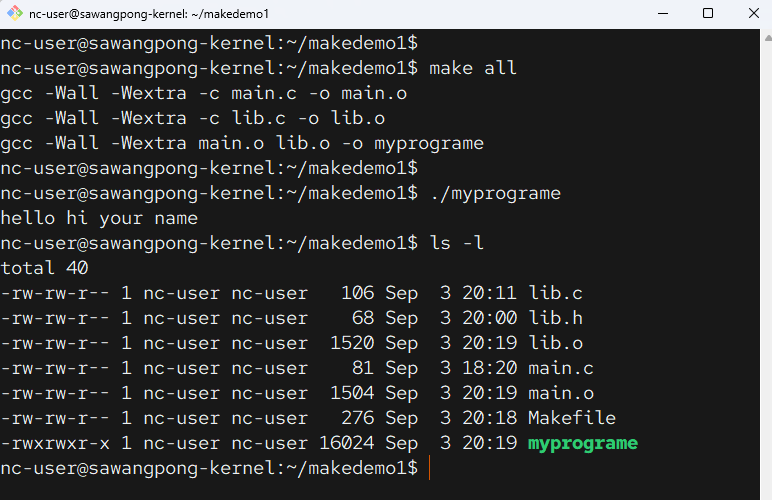
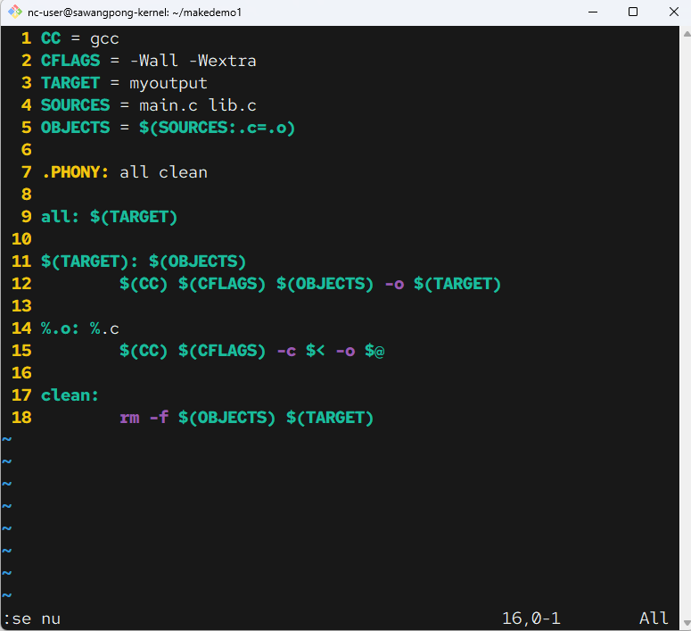

# เรียนรู้การทำงาน MakeFile


### **Makefile: พิมพ์เขียวของการคอมไพล์**

``Makefile`` เป็นไฟล์ข้อความธรรมดาที่อยู่ในไดเรกทอรีของซอร์สโค้ด มีหน้าที่หลักคือการกำหนด "กฎ (Rules)" สำหรับการสร้างโปรเจกต์

โครงสร้างพื้นฐานของกฎใน Makefile คือ:

```
target: dependencies
    commands
```
- **Target (เป้าหมาย):** คือสิ่งที่เราต้องการสร้าง เช่น ไฟล์เคอร์เนลหลัก ``(vmlinuz)``, ``โมดูล (.ko)``, หรือแม้แต่การทำงานบางอย่างเช่น install หรือ clean

- **ependencies (สิ่งที่ต้องใช้):** คือไฟล์หรือเป้าหมายอื่นๆ ที่ต้องมีหรือต้องทำให้เสร็จก่อนที่จะสร้าง ``target`` ได้ เช่น ไฟล์ซอร์สโค้ด (.c) หรือไฟล์ object (.o)

- **Commands (คำสั่ง):**  คือชุดคำสั่ง Shell Script (เช่น ``gcc``, ``cp``, ``rm``) ที่จะถูกรันเพื่อสร้าง target ขึ้นมาจาก ``dependencies``

ใน Linux Kernel นั้น ``Makefile`` หลักจะมีขนาดใหญ่มาก และจะมีการเรียกใช้ ``Makefile`` ย่อยๆ ที่กระจายอยู่ในแต่ละโฟลเดอร์ของซอร์สโค้ดอีกทอดหนึ่ง

---

### **make: โปรแกรมสร้าง (Builder)**

make เป็นโปรแกรมที่เราเรียกใช้ผ่าน Command Line มันจะวิ่งเข้ามาอ่านไฟล์ Makefile ในไดเรกทอรีนั้นๆ แล้วทำงานตามกฎที่เขียนไว้

กระบวนการทำงานของ ``make`` เป็นดังนี้:

1. เมื่อคุณรันคำสั่ง เช่น make -j$(nproc) หรือ make modules_install

1. โปรแกรม make จะมองหาไฟล์ชื่อ Makefile ในโฟลเดอร์ปัจจุบัน

1. make จะไปดูกฎของ target ที่คุณระบุ (ถ้าไม่ระบุจะใช้ target แรกสุด ซึ่งมักจะเป็น all)

1. make จะตรวจสอบเวลาของไฟล์ ``(Timestamp)`` มันจะเปรียบเทียบว่า dependencies มีไฟล์ไหนใหม่กว่า target หรือไม่

1. ถ้า dependencies ใหม่กว่า หรือ target ยังไม่มีอยู่จริง make ก็จะรัน commands ที่กำหนดไว้เพื่อสร้าง target ขึ้นมาใหม่

1. ถ้า target ใหม่กว่า dependencies ทั้งหมด make จะถือว่าไฟล์นั้นทันสมัยแล้วและจะ "ไม่ทำอะไรเลย" ซึ่งนี่คือหัวใจสำคัญที่ทำให้การคอมไพล์ครั้งถัดๆ ไปรวดเร็วขึ้นมาก เพราะมันจะทำใหม่เฉพาะส่วนที่มีการเปลี่ยนแปลงเท่านั้น

!!! info
    ``Makefile`` หลักสามารถเรียกใช้ Makefile อื่นๆ ที่อยู่ในโฟลเดอร์ย่อย (subdirectories) ได้ และนี่คือวิธีการมาตรฐานสำหรับจัดการโปรเจกต์ขนาดใหญ่ที่มีซอร์สโค้ดหลายส่วน เช่น Linux Kernel


## **Makefile เรียก Makefile ในโฟลเดอร์ย่อยได้อย่างไร**

หลักการนี้เรียกว่า **"Recursive Make"** ซึ่งเป็นหัวใจสำคัญที่ทำให้สามารถจัดการโปรเจกต์ที่ซับซ้อนได้ โดยการแบ่งงานสร้าง (build) ออกเป็นส่วนๆ ตามโครงสร้างของโฟลเดอร์

### **วิธีการทำงาน**

`Makefile` ที่อยู่ชั้นบนสุด (Top-level Makefile) จะไม่เก็บรายละเอียดการคอมไพล์ของทุกไฟล์ แต่จะมอบหมายหน้าที่ต่อไปยัง `Makefile` ที่อยู่ในโฟลเดอร์ย่อยๆ แทน โดยใช้คำสั่งพิเศษ

คำสั่งที่ใช้คือ:
```makefile
$(MAKE) -C <subdirectory> <target>
```

**ตัวอย่าง ง่ายๆ**
สมมุติว่า เรามีโครงสร้างโปรเจต์ ดังนี้
```bash
project/
├── Makefile        # Makefile หลัก
├── src/
│   ├── main.c
│   └── Makefile    # Makefile สำหรับ src
└── lib/
    ├── utils.c
    └── Makefile    # Makefile สำหรับ lib
```

- จะได้โครงสร้างของ Makefile หลัก โครงสร้างประมาณนี้ 
```bash   title="Makefile" linenums="1"
# กำหนดโฟลเดอร์ย่อยที่จะเข้าไปทำงาน
SUBDIRS = src lib

# เป้าหมายหลัก 'all' จะไปสั่งให้ 'make all' ในโฟลเดอร์ย่อยทำงาน
all:
    @echo "Starting build from top-level Makefile..."
    @for dir in $(SUBDIRS); do \
        $(MAKE) -C $$dir; \
    done
    @echo "Top-level build finished."

# เป้าหมาย 'clean' ก็จะไปสั่ง 'make clean' ในโฟลเดอร์ย่อยเช่นกัน
clean:
    @echo "Starting clean from top-level Makefile..."
    @for dir in $(SUBDIRS); do \
        $(MAKE) -C $$dir clean; \
    done
    @echo "Top-level clean finished."
```

- ส่วนในไฟล์ Folder ย่อยจะมีโครงสร้าง ตัวอย่างดังนี้
```bash   title="Makefile" linenums="1"
# Makefile นี้รู้แค่เรื่องการ build ไฟล์ในโฟลเดอร์ตัวเอง
all:
    @echo "Building in src directory..."
    gcc -c main.c -o main.o

clean:
    @echo "Cleaning in src directory..."
    rm -f *.o
```

### **Workshop เขียน Makefile**
- สร้าง Folder และ File
```
make --verion
```


```
mkdir makedemo1
cd makedemo1
vim lib.h
vim lib.c
vim main.c
```
- ชุด Code สำหรับการทดสอบ แบ่งออกเป็น 3 ไฟล์ ได้แก่ Headerfile, implementation file และ main programe file

- main.c ทำหน้าที่เป็น Main programe file เป็นจุดเริ่มต้นของ โปรแกรม และทำการ include ไฟล์ lib.h ทำให้ โปรแกรม main.c ได้รู้จักกับ ฟังก์ชั่น hello_world ที่ทำการเรียกใช้ ฟังก์ชั่น
  
```c title="main.c"
#include "lib.h"

int main(void) {
    hello_world("your name");
    return 0;
}
```

- lib.h คือ header file ทำหน้าเหมือนกับ Plublic interface ของ lib.c หน้าที่หลักของ lib.h คือการประกาศ (declare) ฟังก์ชั่น ``hello_wold(char *)`` โดยใน header file ไม่ต้องมีการ implement  และมีโครงสร้าง ``#ifndef / #define / #endif`` เรียกว่า  **include guard** เพื่อให้มีการ include ซ้ำซ้อน
  
```h title="lib.h"
#ifndef LIB_H
#define LIB_H

// ในไฟล์ lib.h (Header File)
// นี่คือ Declaration หรือ "คำประกาศ"
// บอกแค่ว่ามีฟังก์ชันหน้าตาแบบนี้อยู่

void hello_world(char *);

#endif
```  

- Implementation File: ไฟล์นี้เก็บ โค้ดการทำงานจริง (definition) ของฟังก์ชัน hello_world พูดง่ายๆ คือเป็นส่วนที่เขียนว่าฟังก์ชันที่ประกาศไว้ใน header file นั้นทำงานอย่างไร
  
```c title="lib.c"
#include <stdio.h>
#include "lib.h"
// ในไฟล์ lib.c (Implementation File)
// นี่คือ Definition หรือ "โค้ดการทำงานจริง"
void hello_world(char * name) { 
    printf("hello hi %s\n", name);
}
```
- แสดง File ใน Folder
```
.
├── lib.c
├── lib.h
└── main.c

```

## หลักการสำคัญ: Declaration vs. Definition
ในภาษา C เราจะแยก 2 สิ่งนี้ออกจากกันอย่างชัดเจน:

**1 .การประกาศ (Declaration)**
การประกาศเปรียบเสมือน ``"เมนู"`` หรือ ``"สารบัญ"`` ที่บอกให้คอมไพเลอร์รู้ว่า "มีฟังก์ชันชื่อนี้อยู่นะ มันรับข้อมูลประเภทนี้ และจะคืนค่าเป็นข้อมูลประเภทนี้"

- หน้าที่: บอกให้โค้ดส่วนอื่น (เช่น main.c) รู้จักฟังก์ชัน เพื่อที่จะสามารถเรียกใช้งานได้ถูกต้อง
- สิ่งที่คอมไพเลอร์ต้องการ:
    - ชื่อฟังก์ชัน (hello_world)
    - ชนิดข้อมูลที่คืนค่า (Return Type) (void คือไม่คืนค่าอะไร)
    - ชนิดข้อมูลของพารามิเตอร์ที่รับเข้ามา (char *)

ในขั้นตอนนี้ คอมไพเลอร์ไม่สนใจว่าคุณจะเรียกตัวแปร ``char *`` ว่าอะไร เพราะมันยังไม่ได้ถูกนำไปใช้งานจริง ๆ ดังนั้นการเขียน ``void hello_world(char *);`` จึงเพียงพอแล้ว

**2. การนิยาม หรือ การเขียนโค้ดการทำงาน (Definition)**
การนิยามเปรียบเสมือน "สูตรอาหาร" หรือ "เนื้อหาของบท" ซึ่งเป็นการเขียนโค้ดจริงๆ ว่าฟังก์ชันนั้นทำงานอย่างไร

- หน้าที่: เขียนโค้ดการทำงานจริงของฟังก์ชัน
- สิ่งที่คอมไพเลอร์ต้องการ: ทุกอย่างเหมือน Declaration แต่ จำเป็นต้องมีชื่อตัวแปร เพื่อที่เราจะสามารถอ้างอิงและนำค่าที่รับเข้ามาไปใช้งานภายในฟังก์ชันได้

ถ้าไม่มีชื่อตัวแปร เราจะไม่สามารถเรียกใช้ค่าที่ส่งเข้ามาในคำสั่ง printf ได้


## สร้าง Makefile



```makefile title="Makefile"
.PHONY: all
all: main

main: main.o lib.o
    gcc -o main main.o lib.o

main.o: main.c
    gcc -c main.c -o main.o

lib.o: lib.c
    gcc -c lib.c -o lib.o
```
- ใข้ vim set tabstop = 4  ``:se ts=4``



- Run make
```
make main
```



- หากมีการ Run ใหม่อีกครั้ง จะไม่มี compile ใหม่ เนื่องจาก




## update version Makefile อีกครั้ง
```makefile title="Makefile"
CC = gcc
CFLAGS = -Wall -Wextra
TARGET = myprogram
SOURCES = main.c lib.c
OBJECTS = $(SOURCES:.c=.o)

.PHONY: all clean

all: $(TARGET)

$(TARGET): $(OBJECTS)
	$(CC) $(CFLAGS) $(OBJECTS) -o $(TARGET)

%.o: %.c
	$(CC) $(CFLAGS) -c $< -o $@

clean:
	rm -f $(OBJECTS) $(TARGET)
```

**Run make all**
- ให้สั่ง run make all เพื่อ compile 
```
make all
./myprogram
```



# คำอธิบาย Makefile

`Makefile` นี้เป็นสคริปต์มาตรฐานที่ใช้สำหรับสั่งให้โปรแกรม `make` ทำการคอมไพล์โปรแกรมภาษา C โดยอัตโนมัติ โดยมีเป้าหมายเพื่อสร้างไฟล์โปรแกรมชื่อ `myoutput` จากซอร์สโค้ด 2 ไฟล์คือ `main.c` และ `lib.c`

---

## ตัวแปร (Variables)

ส่วนแรกของไฟล์เป็นการกำหนดตัวแปร เพื่อให้สคริปต์อ่านง่ายและแก้ไขได้สะดวก

* `CC = gcc`: กำหนดตัวแปร `CC` ให้หมายถึงคอมไพเลอร์ภาษา C ซึ่งในที่นี้คือ `gcc`
* `CFLAGS = -Wall -Wextra`: กำหนด "แฟล็ก" (flag) หรือออปชันที่จะส่งให้คอมไพเลอร์ โดย `-Wall` และ `-Wextra` เป็นการสั่งให้คอมไพเลอร์แสดงคำเตือน (warning) ที่อาจเป็นปัญหาทั้งหมด ซึ่งเป็นวิธีปฏิบัติที่ดีในการเขียนโปรแกรม
* `TARGET = myoutput`: กำหนดชื่อของไฟล์โปรแกรมสุดท้ายที่จะได้หลังจากการคอมไพล์
* `SOURCES = main.c lib.c`: กำหนดรายการของซอร์สโค้ดไฟล์ทั้งหมด
* `OBJECTS = $(SOURCES:.c=.o)`: สร้างรายการของ "Object File" (`main.o lib.o`) โดยอัตโนมัติ ด้วยการนำค่าจากตัวแปร `SOURCES` มาเปลี่ยนนามสกุลจาก `.c` ให้เป็น `.o`

---

## กฎ (Rules)

กฎเป็นส่วนที่บอก `make` ว่าต้องทำอะไร โดยมีโครงสร้างคือ `เป้าหมาย: สิ่งที่ต้องการ (dependencies)` ตามด้วยคำสั่งที่จะให้ทำงาน

### กฎ `all`

```makefile
all: $(TARGET)
```

- นี่คือ "เป้าหมายเริ่มต้น" (Default Goal) เมื่อเราพิมพ์คำสั่ง make โดยไม่ระบุเป้าหมาย โปรแกรมจะทำงานตามกฎนี้เป็นอันดับแรก

- กฎนี้บอกว่าเป้าหมาย all จะสำเร็จได้ ต้องมีไฟล์ $(TARGET) (ซึ่งก็คือ myoutput) ให้ได้เสียก่อน ดังนั้น make จะไปหากฎอื่นเพื่อสร้างไฟล์ myoutput ต่อไป

### กฎการลิงก์ (Linking Rule)

```makefile
$(TARGET): $(OBJECTS)
    $(CC) $(CFLAGS) $(OBJECTS) -o $(TARGET)
```
- กฎนี้อธิบายวิธีการสร้างไฟล์โปรแกรมสุดท้าย (myoutput)

- เป้าหมาย (Target): myoutput

- สิ่งที่ต้องการ (Dependencies): ไฟล์ Object ทั้งหมด (main.o lib.o)

- คำสั่ง (Command): คำสั่งนี้จะทำงานก็ต่อเมื่อไฟล์ myoutput ยังไม่มีอยู่ หรือไฟล์ Object ใดๆ มีการแก้ไขใหม่กว่าไฟล์ myoutput คำสั่งนี้จะทำการ "ลิงก์" (Link) ไฟล์ Object ทั้งหมดเข้าด้วยกันเพื่อสร้างเป็นไฟล์โปรแกรมที่สมบูรณ์
    - เมื่อขยายตัวแปรแล้วจะได้คำสั่ง: gcc -Wall -Wextra main.o lib.o -o myoutput
  
### กฎการคอมไพล์ (Compilation Rule)

```makefile
%.o: %.c
    $(CC) $(CFLAGS) -c $<  -o $@
```

- นี่คือ "กฎแบบแผน" (Pattern Rule) ที่บอก make ถึงวิธีการสร้างไฟล์ .o ใดๆ จากไฟล์ ``.c`` ที่มีชื่อเดียวกัน (เครื่องหมาย % ทำหน้าที่เป็น wildcard)

- เป้าหมาย: ไฟล์ใดๆ ที่ลงท้ายด้วย ``.o`` (เช่น main.o)

- สิ่งที่ต้องการ: ไฟล์ ``.c`` ที่มีชื่อตรงกัน (เช่น main.c)

- คำสั่ง: คำสั่งนี้จะทำการ "คอมไพล์" (Compile) ซอร์สโค้ดไฟล์ให้กลายเป็น Object File

    - แฟล็ก ``-c`` บอก ``gcc`` ให้คอมไพล์อย่างเดียว แต่ยังไม่ต้องลิงก์

    - ``$<`` คือตัวแปรอัตโนมัติ หมายถึง "สิ่งที่ต้องการตัวแรก" (ในที่นี้คือไฟล์ .c)

    - ``$@`` คือตัวแปรอัตโนมัติ หมายถึง "เป้าหมาย" (ในที่นี้คือไฟล์ .o)

    - ตัวอย่างเช่น สำหรับ main.c คำสั่งนี้จะกลายเป็น: ``gcc -Wall -Wextra -c main.c -o main.o``

### กฎ clean

```makefile
clean:
    rm -f $(OBJECTS) $(TARGET)
```

- เป็นกฎที่ใช้สำหรับ "Clean" โปรเจกต์ ไม่ได้ใช้สร้างไฟล์ใดๆ

- คำสั่ง: เมื่อเรารันคำสั่ง ``make clean`` มันจะไปรันคำสั่ง ``rm -f main.o lib.o myoutput`` ซึ่งเป็นการลบไฟล์ ``Object`` และไฟล์โปรแกรมที่ถูกสร้างขึ้นทั้งหมดทิ้งไป 

!!! note
    **.PHONY: all clean**

    เป็นการบอก make อย่างชัดเจนว่า:
    "target ที่ชื่อ all และ clean ไม่ใช่ชื่อไฟล์นะพวกมันเป็นแค่ชื่อเรียกสำหรับชุดคำสั่งเท่านั้น"

    **สิ่งที่ make จะทำอย่างไร:**

    เมื่อคุณรัน make clean มันจะไม่สนใจว่ามีไฟล์ชื่อ clean อยู่ในโฟลเดอร์หรือไม่ และจะ รันคำสั่งที่อยู่ภายใต้ target clean เสมอ เช่นเดียวกันกับ all ซึ่งเป็นแค่ target 





```makefile title="Makefile"
# --- Variables ---
# CC: The C compiler to use (GNU C Compiler)
CC = gcc

# CFLAGS: Compiler flags for warnings and optimization
# -Wall: Enable all common warnings
# -Wextra: Enable extra warnings not covered by -Wall
CFLAGS = -Wall -Wextra

# TARGET: The name of the final executable file
TARGET = myprogram

# SOURCES: A list of all C source code files
SOURCES = main.c lib.c

# OBJECTS: Automatically generate a list of object files (.o)
# by replacing the .c extension in SOURCES with .o
OBJECTS = $(SOURCES:.c=.o)


# --- Phony Targets ---
# Declares targets that are not actual files.
# This prevents conflicts if a file named "all" or "clean" exists.
.PHONY: all clean


# --- Build Rules ---

# The default goal, executed when you just run "make".
# It depends on the final target executable.
all: $(TARGET)

# Linking Rule: How to create the final executable from object files.
# This rule runs only if the TARGET is missing or if any of the OBJECTS are newer.
$(TARGET): $(OBJECTS)
	@echo "Linking object files to create $(TARGET)..."
	$(CC) $(CFLAGS) $(OBJECTS) -o $(TARGET)
	@echo "Build successful! Run with ./${TARGET}"

# Compilation Rule (Pattern Rule): How to create any .o file from a .c file.
# $< is an automatic variable for the first prerequisite (the .c file).
# $@ is an automatic variable for the target (the .o file).
# -c tells the compiler to compile but not link.
%.o: %.c
	@echo "Compiling $< -> $@"
	$(CC) $(CFLAGS) -c $< -o $@

# Cleanup Rule: How to remove all generated files.
clean:
	@echo "Cleaning up build files..."
	rm -f $(OBJECTS) $(TARGET)
	@echo "Cleanup complete."

```