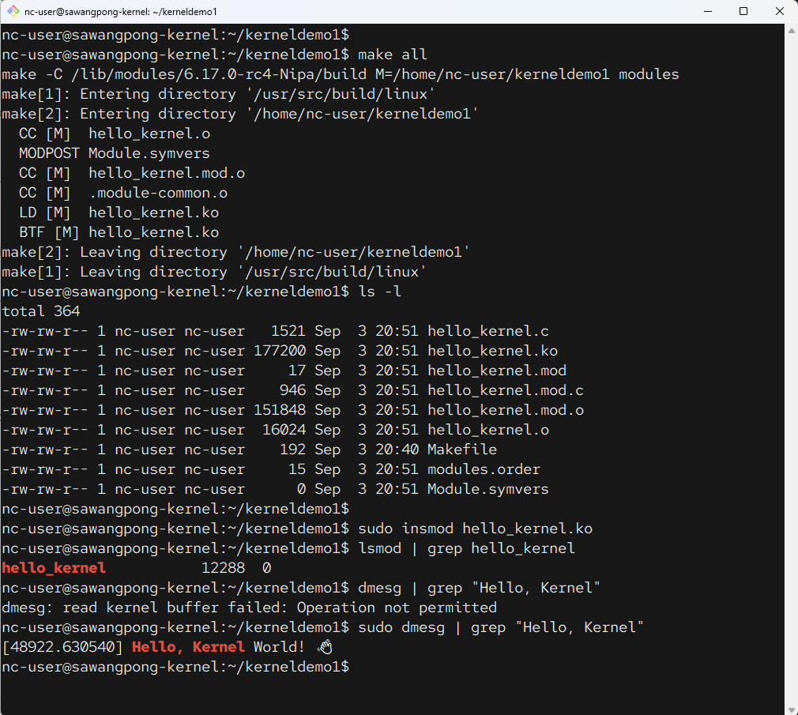
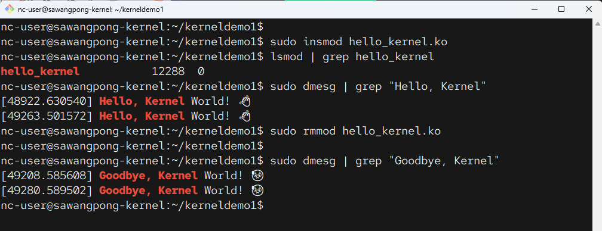
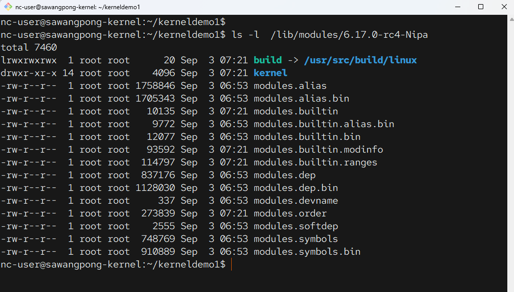
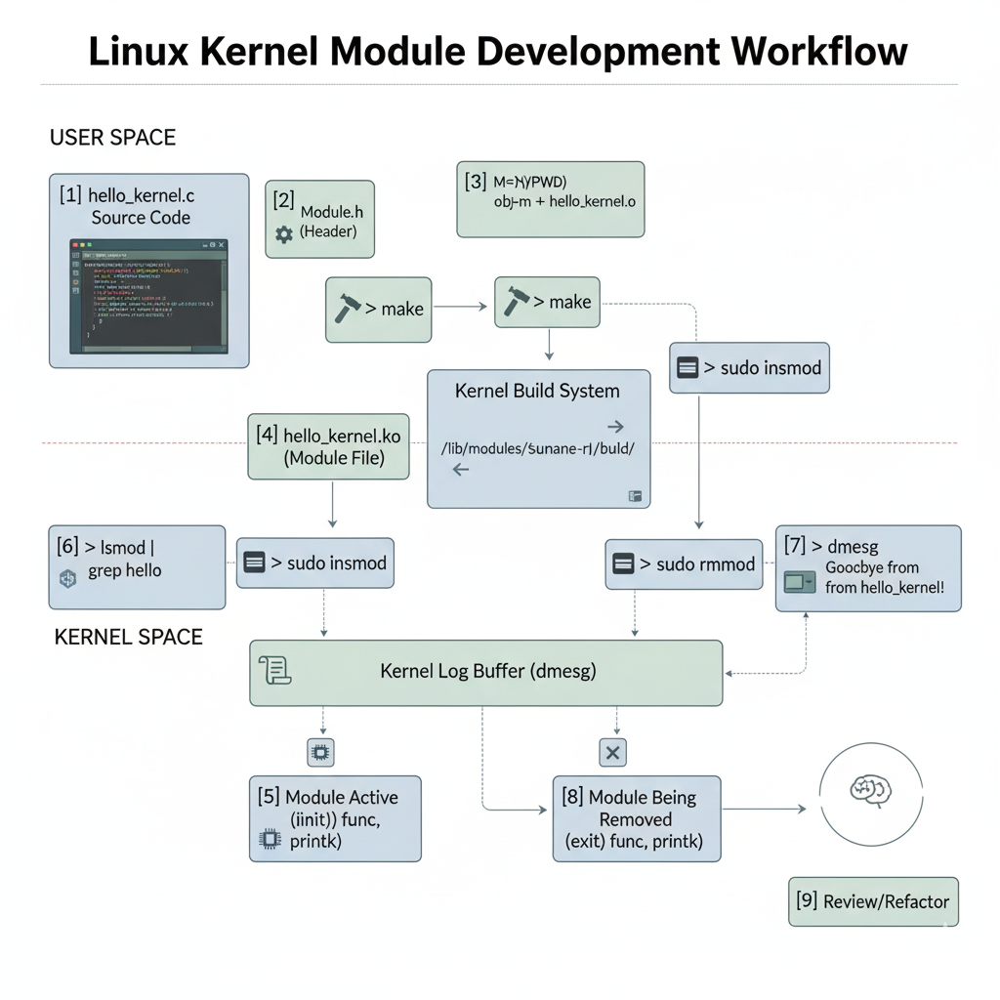

# Build kernel module 1

!!! note
    ถ้าไม่ได้มีการ Build kernel ก็ให้ ติตตั้ง kernel

### เครื่องมือสำหรับการคอมไพล์
```
sudo apt update
sudo apt install build-essential
```

### ติดตั้ง Linux header
```
sudo apt install linux-headers-$(uname -r)
```

---


```c title="hello_kernel.c"
#include <linux/init.h>      // จำเป็นสำหรับ Macro __init และ __exit
#include <linux/module.h>    // จำเป็นสำหรับทุกโมดูล
#include <linux/kernel.h>    // จำเป็นสำหรับ KERN_INFO และฟังก์ชันเคอร์เนลอื่นๆ

// ใบอนุญาตของโมดูล (สำคัญมาก! ไม่มีแล้วเคอร์เนลจะเตือน)
MODULE_LICENSE("GPL");
MODULE_AUTHOR("Sawangpong Muadphet");
MODULE_DESCRIPTION("A simple Hello World kernel module.");
MODULE_VERSION("0.1");

// ฟังก์ชันที่จะถูกเรียกเมื่อทำการโหลดโมดูล (insmod)
static int __init hello_init(void) {
    // printk คือ printf เวอร์ชันเคอร์เนล
    // KERN_INFO คือระดับความสำคัญของข้อความ
    printk(KERN_INFO "Hello, Kernel World! 👋\n");
    return 0; // คืนค่า 0 หมายถึงโหลดสำเร็จ
}

// ฟังก์ชันที่จะถูกเรียกเมื่อทำการถอดโมดูล (rmmod)
static void __exit hello_exit(void) {
    printk(KERN_INFO "Goodbye, Kernel World! 😥\n");
}

// ลงทะเบียนฟังก์ชัน init และ exit กับเคอร์เนล
module_init(hello_init);
module_exit(hello_exit);
```

```makefile  title="Makefile"
# ใช้ obj-m เพื่อระบุว่าเราจะสร้าง object file ใดให้เป็น kernel module ที่โหลดได้
# ในกรณีนี้ มันจะสร้าง hello_kernel.ko จาก hello_kernel.c (หรือไฟล์ .c ที่ชื่อเดียวกัน)
obj-m += hello_kernel.o

# ตัวแปร KERNEL_DIR ชี้ไปยังตำแหน่งของ build system ของเคอร์เนลเวอร์ชันปัจจุบัน
# `shell uname -r` จะดึงเวอร์ชันของเคอร์เนลที่กำลังรันอยู่ (เช่น 5.15.0-41-generic)
KERNEL_DIR = /lib/modules/$(shell uname -r)/build

# --- Phony Targets ---
# ประกาศว่า all และ clean ไม่ใช่ชื่อไฟล์
.PHONY: all clean

# --- Build Rules ---

# เป้าหมายเริ่มต้น (default) เมื่อรันคำสั่ง 'make'
all:
	# นี่คือคำสั่งพิเศษสำหรับคอมไพล์ kernel module
	# -C $(KERNEL_DIR): สั่งให้เปลี่ยนไดเรกทอรีไปทำงานใน build system ของเคอร์เนลก่อน
	# M=$(PWD): บอกให้ build system รู้ว่า source code ของโมดูลเราอยู่ที่ไหน
	#            (PWD คือตัวแปรของ shell ที่หมายถึงไดเรกทอรีปัจจุบัน)
	# modules: คือเป้าหมายใน Makefile ของเคอร์เนลที่เราต้องการจะสร้าง
	$(MAKE) -C $(KERNEL_DIR) M=$(PWD) modules

# เป้าหมายสำหรับล้างไฟล์ที่ถูกสร้างขึ้น
clean:
	# คำสั่งนี้จะไปเรียกเป้าหมาย 'clean' ที่อยู่ใน Makefile ของเคอร์เนล
	$(MAKE) -C $(KERNEL_DIR) M=$(PWD) clean
```

Makefile ที่ไม่มี comment
```makefile title="Makefile"
obj-m += hello_kernel.o

KERNEL_DIR = /lib/modules/$(shell uname -r)/build

.PHONY: all clean

all:
        $(MAKE) -C $(KERNEL_DIR) M=$(PWD) modules

clean:
        $(MAKE) -C $(KERNEL_DIR) M=$(PWD) clean

```

**Run คำสั่ง**
```
make all
sudo insmod hello_kernel.ko

lsmod | grep hello_kernel
sudo dmesg | grep "Hello, Kernel"
```



## Remove kernel module
```
sudo rmmod hello_kernel.ko
sudo dmesg | grep "Goodbye, Kernel"
```



### ตรวจสอบ โมดูล
- ตรวจสอบดูว่า มี โมดูลเข้ามาใน list ของ Kernel หรือไม่
```
lsmod | grep hello_kernel
```

- ตรวจสอบข้อความจาก printk
```
dmesg
```

!!! info
    $(MAKE) -C $(KERNEL_DIR) M=$(PWD) modules


เราสามารถแยกคำอธิบายได้เป็นส่วนๆ แบบนี้ครับ:

1. -C $(KERNEL_DIR): ส่วนนี้คือคำสั่งให้ make "ย้ายที่ทำงาน" ไปยังไดเรกทอรีของเคอร์เนล (/lib/modules/.../build) ก่อนเป็นอันดับแรก เพราะสูตรและเครื่องมือหลักในการคอมไพล์โมดูลทั้งหมดอยู่ที่นั่น

1. M=$(PWD): นี่คือส่วนสำคัญของคำถามครับ

    1. M ย่อมาจาก Module

    1. = คือการกำหนดค่า

    1. $(PWD) คือตัวแปรของ Shell ที่หมายถึง Present Working Directory หรือ "ไดเรกทอรีปัจจุบันที่กำลังทำงานอยู่" (ก็คือโฟลเดอร์ที่มีไฟล์ hello_kernel.c และ Makefile ของเรานั่นเอง)

เมื่อรวมกัน M=$(PWD) จึงเป็นเหมือนการส่งข้อความบอก make (ที่ตอนนี้ไปทำงานอยู่ในไดเรกทอรีของเคอร์เนล) ว่า "ถ้าจะหาซอร์สโค้ดของโมดูล ให้กลับมาหาที่โฟลเดอร์นี้นะ!"

## สรุปความสัมพันธ์ ของ Folder
- /home/nc-user/kerneldemo1
- /usr/src/build/linux
- /lib/modules/6.17.0-rc4-Nipa/build

ยอดเยี่ยมเลยครับ! นี่คือการสรุปความสัมพันธ์ของทั้ง 3 ไดเรกทอรีที่คุณถามมา ซึ่งเป็นหัวใจของการคอมไพล์ Kernel Module ครับ

---

## **สรุปความสัมพันธ์**


เพื่อให้เห็นภาพรวม ผมขอเปรียบเทียบกระบวนการนี้กับการ **"ทำอาหาร"** 👨‍🍳

1.  `/home/nc-user/kerneldemo1`: **ครัวของคุณ** 🏠
    * นี่คือไดเรกทอรีที่คุณเก็บ **"สูตรอาหาร"** เฉพาะของคุณ (`.c` file) และ **"รายการสั่งทำ"** (`Makefile`) ที่บอกว่าคุณต้องการจะทำเมนูอะไร (`obj-m += ...`)
    * คำสั่ง `M=$(PWD)` ใน `Makefile` เปรียบเสมือนการบอกว่า "นี่คือที่อยู่ของครัวของฉันนะ"

2.  `/usr/src/build/linux`: **โรงงานหรือครัวกลางขนาดใหญ่** 🏭
    * นี่คือไดเรกทอรีที่เก็บ **"ซอร์สโค้ดทั้งหมดของ Kernel"** ที่คุณคอมไพล์ไว้
    * เปรียบเสมือนครัวกลางที่มีเครื่องมือ, เตาอบ, และวัตถุดิบทุกอย่างที่จำเป็น (`Kernel Build System`) สำหรับการสร้างโมดูลใดๆ ก็ตาม

3.  `/lib/modules/6.17.0-rc4-Nipa/build`: **ป้ายบอกทางไปยังครัวกลาง** 팻말
    * ในความเป็นจริง ไดเรกทอรีนี้เป็นเพียง **Symbolic Link (ทางลัด)** ที่ชี้ไปยัง `/usr/src/build/linux`
    * มันทำหน้าที่เป็น **"ที่อยู่มาตรฐาน"** ที่ระบบ `make` จะมองหา เพื่อที่จะรู้ว่าต้องไปใช้เครื่องมือจากครัวกลางที่ไหน


เมื่อสั่งคำสั่ง ``ls -l`` จะเห็นว่า build จะชี้ไปยัง ``/usr/src/build/linux
---

## **ลำดับการทำงาน**

เมื่อคุณรันคำสั่ง `make all` ในไดเรกทอรี `kerneldemo1` จะเกิดสิ่งต่อไปนี้:

1.  `make` เริ่มทำงานใน **"ครัวของคุณ"** (`/home/nc-user/kerneldemo1`)
2.  มันอ่านคำสั่งจาก `Makefile` ของคุณ ซึ่งบอกว่า:
    * `-C /lib/modules/6.17.0-rc4-Nipa/build`: "ให้ย้ายไปทำงานที่ **'ที่อยู่ของครัวกลาง'** ก่อน" (ซึ่ง `make` จะเดินตามทางลัดนี้ไปที่ `/usr/src/build/linux`)
    * `M=/home/nc-user/kerneldemo1`: "เมื่อไปถึงครัวกลางแล้ว ให้รู้ไว้ว่าสูตรอาหารที่จะทำอยู่ที่ **'ครัวของฉัน'** นะ"
3.  เมื่อ `make` ย้ายไปทำงานที่ `/usr/src/build/linux` (ครัวกลาง) แล้ว มันจะใช้เครื่องมือและ `Makefile` ของ Kernel ที่นั่น เพื่อคอมไพล์ซอร์สโค้ดที่อยู่ใน `/home/nc-user/kerneldemo1` (ครัวของคุณ)
4.  สุดท้าย ผลลัพธ์ที่ได้คือไฟล์โมดูล `.ko` ซึ่งจะถูกสร้างขึ้นในไดเรกทอรี **"ครัวของคุณ"**

**สรุปสั้นๆ คือ:** เราใช้ **เครื่องมือจากครัวกลาง (Kernel Source)** เพื่อมาปรุง **สูตรอาหารที่ครัวของเรา (Module Source)** โดยอาศัย **ป้ายบอกทาง (Symbolic Link)** เพื่อเดินทางไปยังครัวกลางได้อย่างถูกต้องครับ

!!! note "ทำความเข้าใจ process"
    - Makefile ของเราทำหน้าที่เป็นเพียง ตัวกลาง (intermediary) ที่รู้ว่าจะต้อง ส่งต่องาน ไปให้ใครทำ มันไม่ได้รู้วิธีคอมไพล์โมดูลด้วยตัวเอง แต่มันรู้ว่าจะต้องไปเรียกใช้ระบบ Build ของเคอร์เนลซึ่งเป็นผู้ตัวจริงได้อย่างไร 
    - Makefile ใน Folder Build เป็น Makefile ของ Kernel ``/lib/modules/.../build`` 
    - เคอร์เนลเวอร์ชันปัจจุบัน เปรียบเสมือนกับสมอง และรู้ว่าจะ compile อย่างไร
    - Makefile ของ kernel จะนำไป Compile ``obj-m += hello_kernel.o``
    - สุดท้าย มันสร้างไฟล์ hello_kernel.ko แล้วนำกลับมาวางไว้ในโฟลเดอร์ kerneldemo1 เป็นผลลัพธ์ของการ Build

