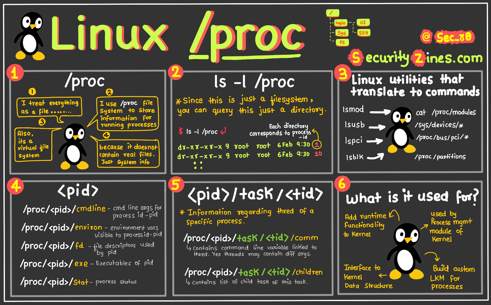
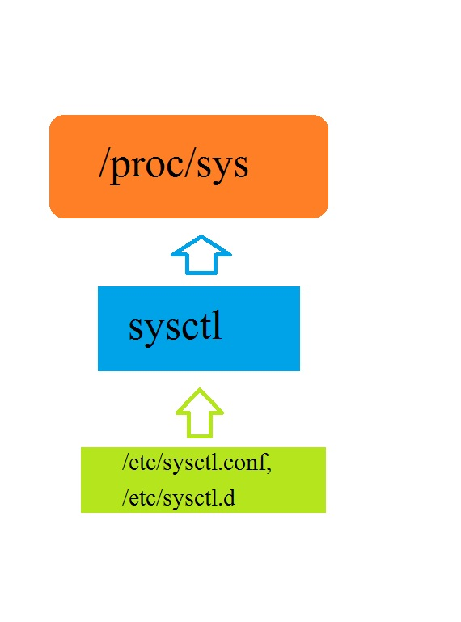

# พื้นที่ ใช้งานของ Kernel Space 
## ทบทวน Linux File system


## ภาพรวมของ /proc 



``/proc`` และ ``/sys`` (หรือ Sysfs) คือระบบไฟล์เสมือน (Virtual Filesystems) ที่ทำหน้าที่เป็น สะพานหลัก สำหรับการสื่อสารแบบสองทางระหว่าง Kernel Space (พื้นที่ของเคอร์เนล) และ User Space (พื้นที่ของผู้ใช้)

มันไม่ใช่ไฟล์ที่อยู่บนฮาร์ดดิสก์จริงๆ แต่เป็นอินเทอร์เฟซที่เคอร์เนลสร้างขึ้นในหน่วยความจำ เพื่อให้โปรแกรมและผู้ใช้สามารถดูข้อมูลภายในของเคอร์เนลและตั้งค่าการทำงานบางอย่างได้

## /proc (Procfs)

ลองนึกภาพ /proc เหมือนเป็น "ที่เก็บข้อมูล" ของเคอร์เนล มีข้อมูลสารพัดประโยชน์มากมาย 
จากคำว่า Process (กระบวนการ) ถูกสร้างขึ้นเพื่อแสดงข้อมูลเกี่ยวกับโปรแกรมต่างๆ ที่กำลังทำงานอยู่ในระบบ คุณจะเห็นไดเรกทอรีที่เป็นตัวเลขเต็มไปหมด (/proc/1, /proc/1234) ซึ่งแต่ละไดเรกทอรีแทนหนึ่งโปรเซส และข้างในก็จะมีไฟล์ที่บอกสถานะ, การใช้หน่วยความจำ, คำสั่งที่ใช้รัน เป็นต้น

- ``cat /proc/<PID>/status``: ดูสถานะของโปรเซส

- ``cat /proc/<PID>/cmdline``: ดูคำสั่งที่ใช้รันโปรเซสนี้

การขยายตัว: ต่อมา /proc ได้ถูกขยายให้รวมข้อมูลอื่นๆ ของระบบที่ไม่เกี่ยวกับโปรเซสโดยตรงเข้าไปด้วย ทำให้มันกลายเป็นแหล่งข้อมูลสารพัดประโยชน์

- ``cat /proc/cpuinfo``: ข้อมูลเกี่ยวกับ CPU

- ``cat /proc/meminfo``: ข้อมูลการใช้หน่วยความจำ

- ``cat /proc/version``: เวอร์ชันของ Linux kernel

การตั้งค่า: บางไฟล์ใน /proc (โดยเฉพาะใน /proc/sys) สามารถใช้เพื่อปรับจูนค่าต่างๆ ของเคอร์เนลได้ทันที เช่น การตั้งค่าเครือข่าย


## ทำความเข้าใจระบบไฟล์ /sys ใน Linux
ไดเรกทอรี /sys ใน Linux คือระบบไฟล์เสมือน (virtual filesystem) ที่มีอินเทอร์เฟซเชิงโครงสร้างสำหรับเข้าถึงข้อมูลของเคอร์เนล โดยเน้นไปที่อุปกรณ์และไดรเวอร์เป็นหลัก /sys แตกต่างจากระบบไฟล์ทั่วไปตรงที่มันอยู่ในหน่วยความจำและถูกสร้างขึ้นแบบไดนามิกขณะรันไทม์ มันเป็นส่วนหนึ่งของระบบไฟล์เสมือน sysfs ซึ่งถูกนำมาใช้ใน Linux kernel เวอร์ชัน 2.6 เพื่อนำเสนอวิธีการโต้ตอบกับอ็อบเจกต์ของเคอร์เนลที่สะอาดและเป็นระเบียบมากขึ้น

### วัตถุประสงค์ของ /sys
ระบบไฟล์ /sys ถูกออกแบบมาเพื่อเปิดเผยโครงสร้างข้อมูลของเคอร์เนล และเป็นช่องทางในการสอบถามและกำหนดค่าคุณสมบัติของอุปกรณ์ มันทำงานเสริมกับ /proc ซึ่งเน้นไปที่ข้อมูลของโปรเซสและระบบ ในขณะที่ /proc เติบโตขึ้นอย่างอิสระและมีอินเทอร์เฟซแบบเก่ารวมอยู่ด้วย แต่ /sys ถูกสร้างขึ้นด้วยแนวทางที่มีโครงสร้างและเน้นอุปกรณ์เป็นศูนย์กลางมากกว่า

### คุณสมบัติและโครงสร้างที่สำคัญ
ไดเรกทอรี /sys ถูกจัดระเบียบตามลำดับชั้นเพื่อสะท้อนความสัมพันธ์ระหว่างอุปกรณ์ ไดรเวอร์ และระบบย่อยต่างๆ ไดเรกทอรีย่อยที่สำคัญบางส่วน ได้แก่:

- ``/sys/class/``: จัดกลุ่มอุปกรณ์ตามประเภท (เช่น net สำหรับอินเทอร์เฟซเครือข่าย, block สำหรับอุปกรณ์บล็อก) ซึ่งช่วยซ่อนรายละเอียดเฉพาะของฮาร์ดแวร์และนำเสนอมุมมองที่เป็นภาพรวม

- ``/sys/devices/``: จำลองแผนผังอุปกรณ์ทางกายภาพ แสดงลำดับชั้นของอุปกรณ์ตามที่เชื่อมต่อกับระบบ

- ``/sys/block/``: มีข้อมูลเกี่ยวกับอุปกรณ์บล็อก เช่น ฮาร์ดไดรฟ์และพาร์ติชัน

- ``/sys/bus/``: แสดงประเภทบัสต่างๆ (เช่น USB, PCI) และรวมถึงไดเรกทอรีสำหรับอุปกรณ์และไดรเวอร์ที่เกี่ยวข้องกับแต่ละบัส

### ระบบไฟล์ /sys เป็นแบบเสมือนและชั่วคราว (virtual and ephemeral)

หมายความว่ามันถูกสร้างขึ้นแบบไดนามิกตอนบูตเครื่องและไม่ได้คงอยู่บนดิสก์ การเปลี่ยนแปลงใดๆ ที่ทำใน /sys จะมีผลชั่วคราวและจะถูกรีเซ็ตหลังจากรีบูต การแก้ไขควรทำด้วยความระมัดระวัง เนื่องจากส่งผลโดยตรงต่อการทำงานของเคอร์เนล

การทำความเข้าใจและใช้ประโยชน์จาก /sys นั้นมีค่าอย่างยิ่งสำหรับผู้ดูแลระบบและนักพัฒนา ช่วยให้สามารถจัดการอุปกรณ์และกำหนดค่าเคอร์เนลได้อย่างมีประสิทธิภาพ


## ความแตกต่างของ ``/proc/sys``  และ ``/sys``

| ลักษณะ | **/proc/sys** | **/sys** |
|:---|:---|:---|
| **ที่มา** | ส่วนหนึ่งของ **procfs** (Process Filesystem) | **sysfs** (System Filesystem) โดยเฉพาะ |
| **จุดประสงค์หลัก** | **อินเทอร์เฟซสำหรับปรับค่า kernel parameters** ในรันไทม์ | **แสดงข้อมูลเกี่ยวกับอุปกรณ์, ไดรเวอร์, และโมดูล kernel** |
| **เนื้อหา** | ไฟล์ที่สามารถ **อ่านและเขียน** ได้เพื่อเปลี่ยนการทำงานของเคอร์เนล | ส่วนใหญ่เป็นไฟล์ **อ่านอย่างเดียว** เพื่อดูสถานะของระบบ |
| **การจัดระเบียบ** | โครงสร้างตาม **namespace ของ kernel parameters** | โครงสร้างตาม **topology ของอุปกรณ์และบัส** |
| **ตัวอย่าง** | `/proc/sys/net/ipv4/ip_forward` | `/sys/devices/`, `/sys/class/`, `/sys/bus/` |

- **คำอธิบายเพิ่มเติม:**

- ``/proc/sys`` ใช้สำหรับปรับแต่งพารามิเตอร์เคอร์เนล (เช่น ด้วยคำสั่ง sysctl)

- ``/sys`` ใช้สำหรับดูข้อมูลสถานะฮาร์ดแวร์และดีไวซ์

ทั้งสองเป็น virtual filesystem ที่สร้างโดยเคอร์เนล และ ไม่ถาวร

- **ตัวอย่างเพิ่มเติม**
1. /proc/sys (สำหรับปรับค่า)  
ใช้คำสั่ง sysctl หรือเขียนค่าไปที่ไฟล์ใน /proc/sys/ โดยตรงเพื่อปรับพฤติกรรมของเคอร์เนล

```
# เปิดการทำงานของ IP Forwarding
echo 1 | sudo tee /proc/sys/net/ipv4/ip_forward

# หรือใช้คำสั่ง sysctl ซึ่งทำงานกับ /proc/sys/ โดยอัตโนมัติ
sudo sysctl -w net.ipv4.ip_forward=1
```

2. /sys (สำหรับดูข้อมูล)  
ใช้เพื่อดูข้อมูลสถานะของ hardware และ driver

```
# ดูความถี่ของ CPU ทั้งหมด
cat /sys/devices/system/cpu/cpu*/cpufreq/scaling_cur_freq

# ดูข้อมูลของ USB devices
ls /sys/bus/usb/devices/
```

**สรุป**    
  - ``/proc/sys`` คือ "ควบคุม" ของเคอร์เนล ใช้สำหรับ ปรับแต่ง พารามิเตอร์ต่างๆ  
  - ``/sys`` คือ "ตัวแปรแสดงสถานะ" ของระบบ ใช้สำหรับ ดูข้อมูล เกี่ยวกับอุปกรณ์และส่วนประกอบภายใน

ทั้งสองอย่างเป็นส่วนสำคัญของ Linux kernel ที่ทำให้ผู้ใช้และโปรเซสสามารถโต้ตอบกับเคอร์เนลได้ผ่านระบบไฟล์แบบปกติ

