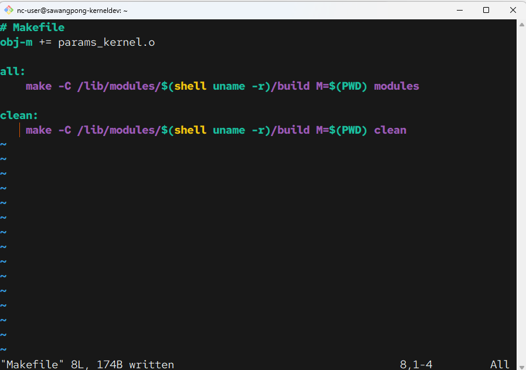

# สร้าง kernel module 2

### เครื่องมือสำหรับการคอมไพล์
```
sudo apt update -y
sudo apt install build-essential
```

### ติดตั้ง Linux header
```
sudo apt install linux-headers-$(uname -r)
```

---

เรียนรู้การสร้าง kernel parameters ด้วยการใช้ ``module_param()`` macro เพื่อกำหนด parameter ขอเรา และกำหนด File permission 

```
mkdir module2
cd module2
vim params_kernel.c
```

```c title="params_kernel.c"
// params_kernel.c

#include <linux/init.h>
#include <linux/module.h>
#include <linux/kernel.h>
#include <linux/moduleparam.h> // Required for module parameters

// --- Module Metadata ---
MODULE_LICENSE("GPL");
MODULE_AUTHOR("Your Name");
MODULE_DESCRIPTION("A kernel module that accepts parameters.");

// --- Module Parameters ---
static int my_int = 1; // Default value is 1
static char *my_string = "default"; // Default value is "default"

// Macro to declare a module parameter
// module_param(variable_name, type, permissions);
// 'int' is for integer, 'charp' is for a character pointer (string).
// S_IRUGO allows the parameter to be read by everyone (user, group, other) via /sysfs.
module_param(my_int, int, S_IRUGO);
module_param(my_string, charp, S_IRUGO);

// Macro to add a description for the parameter
MODULE_PARM_DESC(my_int, "An integer parameter.");
MODULE_PARM_DESC(my_string, "A string parameter.");

// --- Module Functions ---
static int __init params_init(void) {
    printk(KERN_INFO "Module loaded with parameters. ⚙️\n");
    printk(KERN_INFO "my_int is: %d\n", my_int);
    printk(KERN_INFO "my_string is: %s\n", my_string);
    return 0;
}

static void __exit params_exit(void) {
    printk(KERN_INFO "Module unloaded. Goodbye!\n");
}

module_init(params_init);
module_exit(params_exit);
```

**สรุป Code ด้านบน**
1. เรียกใช้ header ``#include <linux/moduleparam.h>`` สำหรับ parameter macro
1. รูปแบบการใช้งาน ``module_param(name, type, perm)``  เพื่อเชื่อมโยงตัวแปล และ ใช้ ``charp`` คือ charactor pointer สำหรับการเชื่อม
1. ``S_IRUGO`` ย่อมาจาก ``Stat_IsReadable for User, Group, and Other.`` หมายความว่าเราสามารถดูค่าได้ใน /sys filesystem แต่ไม่สามารเปลี่ยนแปลได้ในขณะที่ module กำลังโหลดอยู่

สร้าง Makefile
```makefile title="Makefile"

# Makefile
obj-m += params_kernel.o

all:
    make -C /lib/modules/$(shell uname -r)/build M=$(PWD) modules

clean:
	make -C /lib/modules/$(shell uname -r)/build M=$(PWD) clean
```



Run make เพื่อสร้าง ``params_kernel.ko``
```
make
```


## โหลด module ของเราเพราะกับตัวแปร

```
sudo insmod params_kernel.ko my_int=99 my_string="Hello from params"
```

```
sudo dmesg  | tail -n 3
```


## ตรวจสอบค่าตัวแปร ใน /sysfs

```bash
# List the parameters for your module
ls /sys/module/params_kernel/parameters/

# View the value of a specific parameter
cat /sys/module/params_kernel/parameters/my_int
cat /sys/module/params_kernel/parameters/my_string
```


## ถอดถอน kernel (unload)

```
sudo rmmod params_kernel
```

## โหลด kernel module ด้วย Default parameter
```bash

sudo insmod params_kernel.ko
sudo dmesg | tail -n 3

```


## Clean up
```
sudo rmmod params_kernel
make clean
```