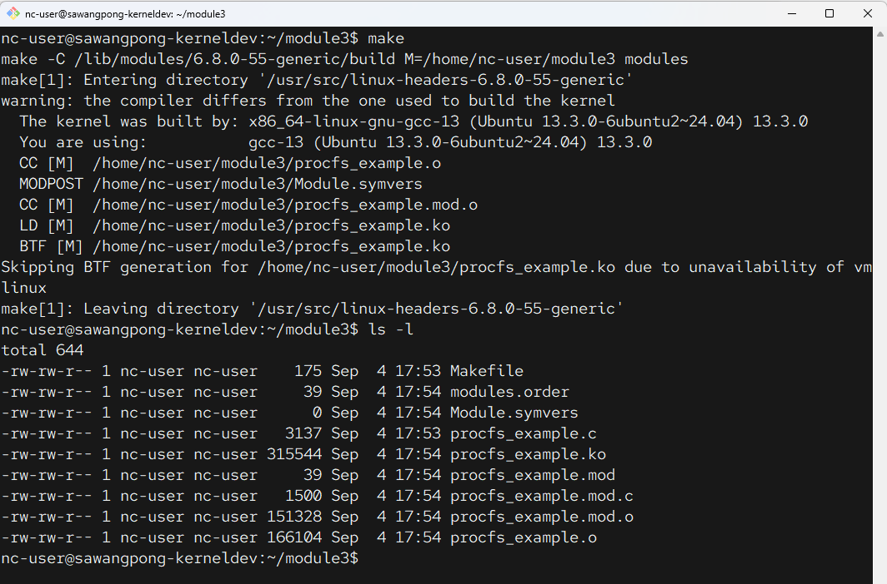
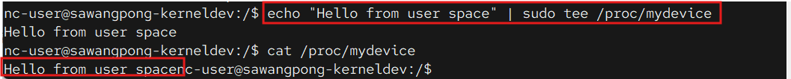
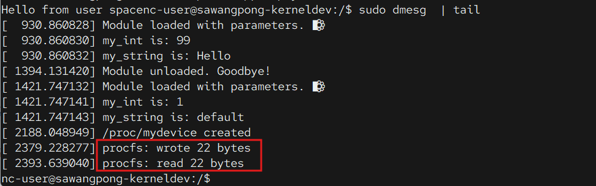

# สร้าง kernel module 3

### เครื่องมือสำหรับการคอมไพล์
```
sudo apt update
sudo apt install build-essential
```

### ติดตั้ง Linux header
```
sudo apt install linux-headers-$(uname -r)
```

---

ขั้นตอนถัดไปที่สมเหตุสมผลหลังจากเรียนรู้เรื่อง printk และพารามิเตอร์ของโมดูลแล้ว คือการเปิดใช้งานการสื่อสารสองทางระหว่างโมดูลของคุณกับพื้นที่ของผู้ใช้ (user-space) วิธีที่ง่ายที่สุดในการทำเช่นนี้คือการสร้างไฟล์ในระบบไฟล์ /proc

ระบบไฟล์ /proc เป็นระบบไฟล์เสมือนพิเศษที่ทำหน้าที่เป็นหน้าต่างสู่เคอร์เนล คุณสามารถสร้างไฟล์ไว้ที่นั่น และเมื่อผู้ใช้สั่งอ่านไฟล์ (ด้วยคำสั่ง cat) หรือเขียนไฟล์ (ด้วยคำสั่ง echo) โค้ดในโมดูลของคุณก็จะทำงาน

ตัวอย่างนี้จะสร้างไฟล์ที่ /proc/mydevice ซึ่งผู้ใช้สามารถอ่านและเขียนข้อมูลได้

```
mkdir module3
cd module3
vim procfs_example.c
```

```c title="procfs_example.c"
// procfs_example.c

#include <linux/init.h>
#include <linux/module.h>
#include <linux/kernel.h>
#include <linux/proc_fs.h>  // Required for procfs
#include <linux/uaccess.h>  // Required for copy_to_user and copy_from_user

#define PROCFS_NAME "mydevice"
#define PROCFS_MAX_SIZE 128

// --- Module Metadata ---
MODULE_LICENSE("GPL");
MODULE_AUTHOR("Your Name");
MODULE_DESCRIPTION("A simple procfs kernel module.");

// --- Global Variables ---
static char proc_buffer[PROCFS_MAX_SIZE]; // The buffer for our proc file's data
static unsigned long proc_buffer_size = 0; // The current size of the data
static struct proc_dir_entry *proc_file_entry; // Pointer to our proc file

// --- Procfs Read Function ---
// Called when a process reads from /proc/mydevice (e.g., `cat /proc/mydevice`)
static ssize_t proc_read(struct file *file, char __user *ubuf, size_t count, loff_t *ppos) {
    // If the offset is greater than 0, we have nothing left to read.
    if (*ppos > 0 || proc_buffer_size == 0) {
        return 0; // Return 0 to signify end-of-file
    }

    // Don't read more than our buffer size
    if (count > proc_buffer_size) {
        count = proc_buffer_size;
    }

    // copy_to_user() is the safe way to copy data from the kernel to user space.
    if (copy_to_user(ubuf, proc_buffer, count)) {
        return -EFAULT; // Return an error if copy fails
    }

    *ppos += count; // Update the file position
    printk(KERN_INFO "procfs: read %zu bytes\n", count);
    return count; // Return the number of bytes read
}

// --- Procfs Write Function ---
// Called when a process writes to /proc/mydevice (e.g., `echo "hi" > /proc/mydevice`)
static ssize_t proc_write(struct file *file, const char __user *ubuf, size_t count, loff_t *ppos) {
    // Don't write more than our buffer can hold
    if (count > PROCFS_MAX_SIZE) {
        count = PROCFS_MAX_SIZE;
    }

    // copy_from_user() is the safe way to copy data from user space to the kernel.
    if (copy_from_user(proc_buffer, ubuf, count)) {
        return -EFAULT;
    }
    
    proc_buffer_size = count; // Update the size of our buffer data
    proc_buffer[proc_buffer_size-1] = '\0'; // Ensure it's null-terminated if it's a string

    printk(KERN_INFO "procfs: wrote %zu bytes\n", count);
    return count; // Return the number of bytes written
}

// Define which functions are called for which operations
static const struct proc_ops my_fops = {
    .proc_read = proc_read,
    .proc_write = proc_write,
};

// --- Module Init and Exit ---
static int __init procfs_init(void) {
    // proc_create(name, mode, parent, file_operations)
    proc_file_entry = proc_create(PROCFS_NAME, 0666, NULL, &my_fops);
    if (proc_file_entry == NULL) {
        printk(KERN_ALERT "Error: Could not create /proc/%s\n", PROCFS_NAME);
        return -ENOMEM;
    }

    printk(KERN_INFO "/proc/%s created\n", PROCFS_NAME);
    return 0;
}

static void __exit procfs_exit(void) {
    // remove_proc_entry(name, parent)
    remove_proc_entry(PROCFS_NAME, NULL);
    printk(KERN_INFO "/proc/%s removed\n", PROCFS_NAME);
}

module_init(procfs_init);
module_exit(procfs_exit);
```

```makefile title="Makefile"
# Makefile
obj-m += procfs_example.o

all:
	make -C /lib/modules/$(shell uname -r)/build M=$(PWD) modules

clean:
	make -C /lib/modules/$(shell uname -r)/build M=$(PWD) clean
```

- Compile Run make สร้าง kernel module
```
make
```



- Load module 
```
sudo insmod procfs_example.ko
lsmod | grep procfs
```

- ตรวจสอบว่ามี file ใน /proc หรือไม่
```
ls -l /proc/mydevice
```

- ทดสอบเขียน file ไปยัง /proc/mydevice
```bash
echo "Hello from user space" | sudo tee /proc/mydevice
```

- หลังจากเขียนแล้วก็อ่าน กลับมาอีกครั้ง
```
cat /proc/mydevice
```



- ตรวจสอบ kernel log
```
sudo dmesg  | tail
```



- unload kernel module
```
sudo rmmod procfs_example
```
- จะเห็นว่า ``/proc/mydevice`` หายไป