#tf-vrouter
[https://github.com/OpenSDN-io/tf-vrouter](https://github.com/OpenSDN-io/tf-vrouter)

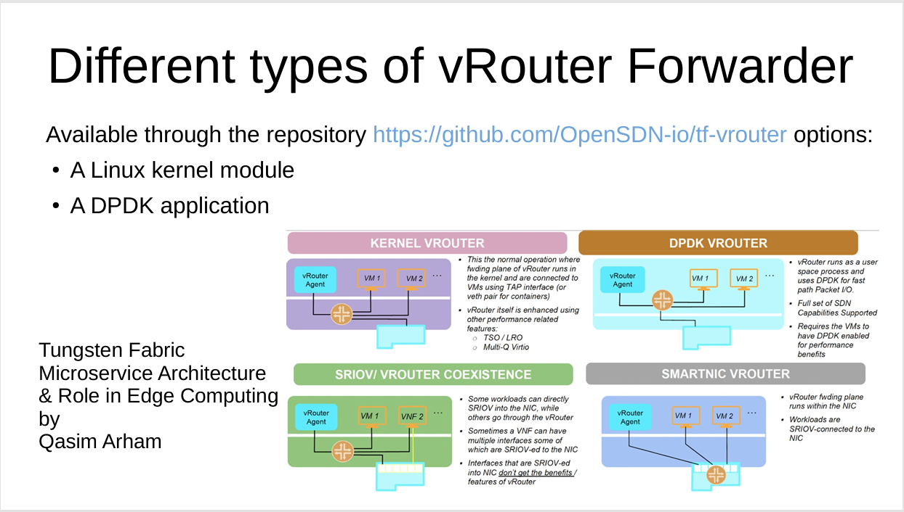
- git source
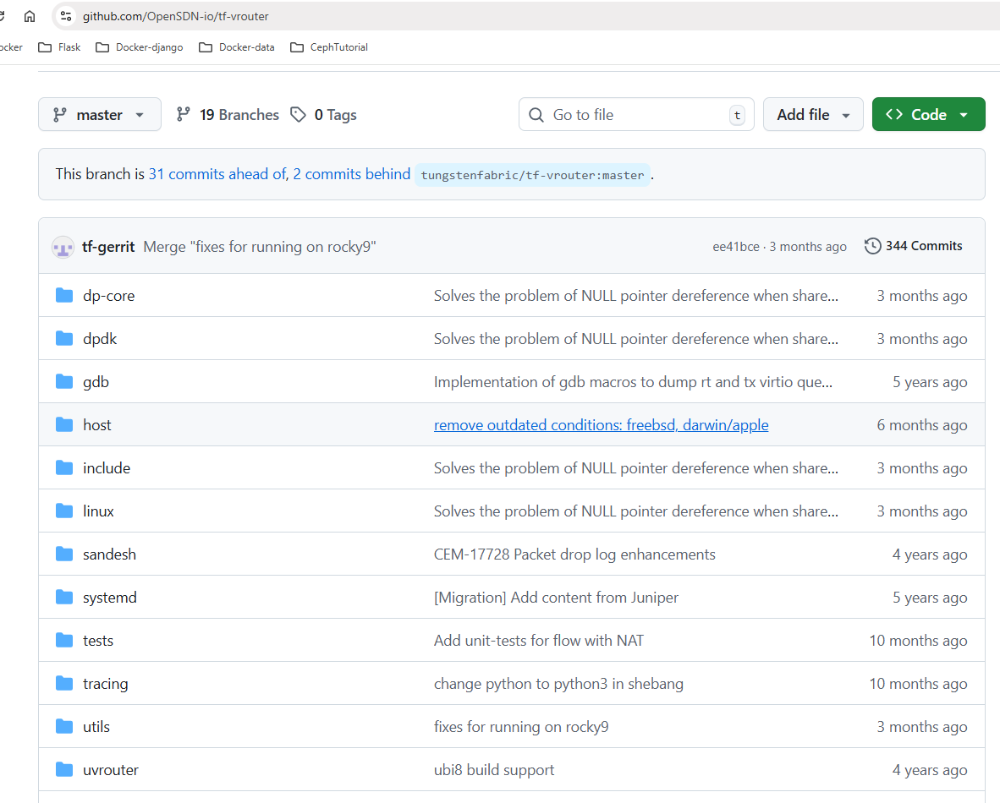

## building vrouter.ko and contrail-vrouter-dpdk

```
sudo dnf -y install dnf-plugins-core
sudo dnf config-manager --add-repo https://download.docker.com/linux/rhel/docker-ce.repo

sudo dnf install docker-ce docker-ce-cli containerd.io docker-buildx-plugin docker-compose-plugin

sudo systemctl start docker
sudo systemctl enable docker


sudo usermod -aG docker nc-user
newgrp docker
```

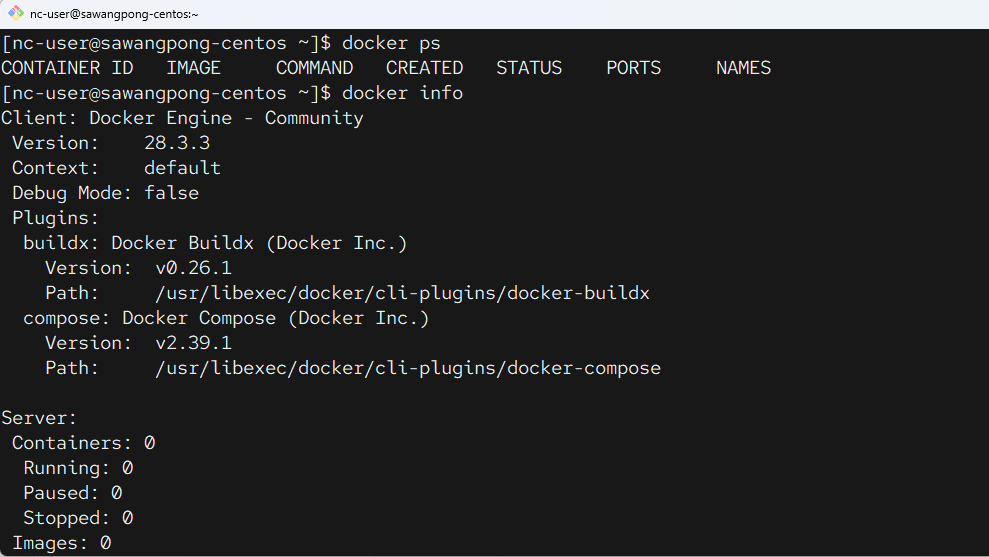

## Download tf-dev-env และ fetch sources
- https://github.com/opensdn-io/tf-dev-env
```
sudo dnf install git
python3 -m venv .venv
source  .venv/bin/activate

sudo ln -s /usr/bin/python3  /usr/bin/python

git clone http://github.com/opensdn-io/tf-dev-env

```

## Prepare the build container and fetch TF sources:
```
tf-dev-env/run.sh
```

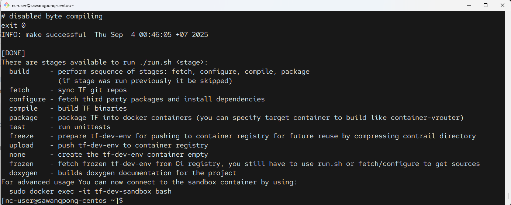

## Stage ต่างๆ ที่ควรทราบ
```
[DONE]
There are stages available to run ./run.sh <stage>:
  build     - perform sequence of stages: fetch, configure, compile, package
              (if stage was run previously it be skipped)
  fetch     - sync TF git repos
  configure - fetch third party packages and install dependencies
  compile   - build TF binaries
  package   - package TF into docker containers (you can specify target container to build like container-vrouter)
  test      - run unittests
  freeze    - prepare tf-dev-env for pushing to container registry for future reuse by compressing contrail directory
  upload    - push tf-dev-env to container registry
  none      - create the tf-dev-env container empty
  frozen    - fetch frozen tf-dev-env from Ci registry, you still have to use run.sh or fetch/configure to get sources
  doxygen   - builds doxygen documentation for the project
For advanced usage You can now connect to the sandbox container by using:
  sudo docker exec -it tf-dev-sandbox bash

```

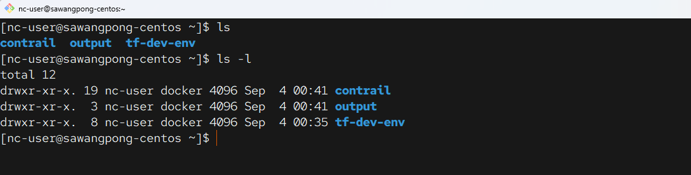

!!! note
    The sources are fetched into the directory ```$WORKSPACE/contrail``. The repo tool is used for fetching. The directory structure corresponds to ``default.xml``


## ตรวจสอบ File

## การเปลี่ยนแปลง ถ้าหากจำเป็น
Make required changes in sources fetched to contrail directory. For example, fetch particular review for controller (you can find download link in the gerrit review):

```
cd contrail/controller
git fetch "https://gerrit.opensdn.io/opensdn-io/tf-controller" refs/changes/..... && git checkout FETCH_HEAD
cd ../../
```

## Build
- เตรียมพร้อม build
```
tf-dev-env/run.sh build
```

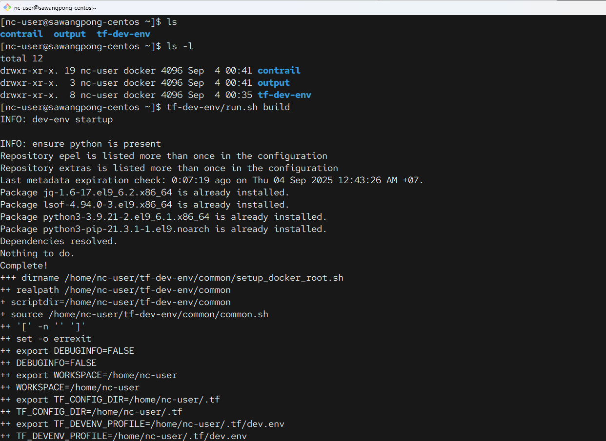

## Unit test
```
tf-dev-env/run.sh test
```

- แต่ละ target ที่ต้องการ run สามารถทำได้โดย กำหนดใน ตัวแปรของ ``run.sh`` โดย stage build ที่เรารันไป คือ การที่ Run ``fetch``, ``configure``, ``compile`` , ``package`` และเราสามารถ Run แต่ละ stage ที่ต้องการแยกจากกัน ได้
- 
```
tf-dev-env/run.sh compile
tf-dev-env/run.sh package
```
- **Supported targets:**

- fetch - sync TF git repos
- configure - fetch third party packages and install dependencies
- compile - build TF binaries (RPM-s)
- package - package TF into docker containers
- test - run unittests

## Advance usage
การปรับแต่ ค่างๆ จะใช้คำสั่ง make , Makefile  

1. target none สำหรับสร้าง  tf-dev-env container 
```
./run.sh none
```
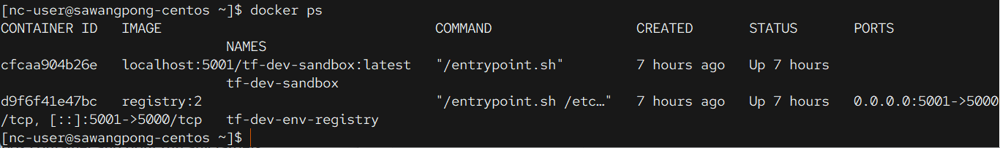

1. ทำการ Attach ไปยัง Container
```
sudo docker exec -it tf-dev-sandbox bash
```

1. เครียมพร้อมสำหรับ developer-sandbox container

```
cd ~/tf-dev-env
make sync              # get latest code
make setup dep         # set up docker container and install build dependencies
make fetch_packages    # pull third_party dependencies
```

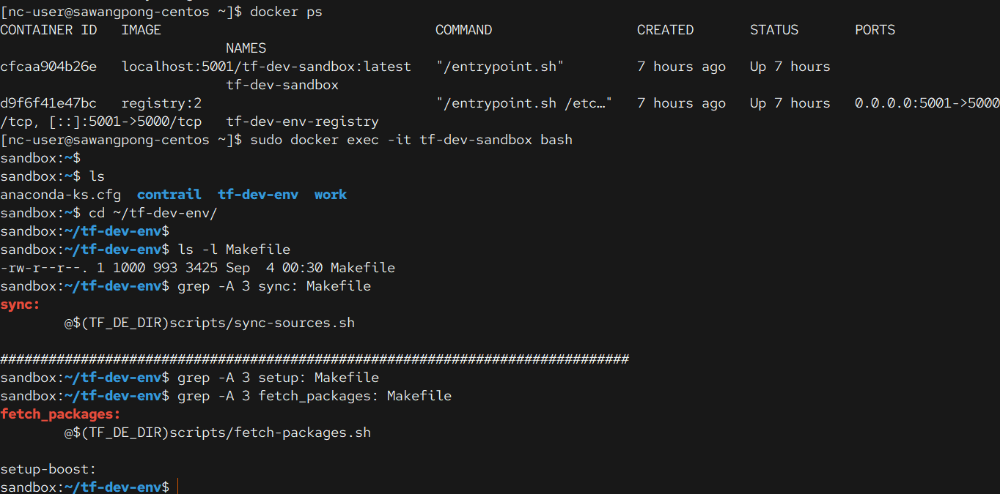

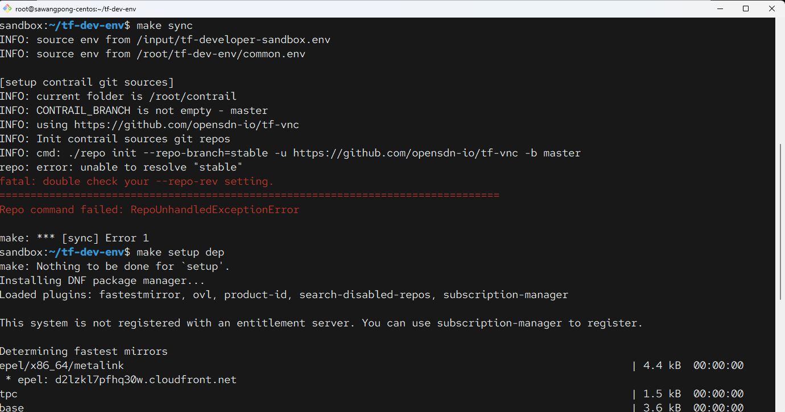

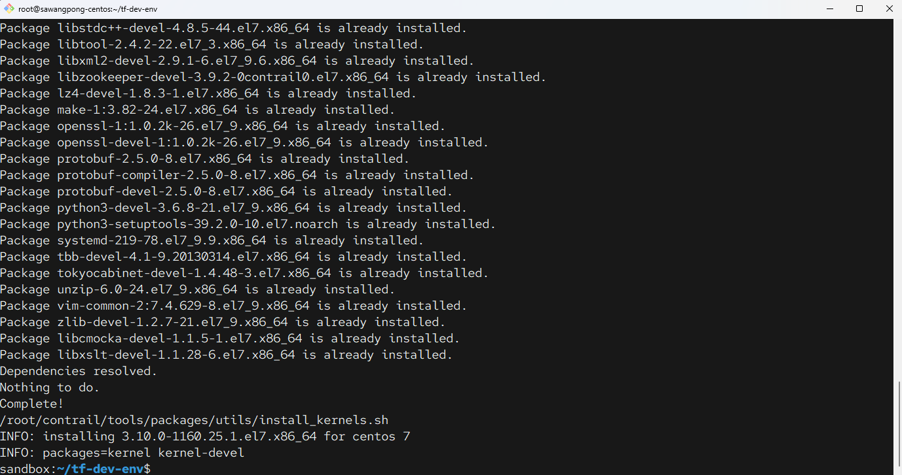

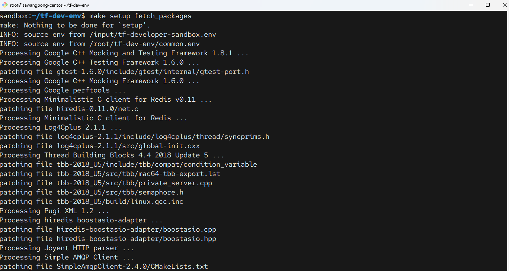

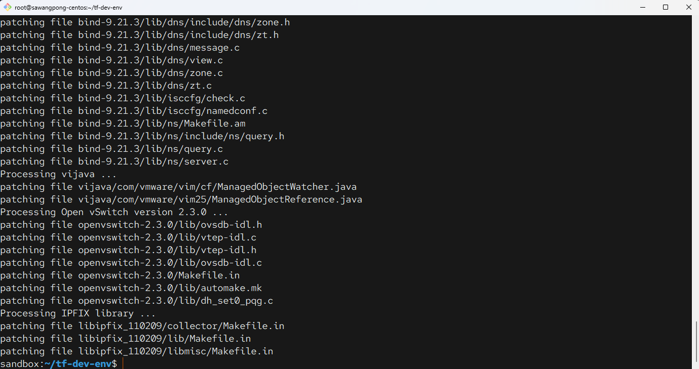

**คำอธิบายสำหรับ targets**  

- make sync - sync code in ./contrail directory using repo tool
- make fetch_packages - pull ./third_party dependencies (after code checkout)
- make setup - initial configuration of image (required to run once)
- make dep - installs all build dependencies
- make dep-<pkg_name> - installs build dependencies for <pkg_name>