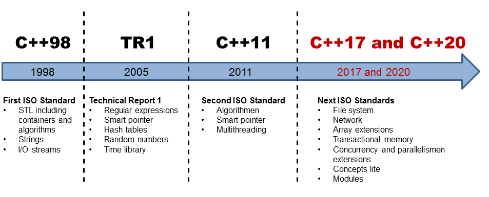
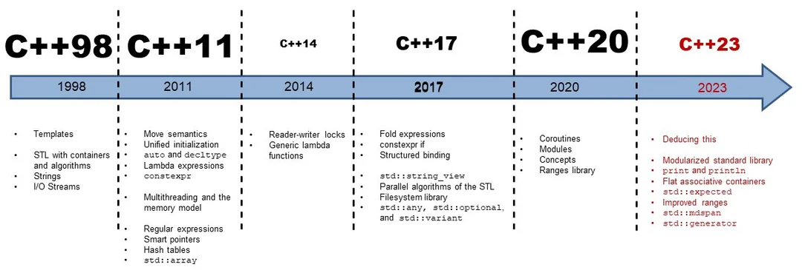

# ทำความรู้จัก gcc และ C standard



หลายคนสับสนนะครับ  **`gcc` เป็นชื่อของโปรแกรมคอมไพเลอร์** ส่วน **C17, C11, C99 เป็นชื่อเวอร์ชันของมาตรฐานภาษา C** ครับ ทั้งสองอย่างนี้ทำงานร่วมกัน แต่เป็นคนละสิ่งกัน

อาจจะอธิบายง่ายๆ ได้ดังนี้:

  * **`gcc` (GNU Compiler Collection):** คือเครื่องมือ หรือ "โปรแกรมแปลภาษา" ที่อ่านโค้ดภาษา C ที่เราเขียน แล้วแปลงให้เป็นภาษาเครื่องที่คอมพิวเตอร์สามารถเข้าใจและนำไปรันได้

  * **C17, C11, C, 20 etc.:** คือ "กฎ" หรือ "มาตรฐาน" ของไวยากรณ์และฟีเจอร์ต่างๆ ในการเขียนภาษา C ซึ่งมีการพัฒนาและออกมาเป็นเวอร์ชันต่างๆ เพื่อเพิ่มความสามารถใหม่ๆ หรือปรับปรุงของเดิมให้ดีขึ้น เปรียบเสมือนคู่มือการเขียนภาษา C ในแต่ละยุคสมัย

-----

### ความสัมพันธ์และการใช้งาน

โดยปกติแล้ว เมื่อเราใช้คำสั่ง `gcc` เพื่อคอมไพล์โปรแกรม มันจะเลือกใช้มาตรฐานภาษา C เวอร์ชันใดเวอร์ชันหนึ่งเป็นค่าเริ่มต้น (default) ซึ่งเวอร์ชันเริ่มต้นนี้จะแตกต่างกันไปตามเวอร์ชันของ `gcc` ที่ติดตั้งอยู่

แต่เราสามารถ **ระบุได้อย่างชัดเจน** ว่าต้องการให้ `gcc` ใช้มาตรฐานภาษา C เวอร์ชันไหนในการคอมไพล์ โดยใช้แฟล็ก (flag) `-std=` ตามด้วยชื่อเวอร์ชันของมาตรฐาน

**ตัวอย่าง:**

  * **คอมไพล์โดยใช้มาตรฐาน C17:**

    ```bash
    gcc -std=c17 my_program.c -o my_program
    ```

  * **คอมไพล์โดยใช้มาตรฐาน C11:**

    ```bash
    gcc -std=c11 my_program.c -o my_program
    ```

  * **คอมไพล์โดยใช้มาตรฐาน C99:**

    ```bash
    gcc -std=c20 my_program.c -o my_program
    ```

### สรุปสั้นๆ

| | **`gcc`** | **C17, C11, C99** |
| :--- | :--- | :--- |
| **หน้าที่** | เป็นโปรแกรมคอมไพเลอร์ | เป็นมาตรฐานของภาษา C |
| **เปรียบเสมือน** | ผู้แปลหนังสือ | ไวยากรณ์และสำนวนของภาษาในแต่ละยุค |
| **ความสัมพันธ์** | ใช้ "มาตรฐาน C" เป็นแนวทางในการแปลโค้ด | เป็น "กฎ" ที่ `gcc` ต้องทำตาม |

ดังนั้น `gcc` และเวอร์ชันของภาษา C จึงเป็นสิ่งที่แยกจากกัน แต่ทำงานควบคู่กันไปในการพัฒนาโปรแกรมครับ



## การตรวจสอบ C std version

ตรวจสอบเวอร์ชันของมาตรฐานภาษา C (C standard) ที่ใช้งานอยู่ได้ 2 วิธีหลักๆ ดังนี้ครับ

-----

### วิธีที่ 1: ตรวจสอบเวอร์ชันปริยาย (Default) ของคอมไพเลอร์

วิธีนี้คือการสั่งให้คอมไพเลอร์ (เช่น GCC หรือ Clang) แสดงข้อมูลออกมาเองว่า โดยปกติแล้วมันใช้มาตรฐาน C เวอร์ชันไหนเป็นค่าเริ่มต้น

**ขั้นตอน:**


มาตรฐานของภาษา C ได้กำหนด Macro ที่ชื่อว่า `__STDC_VERSION__` เอาไว้ ซึ่งจะเก็บค่าตัวเลขของเวอร์ชันมาตรฐานที่ถูกใช้ในขณะที่คอมไพล์โค้ดนั้นๆ วิธีนี้จึงเป็นวิธีที่แม่นยำที่สุด

เราสามารถเขียนโปรแกรมง่ายๆ เพื่อพิมพ์ค่าของ Macro นี้ออกมาดูได้

**ตัวอย่างโค้ด C:**

```
mkdir c-develop
cd c-develop
vim check_std_test.c
gcc check_std_test.c -o check_std_test
./check_std_test
```
```c title="check_std_test.c"
//File check_std_test.c
#include <stdio.h>

int main(void) {
  #if defined(__STDC_VERSION__)
    printf("C Standard Version: %ld\n", __STDC_VERSION__);
  #else
    printf("C Standard: C89/C90\n");
  #endif
  
  return 0;
}
```

**วิธีคอมไพล์และรัน:**

1.  บันทึกโค้ดด้านบนเป็นไฟล์ชื่ออะไรก็ได้ เช่น ` check_std_test.c`
2.  คอมไพล์ด้วยคำสั่ง `gcc`:
    ```bash
    gcc  check_std_test.c -o  check_std_test
    ```
3.  รันโปรแกรมที่คอมไพล์เสร็จแล้ว:
    ```bash
    ./ check_std_test
    ```

**การอ่านผลลัพธ์:**
โปรแกรมจะพิมพ์ตัวเลขออกมา ซึ่งแต่ละค่าจะตรงกับมาตรฐาน C เวอร์ชันต่างๆ ดังตารางนี้

| ค่าของ `__STDC_VERSION__` | มาตรฐานภาษา C |
| :--- | :--- |
| `199409L` | C95 |
| `199901L` | C99 |
| `201112L` | C11 |
| `201710L` | C17 |
| `202311L` | C23 (มาตรฐานใหม่) |

- ลอง Compile ใหม่ อีกครั้ง
```
$ gcc -std=c11 check_std_test.c -o check_std_test

 ./check_std_test
C Standard Version: 201112

$ gcc -std=c23 check_std_test.c -o check_std_test
gcc: error: unrecognized command-line option ‘-std=c23’; did you mean ‘-std=c2x’?

$ gcc -std=c2x check_std_test.c -o check_std_test
$ ./check_std_test
C Standard Version: 202000

```

