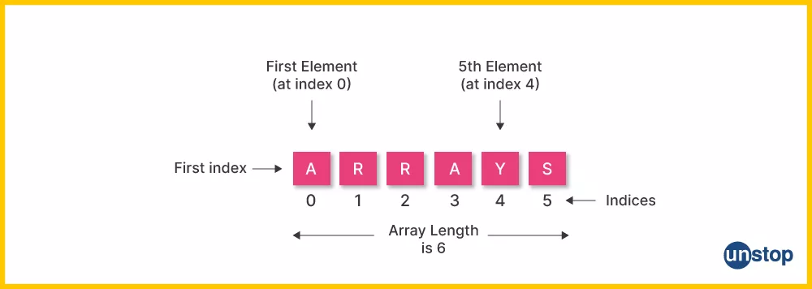
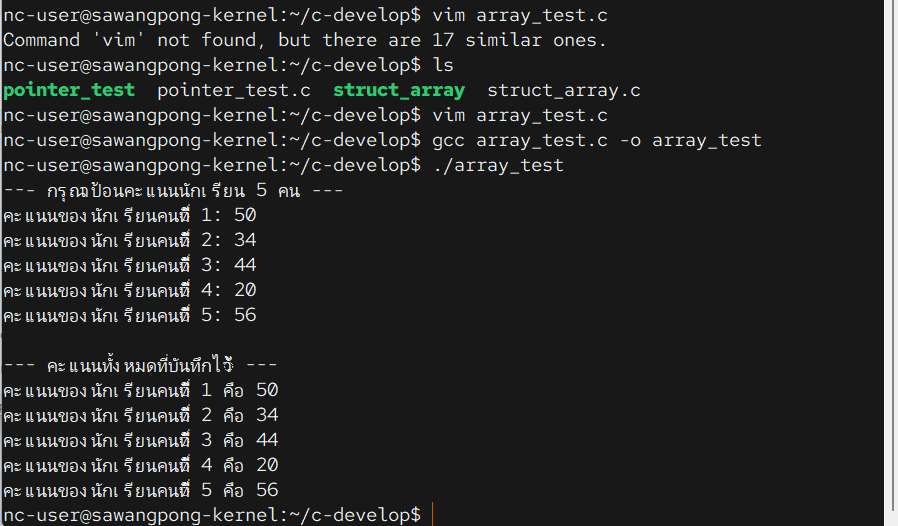

# 02 Array



`Array` (อะเรย์) คือ **ชุดของข้อมูลชนิดเดียวกันที่เรียงต่อกันเป็นแถว**ในหน่วยความจำ 🗄️

ลองนึกภาพ **"ตู้ล็อกเกอร์"** ที่มีหลายๆ ช่องเรียงติดกัน:

  * **ทุกช่องมีขนาดเท่ากัน** และเก็บของ **ประเภทเดียวกัน** (เช่น เก็บได้เฉพาะหนังสือ)
  * แต่ละช่องจะมี **หมายเลขกำกับ** ที่ไม่ซ้ำกัน (เช่น ช่องหมายเลข 0, 1, 2, ...)

ในภาษา C, Array ก็ทำงานแบบเดียวกัน คือการจองพื้นที่ในหน่วยความจำสำหรับเก็บข้อมูลชนิดเดียวกัน (เช่น `int` ล้วน หรือ `char` ล้วน) โดยมี **"index"** (ดัชนี) เป็นเหมือนหมายเลขช่องล็อกเกอร์สำหรับอ้างถึงข้อมูลแต่ละตัว

-----

## ทำไมถึงต้องใช้ Array?

เพื่อ **จัดการข้อมูลจำนวนมากได้อย่างเป็นระบบ** ลองดูตัวอย่างการเก็บคะแนนสอบของนักเรียน 5 คน

**แบบไม่ใช้ Array:**

```
cd c-develop
vim array_test.c
gcc array_test.c -o array_test
./array_test
```
```c title="array_test.c"
//File array_test.c
int score1 = 85;
int score2 = 92;
int score3 = 78;
int score4 = 88;
int score5 = 95;
```

ถ้ามีนักเรียน 100 คน การประกาศตัวแปร 100 ตัวคงไม่สนุกแน่

**แบบที่ใช้ Array:**

```c
int scores[5] = {85, 92, 78, 88, 95};
```

โค้ดจะสั้นลงและจัดการง่ายขึ้นมาก เราสามารถใช้คำสั่งวนลูป (loop) เพื่อเข้าถึงคะแนนของนักเรียนทั้ง 100 คนได้อย่างง่ายดาย

-----

## วิธีการประกาศและใช้งาน

### 1\. การประกาศ Array (Declaration)

เราจะใช้รูปแบบ: `ชนิดข้อมูล ชื่อตัวแปร[ขนาด];`

```c
// สร้าง Array ชื่อ scores สำหรับเก็บข้อมูลชนิด int ได้ 5 ตัว
int scores[5];
```

คำสั่งนี้จะจองพื้นที่ในหน่วยความจำสำหรับตัวแปร `int` จำนวน 5 ตัวเรียงต่อกัน

### 2\. การเข้าถึงข้อมูลใน Array (Accessing Elements)

เราจะใช้ **Index** ซึ่งเป็นตัวเลขในวงเล็บ `[]` เพื่อระบุตำแหน่งของข้อมูล

**กฎที่สำคัญที่สุด:** 🔢 **Index ในภาษา C จะเริ่มต้นที่ 0 เสมอ\!**

สำหรับ `scores[5]` จะมีช่องทั้งหมด 5 ช่อง คือ:

  * ช่องที่ 1 คือ `scores[0]`
  * ช่องที่ 2 คือ `scores[1]`
  * ช่องที่ 3 คือ `scores[2]`
  * ช่องที่ 4 คือ `scores[3]`
  * ช่องที่ 5 คือ `scores[4]` (Index สุดท้ายคือ ขนาด - 1)

<!-- end list -->

```c
// การกำหนดค่าให้สมาชิกใน Array
scores[0] = 85;   // กำหนดค่าให้ช่องแรก
scores[1] = 92;
scores[4] = 95;   // กำหนดค่าให้ช่องสุดท้าย

// การอ่านค่าจาก Array
printf("คะแนนคนที่ 1 คือ %d\n", scores[0]);
printf("คะแนนคนที่ 5 คือ %d\n", scores[4]);
```

-----

## ตัวอย่างโค้ดฉบับสมบูรณ์

โปรแกรมนี้จะประกาศ Array เพื่อเก็บคะแนนของนักเรียน 5 คน จากนั้นใช้ `for loop` เพื่อรับค่าและแสดงผลคะแนนทั้งหมด ซึ่งเป็นรูปแบบการใช้งาน Array ที่พบบ่อยที่สุด

```c
#include <stdio.h>

// กำหนดขนาดของ Array ด้วยค่าคงที่เพื่อง่ายต่อการแก้ไข
#define NUM_STUDENTS 5

int main() {
    // 1. ประกาศ Array เพื่อเก็บคะแนนของนักเรียน 5 คน
    int scores[NUM_STUDENTS];

    // 2. ใช้ for loop เพื่อรับค่าคะแนนเก็บไว้ใน Array
    printf("--- กรุณาป้อนคะแนนนักเรียน %d คน ---\n", NUM_STUDENTS);
    for (int i = 0; i < NUM_STUDENTS; i++) {
        printf("คะแนนของนักเรียนคนที่ %d: ", i + 1); // ใช้ i + 1 เพื่อให้แสดงผลเป็น 1, 2, 3...
        scanf("%d", &scores[i]); // รับค่ามาเก็บในช่องที่ i (0, 1, 2...)
    }

    printf("\n--- คะแนนทั้งหมดที่บันทึกไว้ ---\n");

    // 3. ใช้ for loop เพื่อแสดงผลคะแนนทั้งหมดที่อยู่ใน Array
    for (int i = 0; i < NUM_STUDENTS; i++) {
        printf("คะแนนของนักเรียนคนที่ %d คือ %d\n", i + 1, scores[i]);
    }

    return 0;
}
```



### สรุปและข้อควรรู้

  * **เก็บข้อมูลชนิดเดียวกัน:** Array หนึ่งตัวสามารถเก็บข้อมูลได้แค่ชนิดเดียวเท่านั้น
  * **ขนาดคงที่:** ขนาดของ Array ในภาษา C จะถูกกำหนดตอนประกาศและไม่สามารถเปลี่ยนแปลงได้ในภายหลัง
  * **Index เริ่มที่ 0:** การอ้างอิงข้อมูลตัวแรกสุดคือ index `0`
  * **คู่หูของ Loop:** Array มักจะถูกใช้งานร่วมกับคำสั่งวนลูป (โดยเฉพาะ `for loop`) เพื่อประมวลผลข้อมูลทุกตัวใน Array