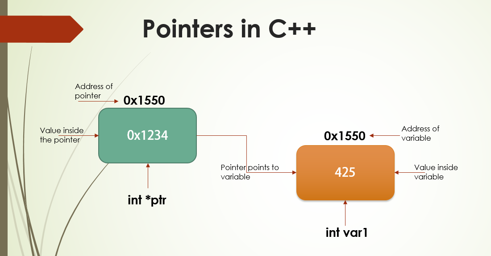
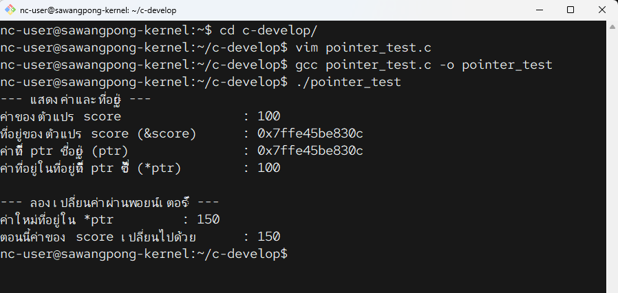

# 03 pointer



`Pointer` (พอยน์เตอร์) คือ **ตัวแปรชนิดพิเศษที่ไม่ได้เก็บ "ค่า" ของข้อมูลโดยตรง แต่เก็บ "ที่อยู่" (Memory Address) ของข้อมูลนั้นๆ** แทนครับ

เปรียบเทียบง่ายๆ เหมือนกับ **บ้าน** 🏠 และ **ที่อยู่ของบ้านบนกระดาษ** 📝

  * **ตัวแปรธรรมดา** (`int score = 100;`): ก็เหมือนกับ **ตัวบ้าน** ที่มี "100" อยู่ข้างใน
  * **พอยน์เตอร์** (`int *ptr;`): ก็เหมือนกับ **กระดาษเปล่า** ที่พร้อมจะจดที่อยู่ของบ้าน
  * เมื่อเราทำ `ptr = &score;`: ก็คือการ **จดที่อยู่ของบ้าน `score` ลงบนกระดาษ `ptr`**

ตอนนี้กระดาษ `ptr` ไม่ได้มีค่า "100" อยู่ในนั้น แต่มีข้อมูลที่บอกว่า "บ้าน `score` ตั้งอยู่ที่ไหน"

-----

## ทำไมถึงต้องใช้ Pointer?

พอยน์เตอร์เป็นหัวใจของภาษา C และมีประโยชน์มหาศาล โดยเฉพาะ:

1.  **เพิ่มประสิทธิภาพ:** เวลาส่งข้อมูลขนาดใหญ่ (เช่น `struct` ที่ซับซ้อน) เข้าไปในฟังก์ชัน แทนที่เราจะคัดลอกข้อมูลไปทั้งก้อน เราส่งแค่ "ที่อยู่" ของมันไป ซึ่งเร็วกว่ามาก
2.  **แก้ไขค่าจากที่อื่น:** ทำให้ฟังก์ชันสามารถ "เอื้อมมือ" ออกไปแก้ไขค่าของตัวแปรที่อยู่นอกฟังก์ชันได้โดยตรง
3.  **จัดการหน่วยความจำแบบไดนามิก:** เป็นเครื่องมือที่จำเป็นสำหรับการจองและคืนหน่วยความจำขณะโปรแกรมทำงาน (ด้วยคำสั่ง `malloc`, `free`)

-----

## เครื่องหมายสำคัญที่ต้องรู้จัก

มีเครื่องหมาย 2 ตัวที่ใช้กับพอยน์เตอร์เสมอ:

1.  `&` **(Address-of Operator)**

      * ทำหน้าที่: ดึง **"ที่อยู่"** ของตัวแปรออกมา
      * อ่านว่า: "ที่อยู่ของ..." (Address of)
      * ตัวอย่าง: `&score` หมายถึง "ขอที่อยู่ของตัวแปร `score`"

2.  `*` **(Dereference Operator)**

      * ทำหน้าที่: เข้าถึง **"ค่า"** ที่อยู่ในที่อยู่นั้นๆ
      * อ่านว่า: "ค่าที่อยู่ในที่อยู่..." (Value at address)
      * ตัวอย่าง: `*ptr` หมายถึง "ไปที่อยู่ที่ `ptr` ชี้อยู่ แล้วเอาค่าข้างในนั้นออกมา"
      * **ข้อสังเกต:** เครื่องหมาย `*` ยังใช้ตอน "ประกาศ" ตัวแปรพอยน์เตอร์ด้วย (`int *ptr;`) ซึ่งเป็นการบอกว่า `ptr` เป็นตัวแปรชนิดพอยน์เตอร์

-----

## ตัวอย่างโค้ดฉบับสมบูรณ์

โปรแกรมนี้จะแสดงการประกาศ, การกำหนดค่า, และการใช้งานพอยน์เตอร์ขั้นพื้นฐาน

```
cd c-develop
vim pointer_test.c
gcc pointer_test.c -o pointer_test
```

```c title="pointer_test.c"
//File pointer_test.c
#include <stdio.h>

int main() {
    // 1. สร้างตัวแปรธรรมดาขึ้นมา 1 ตัว
    int score = 100;

    // 2. สร้างตัวแปรพอยน์เตอร์ (สังเกตเครื่องหมาย *)
    //    ptr ตัวนี้จะเอาไว้เก็บ "ที่อยู่" ของตัวแปรชนิด int เท่านั้น
    int *ptr;

    // 3. นำ "ที่อยู่" ของ score ไปเก็บไว้ใน ptr โดยใช้เครื่องหมาย &
    ptr = &score;

    printf("--- แสดงค่าและที่อยู่ ---\n");
    printf("ค่าของตัวแปร score\t\t: %d\n", score);
    printf("ที่อยู่ของตัวแปร score (&score)\t: %p\n", &score);
    printf("ค่าที่ ptr ชี้อยู่ (ptr)\t\t: %p\n", ptr); // จะได้ที่อยู่เดียวกับ &score
    printf("ค่าที่อยู่ในที่อยู่ที่ ptr ชี้ (*ptr)\t: %d\n", *ptr); // จะได้ค่าเดียวกับ score

    printf("\n--- ลองเปลี่ยนค่าผ่านพอยน์เตอร์ ---\n");

    // 4. เราจะเปลี่ยนค่า "ผ่านพอยน์เตอร์"
    *ptr = 150; // หมายถึง "ไปที่อยู่ที่ ptr ชี้อยู่ แล้วเปลี่ยนค่าข้างในให้เป็น 150"

    printf("ค่าใหม่ที่อยู่ใน *ptr\t\t: %d\n", *ptr);
    printf("ตอนนี้ค่าของ score เปลี่ยนไปด้วย\t: %d\n", score); // score จะกลายเป็น 150

    return 0;
}
```

**ผลลัพธ์ที่อาจจะได้ (เลขที่อยู่จะเปลี่ยนไปทุกครั้งที่รัน):**

```
--- แสดงค่าและที่อยู่ ---
ค่าของตัวแปร score               : 100
ที่อยู่ของตัวแปร score (&score)   : 0x7ffc1b4b9e14
ค่าที่ ptr ชี้อยู่ (ptr)             : 0x7ffc1b4b9e14
ค่าที่อยู่ในที่อยู่ที่ ptr ชี้ (*ptr) : 100

--- ลองเปลี่ยนค่าผ่านพอยน์เตอร์ ---
ค่าใหม่ที่อยู่ใน *ptr              : 150
ตอนนี้ค่าของ score เปลี่ยนไปด้วย     : 150
```



**หมายเหตุ:** `%p` คือ Format Specifier ที่ใช้สำหรับแสดงผลค่า Memory Address ในรูปแบบเลขฐาน 16 (Hexadecimal)