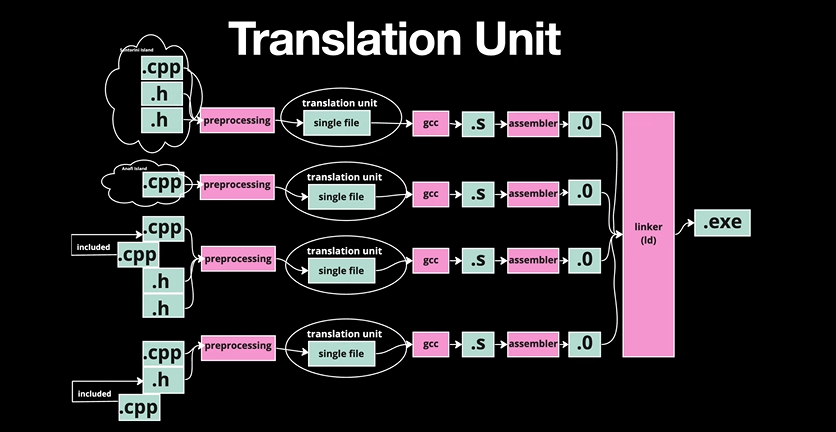
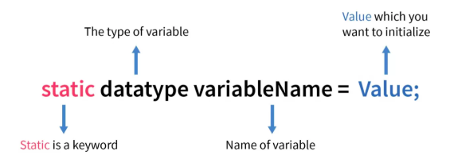

# 05 Static

## Static keyword จะกระทบกับ Scope 



ในภาษา C, `static` คือคีย์เวิร์ด (keyword) ที่ใช้ควบคุมคุณสมบัติ 2 อย่าง  
1. **`static`** เมื่อใช้ร่วมกับ global หรือ function จะสามารถมองให้ได้ เฉพาะ Translation unit   
2. **`static`** สำหรับตัวแปร จะทำให้ ตัวแปรนั้น จะรักษาค่าเอาไว้ (persistent) และ จำกัดการมองเห็น เพียงแค่ฟังก์ชั้น

-----

## 1. Static Local Variables (ตัวแปร static ภายในฟังก์ชัน) 📝

โดยปกติแล้ว ตัวแปรที่ประกาศภายในฟังก์ชัน (Local Variable) จะถูกสร้างขึ้นมาใหม่ทุกครั้งที่ฟังก์ชันถูกเรียก และจะถูกทำลายทิ้งไปเมื่อฟังก์ชันทำงานเสร็จ

แต่ถ้าเราเติม `static` เข้าไปข้างหน้า ตัวแปร มันจะเปลี่ยนพฤติกรรมดังนี้:

  * **Lifetime:** ตัวแปรจะถูกสร้างขึ้น *เพียงครั้งเดียว* -one time initialization และจะคงอยู่ในหน่วยความจำไปตลอดการทำงานของโปรแกรม
  * **Preserved Value:** ค่าของมันจะถูกเก็บรักษาไว้ข้ามการเรียกฟังก์ชัน ทำให้มัน "จำ" ค่าล่าสุดของตัวเองได้




**ตัวอย่าง:** การสร้างฟังก์ชันนับจำนวนครั้งที่ถูกเรียก

```bash title="command"
vim counter.c
```

```c title="counter.c"
#include <stdio.h>

void counterFunction() {
    int normal_counter = 0;      // ตัวแปรปกติ จะถูกรีเซ็ตเป็น 0 ทุกครั้ง
    static int static_counter = 0; // ตัวแปร static จะถูกสร้างและกำหนดค่าเป็น 0 แค่ครั้งแรก

    normal_counter++;
    static_counter++;

    printf("Normal Counter: %d, Static Counter: %d\n", normal_counter, static_counter);
}

int main() {
    printf("Calling first time:\n");
    counterFunction();

    printf("Calling second time:\n");
    counterFunction();

    printf("Calling third time:\n");
    counterFunction();

    return 0;
}
```

**ผลลัพธ์:**

```
gcc -o counter counter.c
./counter

Calling first time:
Normal Counter: 1, Static Counter: 1
Calling second time:
Normal Counter: 1, Static Counter: 2
Calling third time:
Normal Counter: 1, Static Counter: 3
```

จะเห็นว่า `normal_counter` ถูกรีเซ็ตเป็น 0 ทุกครั้งที่ฟังก์ชันทำงาน ในขณะที่ `static_counter` ยังคงจำค่าเดิมและเพิ่มค่าต่อไปได้เรื่อยๆ

-----

## 2. Static Global Variables & Static Functions (นอกฟังก์ชัน) 🔒

โดยปกติ ตัวแปรหรือฟังก์ชันที่ประกาศไว้นอกฟังก์ชัน (Global Scope) จะสามารถถูกเข้าถึงได้จากทุกไฟล์ในโปรเจกต์เดียวกัน (เรียกว่ามี **External Linkage**)

แต่เมื่อเราเติม `static` เข้าไปข้างหน้า มันจะจำกัดการมองเห็น (Visibility) ของตัวแปรหรือฟังก์ชันนั้นๆ:  

  * **Visibility:** จะสามารถเรียกใช้งานได้ **เฉพาะภายในไฟล์ที่มันถูกประกาศไว้เท่านั้น** (เรียกว่ามี **Internal Linkage**) ไฟล์อื่นจะไม่สามารถมองเห็นหรือเข้าถึงได้ แม้จะใช้ `extern` ก็ตาม

สิ่งนี้มีประโยชน์อย่างมากในการ **encapsulation** หรือการซ่อนรายละเอียดการทำงานที่ไม่จำเป็น และป้องกันการตั้งชื่อตัวแปรหรือฟังก์ชันซ้ำซ้อนกันระหว่างไฟล์ (Naming Conflict)

**ตัวอย่าง:** สมมติเรามี 2 ไฟล์ คือ `main.c` และ `helper.c`

**ไฟล์ `helper.c`**

```c
// ตัวแปร global ที่ไฟล์อื่นเข้าถึงได้
int public_variable = 100;

// ตัวแปร static global ที่ใช้ได้แค่ใน helper.c
static int private_variable = 50;

// ฟังก์ชัน static ที่ใช้ได้แค่ใน helper.c
static void private_helper() {
    printf("This is a private helper function.\n");
}

// ฟังก์ชันสาธารณะที่ไฟล์อื่นเรียกได้
void do_something() {
    printf("Accessing private variable from inside: %d\n", private_variable);
    private_helper();
}
```

**ไฟล์ `main.c`**

```bash title="command"
vim main.c
```

```c title="main.c"
#include <stdio.h>

// ประกาศว่าจะใช้ตัวแปรและฟังก์ชันจากไฟล์อื่น
extern int public_variable;
void do_something();

// extern int private_variable; // <-- ถ้าพยายามทำแบบนี้จะเกิด Linker Error!

int main() {
    printf("Public variable: %d\n", public_variable);
    
    // เราเรียกใช้ do_something() ได้ เพราะเป็น public
    do_something();

    // แต่เราไม่สามารถเรียก private_helper() หรือเข้าถึง private_variable โดยตรงได้
    // private_helper(); // <-- บรรทัดนี้จะทำให้เกิด Compile/Linker Error!
    
    return 0;
}
```

```makefile title="Makefile"
# ------------------ Configuration ------------------
# Compiler
CC = gcc
# Compiler flags: -Wall (เปิด warnings ทั้งหมด), -g (ใส่ debugging info)
CFLAGS = -Wall -g

# Name of the final executable
TARGET = my_program

# List of all source (.c) files
SOURCES = main.c help.c
# Automatically create a list of object (.o) files from the source files
OBJECTS = $(SOURCES:.c=.o)


# ------------------ Build Rules ------------------
# Default target: This is what runs when you just type "make"
# It depends on the final executable being built.
all: $(TARGET)

# Rule for linking all the object files (.o) into the final executable
$(TARGET): $(OBJECTS)
	$(CC) $(CFLAGS) -o $(TARGET) $(OBJECTS)

# A generic rule for compiling a .c file into a .o file
# $< is the source file (e.g., main.c)
# $@ is the target file (e.g., main.o)
%.o: %.c
	$(CC) $(CFLAGS) -c $< -o $@


# ------------------ Phony Targets (Actions) ------------------
# Target to run the compiled program
run: all
	./$(TARGET)

# Target to remove all generated files
clean:
	rm -f $(TARGET) $(OBJECTS)

# Declare which targets are "phony" (not actual files)
.PHONY: all run clean
```

-----

## สรุปในตารางเดียว

| บริบทที่ใช้ | ผลต่อ Lifetime (อายุ) | ผลต่อ Visibility (ขอบเขต) | จุดประสงค์หลัก |
| :--- | :--- | :--- | :--- |
| **ตัวแปรในฟังก์ชัน** (Local) | **ยืดอายุ** ให้อยู่ตลอดโปรแกรม | ไม่เปลี่ยนแปลง (เห็นแค่ในฟังก์ชัน) | ทำให้ฟังก์ชันมี "ความจำ" |
| **ตัวแปรนอกฟังก์ชัน** (Global) | ไม่เปลี่ยนแปลง (อยู่ตลอดอยู่แล้ว) | **จำกัดขอบเขต** ให้อยู่แค่ในไฟล์นั้น | ป้องกันการเข้าถึงจากไฟล์อื่น |
| **ฟังก์ชัน** | ไม่เปลี่ยนแปลง (อยู่ตลอดอยู่แล้ว) | **จำกัดขอบเขต** ให้อยู่แค่ในไฟล์นั้น | ซ่อนฟังก์ชันช่วย (helper) จากไฟล์อื่น |

---

## **Workshop: ตัวอย่างโปรแกรมภาษา C ที่เกี่ยวกับการใช้คำสั่ง `static` ในบริบทต่างๆ ครับ**

## 1. Static Variable ใน Function

```bash title="command"
vim static_counter.c
```

```c title="static_counter.c"

#include <stdio.h>

void counter() {
    static int count = 0; // เก็บค่าไว้ระหว่างการเรียกฟังก์ชัน
    count++;
    printf("Count: %d\n", count);
}

int main() {
    counter(); // Count: 1
    counter(); // Count: 2
    counter(); // Count: 3
    return 0;
}
```

## 2. Static Global Variable

```bash title="command"
vim static_global.c
```

```c title="static_global.c"
#include <stdio.h>

static int internal_var = 100; // ใช้ได้เฉพาะในไฟล์นี้

void display() {
    printf("Internal variable: %d\n", internal_var);
}

int main() {
    display();
    internal_var = 200;
    display();
    return 0;
}
```

## 3. Static Function

**file1.c:**
```bash title="command"
vim file1.c
```

```c title="file1.c"
#include <stdio.h>

static void private_function() { // ใช้ได้เฉพาะในไฟล์นี้
    printf("This is a private function\n");
}

void public_function() {
    printf("Calling private function: ");
    private_function();
}
```

**main.c:**
```bash title="command"
vim main.c
```

```c title="main.c"
#include <stdio.h>

// extern void private_function(); // จะ error เพราะเป็น static
extern void public_function();

int main() {
    public_function();
    // private_function(); // compile error
    return 0;
}
```

## 4. Static ใน Structure (C99 ขึ้นไป)

```bash title="command"
vim static_struct.c
```

```c title="static_struct.c"
#include <stdio.h>

struct Example {
    int normal_var;
    static int static_var; // ต้องกำหนดค่าที่ไฟล์ scope
};

int Example::static_var = 50; // กำหนดค่าสำหรับ static member

int main() {
    struct Example ex1, ex2;
    ex1.normal_var = 10;
    ex2.normal_var = 20;
    
    printf("ex1 normal: %d\n", ex1.normal_var);
    printf("ex2 normal: %d\n", ex2.normal_var);
    printf("Static variable: %d\n", Example::static_var);
    
    return 0;
}
```

## 5. Static Array ใน Function

```bash title="command"
vim static_array.c
```

```c title="static_array.c"
#include <stdio.h>

void process_data() {
    static int data[5] = {0}; // เก็บค่า array ระหว่างการเรียกฟังก์ชัน
    
    printf("Data: ");
    for(int i = 0; i < 5; i++) {
        data[i] += i + 1;
        printf("%d ", data[i]);
    }
    printf("\n");
}

int main() {
    process_data(); // Data: 1 2 3 4 5
    process_data(); // Data: 2 4 6 8 10
    process_data(); // Data: 3 6 9 12 15
    return 0;
}
```

## 6. Static กับ Pointer

```bash title="command"
vim static_pointer.c
```
```c title="static_pointer.c"
#include <stdio.h>

char* get_buffer() {
    static char buffer[100]; // เก็บ memory ไว้ไม่หายเมื่อออกจากฟังก์ชัน
    return buffer;
}

int main() {
    char* buf1 = get_buffer();
    char* buf2 = get_buffer();
    
    sprintf(buf1, "Hello");
    printf("Buffer 1: %s\n", buf1); // Hello
    printf("Buffer 2: %s\n", buf2); // Hello (ชี้ไปที่เดียวกัน)
    
    sprintf(buf2, "World");
    printf("Buffer 1: %s\n", buf1); // World
    printf("Buffer 2: %s\n", buf2); // World
    
    return 0;
}
```

## 7. Static ในการนับ Object (แบบง่าย)

```c title="static_object.c"
#include <stdio.h>

struct Object {
    int id;
    static int count; // นับจำนวน object
};

int Object::count = 0;

void create_object(struct Object *obj) {
    obj->id = Object::count++;
}

int main() {
    struct Object obj1, obj2, obj3;
    
    create_object(&obj1);
    create_object(&obj2);
    create_object(&obj3);
    
    printf("Object 1 ID: %d\n", obj1.id);
    printf("Object 2 ID: %d\n", obj2.id);
    printf("Object 3 ID: %d\n", obj3.id);
    printf("Total objects: %d\n", Object::count);
    
    return 0;
}
```

## สรุปคุณสมบัติของ static:
1. **ในฟังก์ชัน**: ตัวแปรคงค่าตลอดการทำงานของโปรแกรม
2. **ในไฟล์**: จำกัด scope ให้ใช้ได้เฉพาะในไฟล์นั้น
3. **ในฟังก์ชัน**: ทำให้ฟังก์ชันใช้ได้เฉพาะในไฟล์นั้น
4. **ใน structure**: เป็นตัวแปรที่แชร์กันระหว่าง instance ทั้งหมด

