# 06 C สำหรับเตรียม kernel Developer


การตั้งเป้าหมายเป็น Linux Kernel Developer เป็นเส้นทางที่ท้าทายแต่ก็น่าภาคภูมิใจอย่างยิ่ง ภาษา C คือหัวใจสำคัญที่สุดของการพัฒนานี้ นี่คือแผนการเตรียมตัวและเรียนรู้ภาษา C ที่เน้นเฉพาะสำหรับการเป็นนักพัฒนาเคอร์เนลโดยเฉพาะครับ

- ใช้เวลาสักนิด เข้าไปที่
[https://kernelnewbies.org/kernelbuild](https://kernelnewbies.org/kernelbuild)

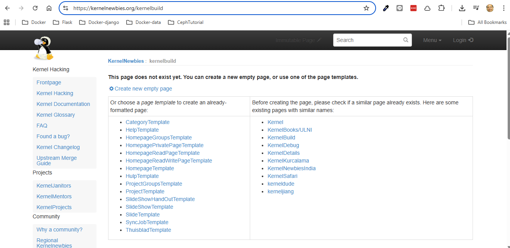

```
git log --pretty=oneline --abbrev-commit
```
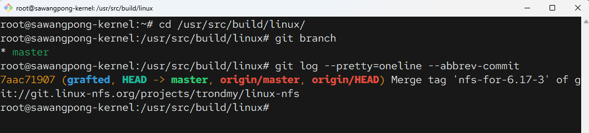

- Kernel Docs
[https://www.kernel.org/doc/html/latest/](https://www.kernel.org/doc/html/latest/)

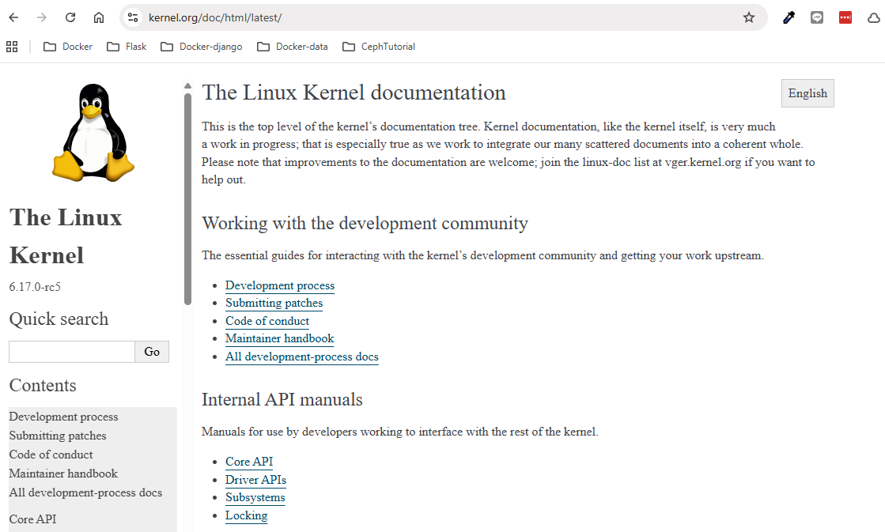

```bash title="check kernel version"
root@sawangpong-kernel:/usr/src/build/linux# uname -r
6.17.0-rc5+
```

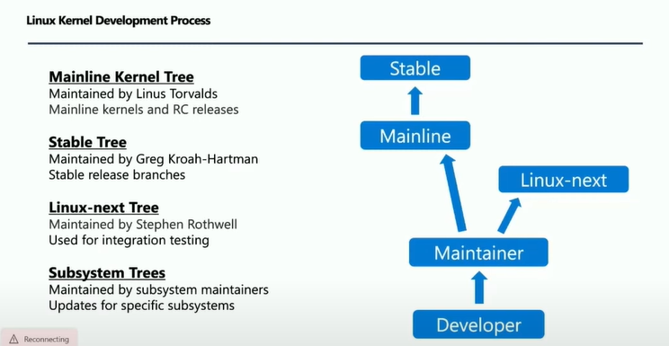

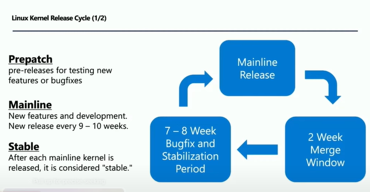

-----

### ภาพรวมการเตรียมตัว

การพัฒนาเคอร์เนลไม่ใช่แค่การเขียน C ทั่วไป แต่เป็นการเขียน C สำหรับ "ระบบ" (Systems Programming) ซึ่งต้องเข้าใจลึกซึ้งถึงการทำงานของฮาร์ดแวร์ การจัดการหน่วยความจำ และการทำงานพร้อมกัน (Concurrency)

เราจะแบ่งการเตรียมตัวเป็น 4 ขั้นตอนหลักครับ

## ขั้นที่ 1: เชี่ยวชาญภาษา C (ในระดับลึก)

เริ่มต้นจากการเขียน C ให้แข็งแกร่งเหมือนเป็นส่วนหนึ่งของร่างกาย โดยต้องเน้นเรื่องเหล่านี้เป็นพิเศษ เพราะในเคอร์เนลจะใช้บ่อยมาก:

#### **1. พอยเตอร์ (Pointers) - สำคัญที่สุด** ⭐⭐⭐⭐⭐

คุณต้องเข้าใจพอยเตอร์ในทุกมิติ เพราะโค้ดในเคอร์เนลแทบทั้งหมดล้วนเกี่ยวกับพอยเตอร์และการเข้าถึงหน่วยความจำโดยตรง

  * **Pointer Basics:** การประกาศ, การ dereference (`*`), การหา address (`&`)
  * **Pointer Arithmetic:** การบวก-ลบพอยเตอร์เพื่อเลื่อนตำแหน่งในหน่วยความจำ (สำคัญมากในการจัดการ Array และ Buffer)
  * **Pointers to Pointers (`**ptr`)**: การชี้ไปยังพอยเตอร์อีกตัว
  * **Function Pointers**: การใช้พอยเตอร์ชี้ไปยังฟังก์ชัน ใช้ในระบบ callback และ driver-model เยอะมาก
  * **`void*` Pointers**: พอยเตอร์ทั่วไปที่ใช้รับหรือส่งข้อมูลได้ทุกประเภท
  * **`NULL` Pointer**: เข้าใจความหมายและการตรวจสอบค่า `NULL`

**ตัวอย่าง (Function Pointer):**

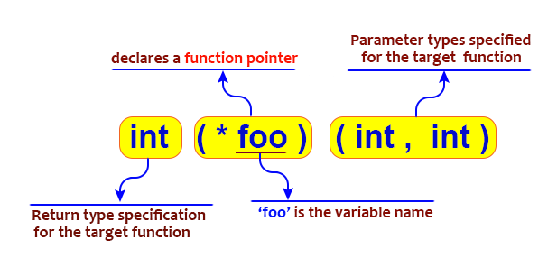

```
cd c-develop
vim function_pointer_test.c
gcc function_pointer_test.c -o function_pointer_test
./function_pointer_test
```
```c title="function_pointer_test.c"
#include <stdio.h>

void say_hello() {
    printf("Hello!\n");
}

int add(int a, int b) {
    return a + b;
}

int main() {
    // ประกาศ function pointer ที่ชี้ไปยังฟังก์ชันที่ไม่มี argument และไม่คืนค่า
    void (*ptr_hello)();
    ptr_hello = &say_hello; // ชี้ไปที่ฟังก์ชัน say_hello

    // ประกาศ function pointer ที่ชี้ไปยังฟังก์ชันที่รับ int 2 ตัวและคืนค่า int
    int (*ptr_add)(int, int);
    ptr_add = &add;

    // เรียกใช้ฟังก์ชันผ่าน pointer
    (*ptr_hello)();
    int result = (*ptr_add)(10, 5);
    printf("Result: %d\n", result);

    return 0;
}
```

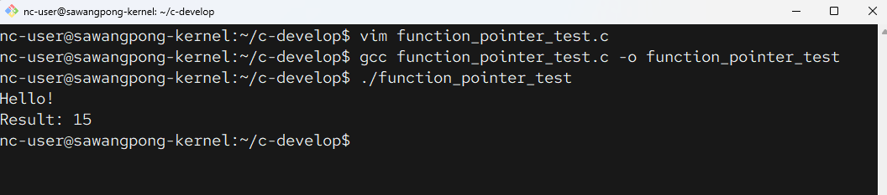

-----

#### **2. การจัดการหน่วยความจำ (Memory Management)**

แม้ว่าในเคอร์เนลจะไม่ได้ใช้ `malloc()` หรือ `free()` แต่จะใช้ฟังก์ชันของตัวเองอย่าง `kmalloc()`, `kzalloc()`, `kfree()` แต่คอนเซ็ปต์ยังคงเดิม คือการเข้าใจ **Stack vs. Heap**

  * **Stack:** หน่วยความจำสำหรับตัวแปร local ในฟังก์ชัน (จัดการอัตโนมัติ)
  * **Heap:** หน่วยความจำที่คุณต้องจัดการเอง (ขอใช้งานและคืนเมื่อเลิกใช้)
  * ทำความเข้าใจเรื่อง Memory Leaks และ Dangling Pointers

-----

#### **3. โครงสร้างข้อมูล (Structs & Unions) และ Bit-fields**

เคอร์เนลเต็มไปด้วย `struct` ที่ซับซ้อนเพื่อจัดการข้อมูลต่างๆ เช่น process, file, network packet

  * **`struct`**: การจัดกลุ่มตัวแปรหลายๆ ตัวไว้ด้วยกัน
  * **`union`**: การใช้พื้นที่หน่วยความจำเดียวกันสำหรับตัวแปรหลายตัว (ช่วยประหยัดที่)
  * **Bit-fields**: การกำหนดขนาดของสมาชิกใน `struct` เป็นจำนวนบิต เพื่อประหยัดพื้นที่ให้ได้มากที่สุด (ใช้เยอะมากในการควบคุม hardware register)

**ตัวอย่าง (Bit-fields):**
```
cd c-develop
vim bitfield_test.c
gcc bitfield_test.c -o bitfield_test
./bitfield_test
```
```c title="bitfield_test.c"
//File bitfield_test.c
#include <stdio.h>

// Struct นี้ใช้พื้นที่แค่ 4 bytes (ขนาดของ int)
struct hardware_flags {
    unsigned int is_ready    : 1; // ใช้ 1 บิต
    unsigned int is_error    : 1; // ใช้ 1 บิต
    unsigned int mode        : 2; // ใช้ 2 บิต (เก็บค่า 0-3)
    unsigned int reserved    : 28; // จองที่ที่เหลือ
};

int main() {
    struct hardware_flags flags;
    flags.is_ready = 1;
    flags.is_error = 0;
    flags.mode = 2;

    printf("Size of struct: %zu bytes\n", sizeof(flags));

    if (flags.is_ready) {
        printf("Device is ready in mode %u\n", flags.mode);
    }
    return 0;
}
```

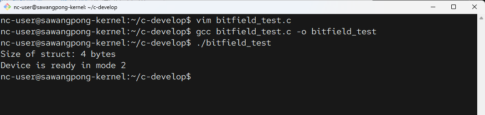

-----

#### **4. การดำเนินการระดับบิต (Bitwise Operations)**

เป็นทักษะที่ขาดไม่ได้เลยสำหรับการเขียนโปรแกรมระดับล่าง เพื่อควบคุม Flags หรือจัดการข้อมูลในระดับบิต

  * `&` (AND), `|` (OR), `^` (XOR), `~` (NOT)
  * `<<` (Left Shift), `>>` (Right Shift)

**ตัวอย่าง:** ใช้สำหรับตั้งค่า (set), ล้างค่า (clear), และตรวจสอบ (check) บิต

```
cd c-develop
vim bitwise_operate_test.c
gcc bitwise_operate_test.c -o bitwise_operate_test
./bitwise_operate_test
```
```c title="bitwise_operate_test.c"
//File "bitwise_operate_test.c"
#include <stdio.h>

#define FLAG_A 0b0001  // 1
#define FLAG_B 0b0010  // 2
#define FLAG_C 0b0100  // 4

int main() {
    unsigned char status = 0; // เริ่มต้นไม่มี flag ใดๆ

    // ตั้งค่า FLAG_A และ FLAG_C
    status |= FLAG_A;
    status |= FLAG_C;

    // ตรวจสอบว่า FLAG_A ถูกตั้งค่าหรือไม่
    if (status & FLAG_A) {
        printf("FLAG_A is set.\n");
    }

    // ล้างค่า FLAG_C ออก
    status &= ~FLAG_C;

    return 0;
}
```


-----

#### **5. ความเข้าใจใน C Preprocessor, Keywords อื่นๆ**

  * **Preprocessor:** `#include`, `#define` (Macros), `#if`, `#ifdef` (ใช้เยอะมากในการทำให้โค้ดรองรับหลายสถาปัตยกรรม)
  * **Keywords:** `static`, `const`, `volatile`, `extern`. ต้องเข้าใจความแตกต่างและความหมายของแต่ละตัวอย่างแม่นยำ

## ขั้นที่ 2: เรียนรู้เครื่องมือ (Toolchain) ที่จำเป็น

เขียนโค้ดอย่างเดียวไม่พอ ต้องใช้เครื่องมือให้เป็นด้วย

1.  **Compiler (GCC):** เรียนรู้การใช้ GCC ผ่าน Command Line ไม่ใช่แค่ใน IDE รู้จักแฟล็ก (flag) ที่สำคัญ เช่น `-g` (สำหรับ debug), `-Wall` (เปิด warning ทั้งหมด), `-O` (ปรับแต่ง optimization)
2.  **Build System (Make & Makefiles):** เคอร์เนลมีขนาดใหญ่มาก การ build จะใช้ `make` คุณต้องอ่านและเข้าใจ Makefile ได้ว่ามันทำงานอย่างไร
3.  **Version Control (Git):** Linux Kernel พัฒนาด้วย Git นี่คือเครื่องมือที่ **ต้องใช้ให้เป็น** ฝึกใช้ `git clone`, `git branch`, `git log`, `git diff`, `git commit` ให้คล่อง
4.  **Debugger (GDB):** ฝึกการใช้ GDB เพื่อหาข้อผิดพลาดในโปรแกรม C ของคุณ การไล่โค้ดทีละบรรทัด, ดูค่าตัวแปร, ตรวจสอบ memory จะช่วยคุณได้มากเมื่อเจอบั๊กในเคอร์เนล

## ขั้นที่ 3: ศึกษาทฤษฎีระบบปฏิบัติการ (OS Concepts)

ตอนนี้คุณมีทักษะภาษา C และเครื่องมือแล้ว ต่อไปคือการเติมความรู้ว่า "เคอร์เนล" ทำอะไร

  * **Process & Thread Management:** การสร้าง, การจัดตารางเวลา (Scheduling), การสื่อสารระหว่างโปรเซส (IPC)
  * **Memory Management:** หน่วยความจำเสมือน (Virtual Memory), Paging, Page Tables
  * **System Calls & Interrupts:** กลไกการสื่อสารระหว่าง User-space และ Kernel-space
  * **Concurrency & Synchronization:** เข้าใจปัญหา Race Condition และรู้จักวิธีป้องกันด้วย Mutex, Spinlock, Semaphore
  * **File Systems:** VFS (Virtual File System), Inode, Dentry

## ขั้นที่ 4: ลงมือปฏิบัติกับ Linux Kernel 🐧

เมื่อพร้อมแล้ว ก็ถึงเวลาลงสนามจริง

1.  **ติดตั้ง Linux:** ใช้ Distribution ที่ยืดหยุ่น เช่น Arch Linux, Gentoo หรือ Debian เพื่อให้คุณคุ้นเคยกับระบบอย่างลึกซึ้ง
2.  **โหลด Source Code:** ใช้ `git clone` เพื่อดึง source code ของเคอร์เนลมาทั้ง หมด
    ```bash
    git clone https://git.kernel.org/pub/scm/linux/kernel/git/torvalds/linux.git
    ```
3.  **Compile Kernel ของตัวเอง:** ลองตั้งค่า (`make menuconfig`) และคอมไพล์เคอร์เนลเวอร์ชันของคุณเอง แล้วบูทเครื่องด้วยเคอร์เนลนั้น นี่เป็นเหมือน "Hello, World\!" ของวงการนี้
4.  **เริ่มอ่านโค้ด:** เลือกส่วนที่คุณสนใจ เช่น driver ง่ายๆ หรือ file system เล็กๆ แล้วเริ่มอ่านโค้ดเพื่อทำความเข้าใจ
5.  **เริ่มลงมือแก้ไขเล็กๆ น้อยๆ:**
      * **แก้ไขคำผิด (Typo) ใน Comment หรือ Documentation:** เป็นวิธีเริ่มต้นที่ดีที่สุดในการส่ง patch แรก
      * **แก้ Warning จาก Compiler:** เปิด warning ทั้งหมดแล้วลองแก้โค้ดให้ warning หายไป
      * **เข้าร่วม Community:** อ่าน Linux Kernel Mailing List (LKML) เพื่อดูว่าคนอื่นคุยอะไรกัน, เรียนรู้วัฒนธรรมและขั้นตอนการส่งงาน


## Kernel Mailing list
[vger.kernel.org](vger.kernel.org)

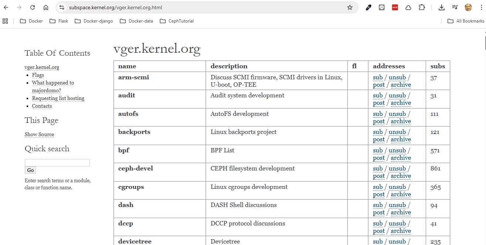

[lore.kernel.org](lore.kernel.org)

## report bug
[https://bugzilla.kernel.org](https://bugzilla.kernel.org)


## Example
[https://www.phoronix.com/news/Linux-617-Better-Nouveau-Stable](https://www.phoronix.com/news/Linux-617-Better-Nouveau-Stable)
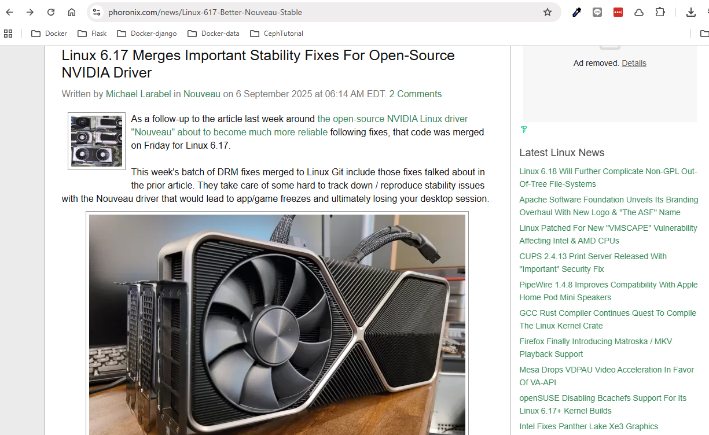

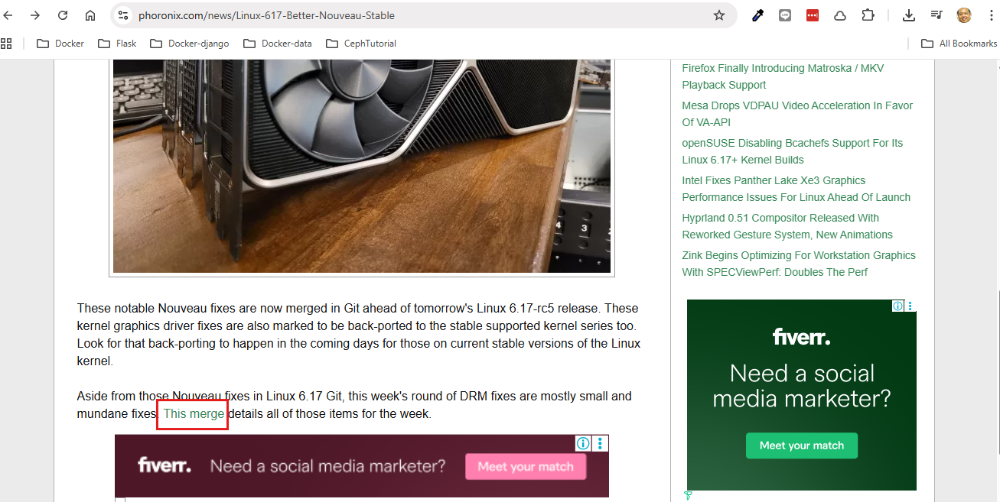

click view [this merge](https://git.kernel.org/pub/scm/linux/kernel/git/torvalds/linux.git/commit/?id=c8ed9b5c02a5ceb3d8244f3862a7e64cf0b5648e)