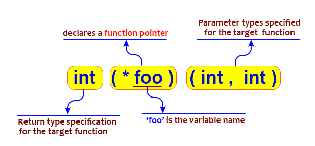

# Ref 02 Function pointer

การประกาศ **"ฟังก์ชันพอยเตอร์" (Function Pointer)** ซึ่งเป็นหนึ่งในคอนเซ็ปต์ที่ทรงพลังและสำคัญมากในภาษา C โดยเฉพาะในการเขียนโปรแกรมระดับระบบ (System Programming) อย่าง Kernel

พูดง่ายๆ **ฟังก์ชันพอยเตอร์ คือ ตัวแปรที่ไม่ได้เก็บค่าข้อมูลทั่วไป แต่เก็บ "ที่อยู่" ของฟังก์ชันอื่น** ครับ

---

!!! info "Function Pointer"
    เรียนรู้พื้นฐาน การใข้งาน Function pointer
    
## การถอดรหัส Syntax

เรามาแยกส่วนประกอบของตัวอย่างนี้กันทีละชิ้นนะครับ:
`int (*bind)(struct net *net, int group);`

1.  **`int`**
    * นี่คือ **ชนิดข้อมูลที่ส่งกลับ (Return Type)** ของฟังก์ชันที่พอยเตอร์ตัวนี้จะชี้ไป
    * หมายความว่า ฟังก์ชันใดๆ ที่จะให้พอยเตอร์ `bind` ชี้ไปได้ จะต้องเป็นฟังก์ชันที่คืนค่าเป็น `int` เท่านั้น

2.  **`(*bind)`**
    * นี่คือส่วนที่สำคัญที่สุดในการประกาศฟังก์ชันพอยเตอร์
    * `bind` คือ **ชื่อของตัวแปรพอยเตอร์**
    * วงเล็บ `()` ที่อยู่รอบ `*bind` มีความสำคัญอย่างยิ่ง มันเป็นการบอก Compiler ว่า "`bind` เป็นพอยเตอร์" ที่ชี้ไปยังฟังก์ชัน
    * **ข้อควรระวัง:** ถ้าไม่มีวงเล็บ เช่น `int *bind(...)` มันจะกลายเป็นการประกาศ "ฟังก์ชันชื่อ `bind` ที่คืนค่าเป็นพอยเตอร์ชนิด `int *`" ซึ่งความหมายต่างกันโดยสิ้นเชิง

3.  **`(struct net *net, int group)`**
    * นี่คือ **รายการพารามิเตอร์ (Parameter List)** หรือที่เรียกว่า **"ซิกเนเจอร์" (Signature)** ของฟังก์ชัน
    * มันกำหนดว่าฟังก์ชันที่พอยเตอร์ `bind` จะชี้ไปได้นั้น จะต้องรับพารามิเตอร์ 2 ตัว คือ:
        1.  ตัวแรกต้องเป็นพอยเตอร์ชนิด `struct net *`
        2.  ตัวที่สองต้องเป็น `int`

**สรุป:** การประกาศ `int (*bind)(struct net *net, int group);` คือการสร้างตัวแปรพอยเตอร์ชื่อ `bind` ซึ่งสามารถเก็บได้เฉพาะที่อยู่ของฟังก์ชันที่ "รับ `struct net *` กับ `int` เป็นอินพุต และคืนค่าเป็น `int`" เท่านั้น

---

## แล้วมันมีประโยชน์อย่างไร? 🤔

ลองนึกภาพว่าฟังก์ชันพอยเตอร์เป็นเหมือน "รายชื่อผู้ติดต่อ" ในโทรศัพท์มือถือ:
* ตัวแปรพอยเตอร์ (`bind`) คือ **ชื่อผู้ติดต่อ** เช่น "ช่างซ่อม"
* ที่อยู่ของฟังก์ชัน คือ **เบอร์โทรศัพท์** ของช่างซ่อมคนนั้นจริงๆ

คุณสามารถเปลี่ยนเบอร์โทรศัพท์ในรายชื่อ "ช่างซ่อม" ได้ตลอดเวลา วันนี้อาจจะเป็นเบอร์ของนาย A พรุ่งนี้อาจจะเปลี่ยนเป็นเบอร์ของนาย B แต่เวลาคุณจะเรียกใช้ คุณก็แค่กดโทรออกจากรายชื่อ "ช่างซ่อม" เหมือนเดิม

ในทางโปรแกรมมิ่ง นี่คือการทำให้โค้ดของเรายืดหยุ่นมาก:
1.  **Callbacks:** เป็นการใช้ที่พบบ่อยที่สุด (เหมือนในตัวอย่าง `netlink_kernel_cfg`) เราส่งฟังก์ชันของเราไปให้ระบบอื่นเก็บไว้ในฟังก์ชันพอยเตอร์ พอถึงเวลาที่เหมาะสม ระบบนั้นก็จะเรียกใช้ฟังก์ชันของเรากลับมาเอง
2.  **เปลี่ยนพฤติกรรมโปรแกรมตอน Runtime:** เราสามารถเขียนโค้ดหลักไว้ชุดเดียว แล้วเปลี่ยนฟังก์ชันที่พอยเตอร์ชี้ไปตามสถานการณ์ต่างๆ ได้ ทำให้โค้ดไม่ต้องใช้ `if-else` หรือ `switch-case` ที่ซับซ้อน
3.  **สร้าง Plugin หรือ Module:** ระบบหลักสามารถเรียกใช้ฟังก์ชันจาก Plugin ที่โหลดเข้ามาใหม่ได้ โดยไม่จำเป็นต้องรู้จักฟังก์ชันเหล่านั้นตอนคอมไพล์ แค่รู้ว่า Plugin ต้องมีฟังก์ชันที่มีซิกเนเจอร์ตรงกับที่ฟังก์ชันพอยเตอร์กำหนดไว้

---

## สรุปตัวอย่างทั้งหมด

| การประกาศ (Declaration)                            | ชื่อพอยเตอร์ | ต้องชี้ไปยังฟังก์ชันที่...                                |
| --------------------------------------------------- | ------------ | --------------------------------------------------------- |
| `void (*input)(struct sk_buff *skb);`               | `input`      | รับ `struct sk_buff *` และ **ไม่คืนค่า** (`void`)          |
| `int (*bind)(struct net *net, int group);`          | `bind`       | รับ `struct net *` และ `int` และคืนค่าเป็น `int`          |
| `void (*unbind)(struct net *net, int group);`       | `unbind`     | รับ `struct net *` และ `int` และ **ไม่คืนค่า** (`void`)    |
| `bool (*compare)(struct net *net, struct sock *sk);` | `compare`    | รับ `struct net *` และ `struct sock *` และคืนค่าเป็น `bool` |