# 01 Introduction Memory management part 1

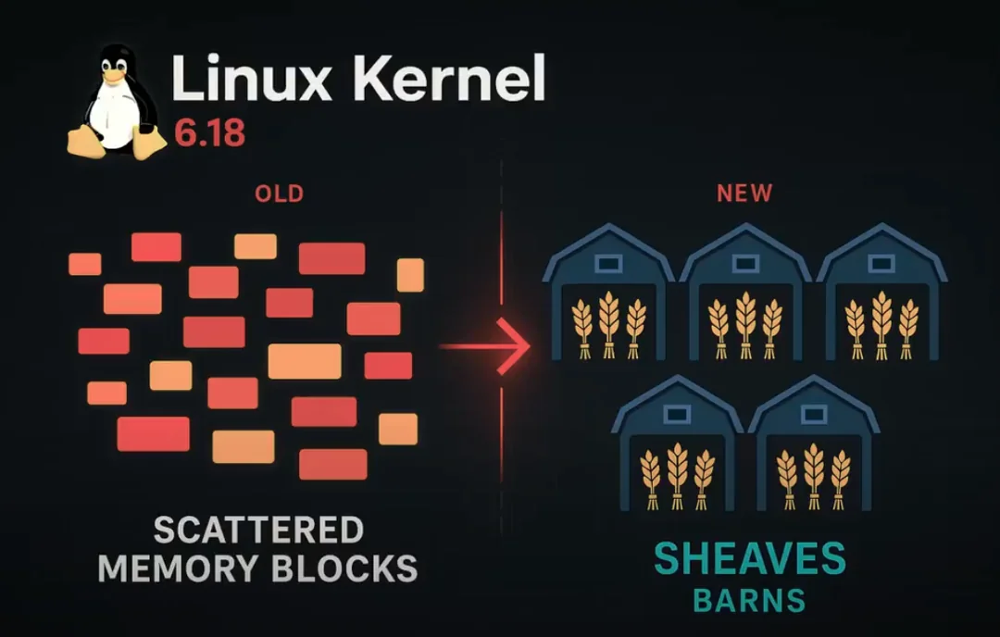

[https://www.phoronix.com/news/Linux-6.18-Likely-Sheaves](https://www.phoronix.com/news/Linux-6.18-Likely-Sheaves)

!!! note "ประยุกต์การใช้ fzf ร่วมกับ vim"
      $ sudo apt install fzf  -y
      $ cd /usr/src/build/linux  
      $ vim -c "set number" $(fzf)  

      # เพิ่มบรรทัดนี้ในไฟล์ ~/.bashrc หรือ ~/.zshrc  
      $ vim ~/.bashrc  
      $ alias vimfzf='vim -c "set number" $(fzf)'   
      $ source ~/.bashrc    
      $ vimfzf  

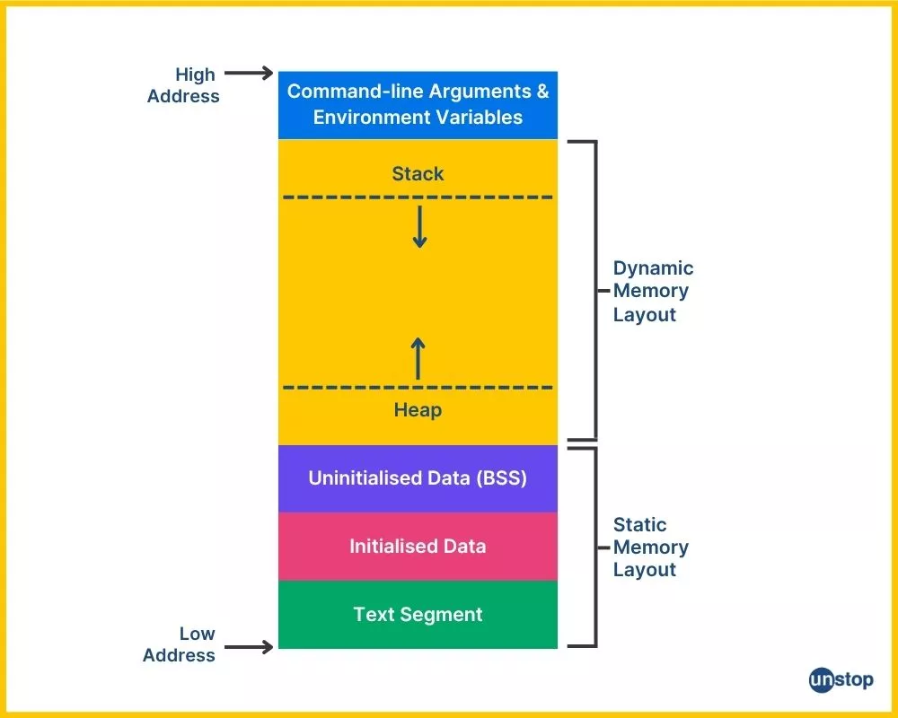

## Single Memory Address space Arm Cortex microcontroller

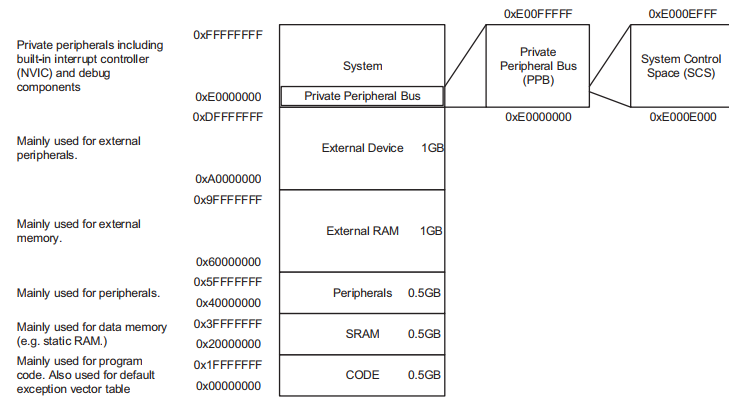
- Single Address space สำหรับระบบปฏิบัติการ ของ Arm Cortex โดยที่ทุกๆ process , kernel สามารถเข้าถึง หน่วยความจำได้ ขาดการจัดการเรื่อง Security   
- Virtual memory จึงเข้ามาเพื่อจัดการการการเข้าถึง memomy ของแต่และ Process
  


## Fragmentation

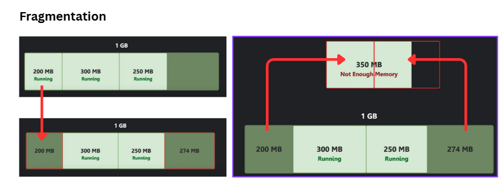

## Insufficient Memory
- สรุปการคำนวน memory
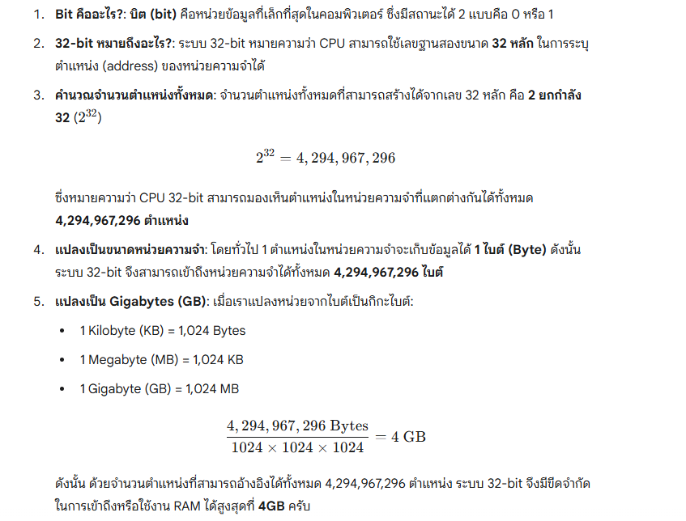
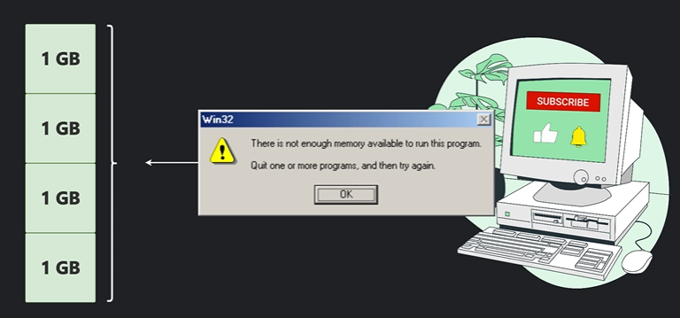

- ปัญหาการที่ โปรแกรม โหลดไปยัง physical memory โดยตรง โปรแกรมปัจจุบันมีความต้องการใช้ memory มากขึ้น
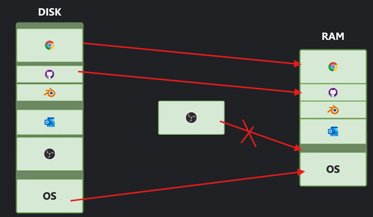

- ทำให้ OS จะต้องแก้ปัญหา. OS จึงต้องพัฒนาการใช้ memory เรียกว่า Virtual Memory และ ทำการเชื่อมต่อไปยัง Physical Address
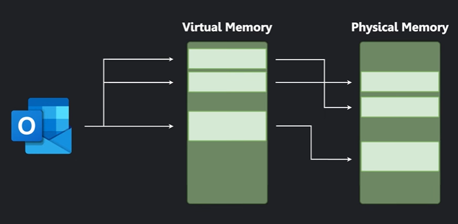

- แต่ละ Process ที่ Start ก็จะมีพื้นที่ Virtual memory แยกจากกัน  โดยที่ แต่ละ Process ไม่ได้รับรู้เกี่ยวกับ Map memory ของ Physical Address เลย และเนื่องจากแต่ละ process ทำงานอยู่ใน Virtual memory ทำให้ไม่สามารถเข้าถึง process อื่นด้วยเช่นเดียวกัน
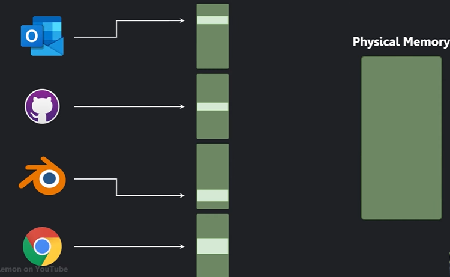


- แต่ระบบก็ยังมีปัญหา ข้อจำกัดของ Physical memory เหมือนเดิม  OS แก้ปัญหาดังกล่าวใช้ SWAP
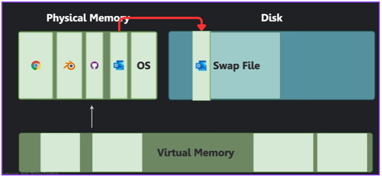

**Swap memory** ใน Linux kernel คือกลไกหน่วยความจำเสมือนที่ช่วยให้ระบบสามารถย้ายข้อมูลบางส่วนจากหน่วยความจำหลัก (RAM) ซึ่งมีพื้นที่จำกัด ไปเก็บไว้ยังพื้นที่บนฮาร์ดดิสก์หรือ SSD ชั่วคราวได้ พื้นที่นี้เรียกว่า **"swap space"** หรือ **"swap partition"** 💾

การทำงานของ swap memory ช่วยให้ระบบปฏิบัติการสามารถทำงานต่อไปได้แม้ว่า RAM จริงจะถูกใช้งานจนเต็ม ทำให้สามารถรันโปรแกรมที่มีขนาดใหญ่กว่า RAM ที่มีอยู่ หรือรันโปรแกรมจำนวนมากพร้อมกันได้

---

### การทำงานหลักของ Swap Memory ใน Linux Kernel

การจัดการ swap memory ใน Linux kernel มีกระบวนการหลักๆ ดังนี้:

**1. การจัดสรรพื้นที่ Swap (Swap Activation)**
เมื่อระบบบูตขึ้นมา หรือเมื่อผู้ดูแลระบบสั่งเปิดใช้งาน (swapon) kernel จะกำหนดพื้นที่บนดิสก์ที่ระบุไว้ให้เป็น swap space และสร้างโครงสร้างข้อมูลภายในเพื่อติดตามการใช้งานพื้นที่ส่วนนี้

**2. การคัดเลือกหน้าหน่วยความจำ (Page Selection)**
เมื่อ RAM ของระบบเหลือน้อยลง kernel จะต้องตัดสินใจว่าจะย้ายข้อมูลหน้าไหน (page) ออกจาก RAM ไปไว้ที่ swap space กระบวนการนี้เรียกว่า **"paging out"** หรือ **"swapping out"** โดย kernel จะพิจารณาจาก:

* **หน้าหน่วยความจำที่ไม่ถูกใช้งาน (Inactive Pages):** kernel จะพยายามเลือกหน้าที่ไม่ได้ถูกเข้าถึงมาเป็นเวลานานก่อน เพราะมีโอกาสน้อยที่จะถูกเรียกใช้อีกในเร็วๆ นี้
* **ประเภทของหน้า:** โดยทั่วไป kernel จะเลี่ยงการ swap หน้าที่เกี่ยวกับ kernel โดยตรง และจะเน้นไปที่หน้าของโปรแกรมผู้ใช้งาน (user-space applications)

**3. กระบวนการ Swapping Out (ย้ายข้อมูลจาก RAM ไปยัง Disk)**
เมื่อ kernel เลือกหน้าที่จะย้ายได้แล้ว จะเกิดขั้นตอนดังนี้:
* ข้อมูลในหน้านั้นจะถูกคัดลอกไปยังพื้นที่ว่างใน swap space บนดิสก์
* ตารางหน้าหน่วยความจำ (page table) ของโปรแกรมนั้นๆ จะถูกอัปเดตเพื่อชี้ว่าข้อมูลหน้านี้ไม่ได้อยู่ใน RAM แล้ว แต่ถูกย้ายไปที่ swap space
* พื้นที่ใน RAM ที่เคยเก็บหน้านั้นจะถูกปล่อยให้เป็นอิสระ เพื่อให้ระบบนำไปใช้งานอื่นต่อไป

**4. กระบวนการ Swapping In (ย้ายข้อมูลจาก Disk กลับมายัง RAM)**
เมื่อโปรแกรมต้องการเข้าถึงข้อมูลในหน้าที่ถูกย้ายไป swap space แล้ว จะเกิดเหตุการณ์ที่เรียกว่า **"page fault"** ซึ่งจะกระตุ้นให้ kernel ทำงานดังนี้:
* Kernel จะหยุดการทำงานของโปรแกรมนั้นชั่วคราว
* ค้นหาพื้นที่ว่างใน RAM
* คัดลอกข้อมูลจาก swap space บนดิสก์กลับมายังพื้นที่ว่างใน RAM
* อัปเดตตารางหน้าหน่วยความจำ (page table) อีกครั้งเพื่อชี้ไปยังตำแหน่งใหม่ใน RAM
* โปรแกรมจะกลับมาทำงานต่อได้ตามปกติ


---

### ส่วนประกอบสำคัญที่เกี่ยวข้อง

* **kswapd (Kernel Swap Daemon):** เป็นกระบวนการเบื้องหลัง (background process) ที่ทำงานใน kernel มีหน้าที่คอยตรวจสอบสถานะของ RAM อยู่ตลอดเวลา หากพบว่า RAM เริ่มเหลือน้อย kswapd จะเริ่มทำการ swapping out หน้าที่ไม่ถูกใช้งานล่วงหน้าอย่างค่อยเป็นค่อยไป เพื่อป้องกันไม่ให้ระบบหยุดชะงักกะทันหันเมื่อ RAM หมดจริงๆ

* **Swappiness:** เป็นพารามิเตอร์ใน kernel (ค่าอยู่ระหว่าง 0-100) ที่ใช้ปรับแต่งพฤติกรรมการ swap ของระบบ
    * **Swappiness สูง (เช่น 100):** kernel จะพยายามย้ายข้อมูลไปยัง swap space อย่างจริงจัง แม้ว่า RAM จะยังพอมีที่ว่างเหลืออยู่ เหมาะสำหรับระบบที่ต้องการรักษา RAM ให้ว่างมากที่สุด
    * **Swappiness ต่ำ (เช่น 0 หรือ 1):** kernel จะพยายามหลีกเลี่ยงการ swap ให้มากที่สุด และจะทำก็ต่อเมื่อ RAM ใกล้จะหมดจริงๆ เหมาะสำหรับเครื่องที่ต้องการประสิทธิภาพสูงสุดจากการใช้ RAM เพราะการอ่านเขียนข้อมูลบนดิสก์ช้ากว่า RAM มาก

โดยสรุป **swap memory** เป็นเครื่องมือสำคัญที่ช่วยเพิ่มความยืดหยุ่นให้กับการจัดการหน่วยความจำของ Linux kernel แต่ก็มีข้อเสียคือประสิทธิภาพการทำงานจะลดลงอย่างมากเมื่อมีการ swap เกิดขึ้นบ่อยครั้ง เนื่องจากการเข้าถึงข้อมูลบนดิสก์นั้นช้ากว่าการเข้าถึง RAM หลายเท่าตัว 🐢💨.


## ทดสอบการสร้าง Swap file และการเปิดใช้งาน
1. สร้าง swapfile ขนาด 2GB ด้วยคำสั่ง dd  ``count=(1024x2048)``
   ```
   # dd if=/dev/zero of=/mnt/swapfile bs=1024 count=2097152
   - หรือใช้คำสั่ง fallocate (recommened)

   # fallocate --length 2GiB /mnt/swapfile
   ```
1. เปลี่ยน permision ให้สามารถอ่านได้จาก root เท่านั้น
   ```
   chmod 600 /mnt/swapfile
   ```
1. แปลง file ให้เป็นพื้นที่สำหรับ swap
   
   ```bash title="สร้าง swaps"
   # mkswap /mnt/swapfile
   ```

   ```bash title="ตรวจสอบ"
   # swapon /mnt/swapfile
   # free -m
   # swapon --show
   ```
   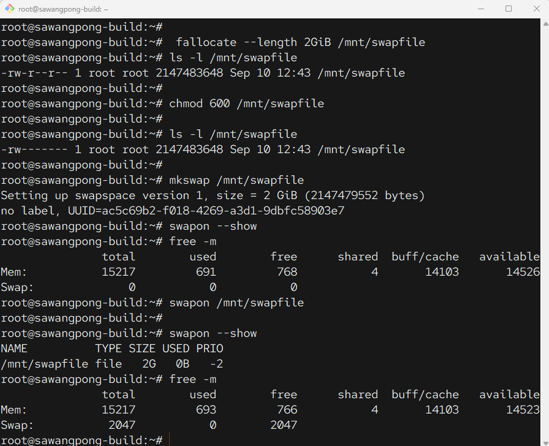

## เพิ่มใน /etc/fstab
   หลังจากนั้นให้ทำการ เพิ่ม record สำหรับ ``/etc/fstab`` โดยการเพิ่มบรรทัดล่างนี้ใน ไฟล์ ``/etc/fstab``
   ```
   # vim /etc/fstab

   /mnt/swapfile swap swap defaults 0 0
   ```

   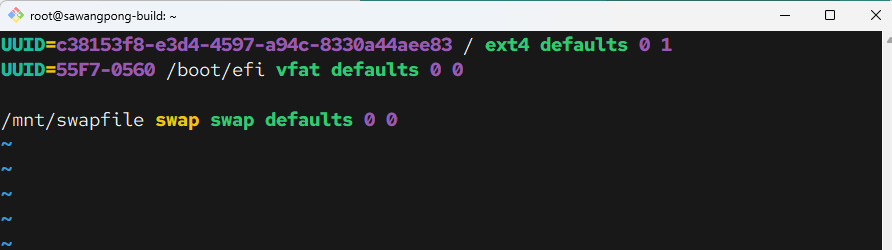

   ```
   # reboot
   ```

   ความหมาย

    /mnt/swapfile – device/file name
    swap – defines device mount point
    swap – specifies the file-system type
    defaults – describes the mount options
    0 – specifies the option to be used by the dump program
    0 – specifies the fsck command option


- สามารถตรวจสอบผ่าน ``/proc/swaps``
   ```
   cat /proc/swaps
   ```

   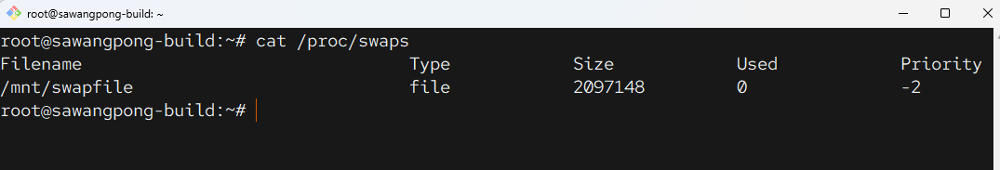

!!! info
     ไม่มี kernel module ชื่อ 'swap' ที่คุณสามารถใช้คำสั่ง lsmod เพื่อดูได้ครับ
    เหตุผลก็คือ Swap ไม่ได้ทำงานในรูปแบบของ kernel module ที่สามารถโหลดเข้าหรือถอดออกได้ (loadable module) แต่มันเป็นหนึ่งใน ฟังก์ชันหลัก (core functionality) ของระบบจัดการหน่วยความจำ (Memory Management subsystem) ที่ถูกคอมไพล์รวมเข้าไปในตัวเคอร์เนลโดยตรง ครับ 🧠

    เปรียบเสมือนเครื่องยนต์ของรถยนต์ Swap เป็นส่วนหนึ่งของบล็อกเครื่องยนต์ ไม่ใช่ชิ้นส่วนที่ถอดเปลี่ยนได้ง่ายๆ อย่างหัวเทียนหรือไส้กรองอากาศ