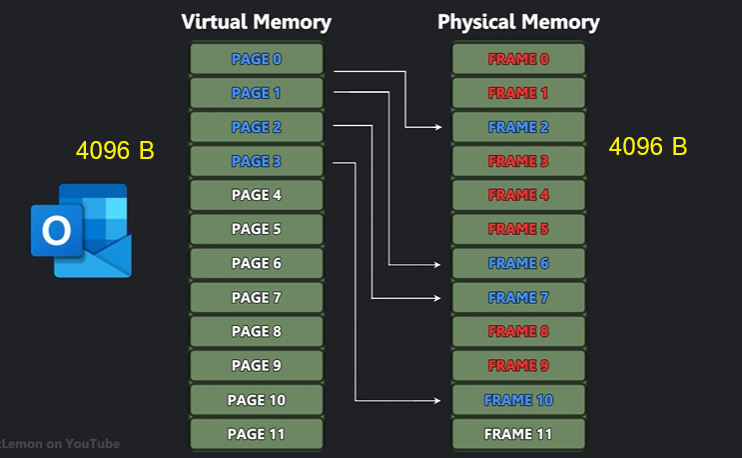
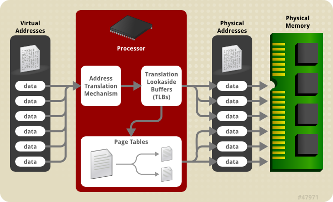

# 01 Introduction Memory management part 2

การที่ Virtual memory map เข้ากับ physical memory จะทำผ่าน ส่งที่เรียกว่า ว่า pageing โดยแบ่ง memory ออกเป็นส่วนๆ ถ้าไม่แบ่งจะทำให้เกิดปัญหาว่า ตาราง Map Translation จะมีขนาดใหญมาก



เราไม่จำเป็นต้อง "คำนวณ" ขนาดของเพจ (page) ใน Linux เพราะค่านี้ถูกกำหนดไว้ล่วงหน้าโดยสถาปัตยกรรมของ CPU และเคอร์เนลของระบบปฏิบัติการ แต่เราสามารถ "ตรวจสอบ" ขนาดของเพจได้ง่ายๆ ด้วยคำสั่งใน Terminal ครับ

```
$ getconf PAGE_SIZE
4096
```
ผลลัพธ์ที่ได้จะเป็นขนาดของเพจในหน่วย ไบต์ (Bytes)

เมื่อโปรแกรมต้องการข้อมูล OS ก็จะไปดึงข้อมูลมาทีละ "หน้า" เต็มๆ การจัดการเป็นหน้าๆ แบบนี้มีข้อดีคือ:

- **จัดการง่าย:** OS ไม่ต้องจำตำแหน่งของข้อมูลทุกไบต์ แต่จำแค่ว่าหน้าไหนอยู่ตรงไหน

- **ทำงานเร็ว:** การย้ายข้อมูลทั้งหน้าจากดิสก์ไปยัง RAM (หรือในทางกลับกัน) ทำได้เร็วกว่าการย้ายข้อมูลทีละเล็กทีละน้อย

- **ประสิทธิภาพ:** ขนาด 4KB เป็นขนาดที่สมดุล ไม่เล็กเกินไปจนจัดการลำบาก และไม่ใหญ่เกินไปจนสิ้นเปลืองพื้นที่หากโปรแกรมต้องการใช้หน่วยความจำแค่เล็กน้อย

อย่างไรก็ตาม ในระบบที่ต้องการประสิทธิภาพสูงมากๆ เช่น เซิร์ฟเวอร์ฐานข้อมูลขนาดใหญ่ หรือระบบ Virtualization, Linux ยังมีสิ่งที่เรียกว่า Huge Pages ซึ่งมีขนาดใหญ่กว่าปกติ เช่น 2 เมกะไบต์ (MB) หรือ 1 กิกะไบต์ (GB)

การใช้ Huge Pages ช่วยลดภาระงาน (overhead) ของ CPU ในการจัดการตารางที่เก็บตำแหน่งของเพจ (Page Table) ทำให้เข้าถึงหน่วยความจำจำนวนมากได้เร็วขึ้น

```bash title="huge page"
$ grep Huge /proc/meminfo
AnonHugePages:         0 kB
ShmemHugePages:        0 kB
FileHugePages:     20480 kB
HugePages_Total:       0
HugePages_Free:        0
HugePages_Rsvd:        0
HugePages_Surp:        0
Hugepagesize:       2048 kB
Hugetlb:               0 kB
```

ผลลัพธ์นี้แสดงข้อมูลเกี่ยวกับ **Huge Pages** ในระบบ Linux ของคุณ ซึ่งเป็นเพจหน่วยความจำที่มีขนาดใหญ่กว่าปกติ (ซึ่งปกติคือ 4KB) เพื่อเพิ่มประสิทธิภาพสำหรับโปรแกรมที่ใช้หน่วยความจำเยอะๆ

จากข้อมูลที่คุณให้มา สรุปได้ว่าระบบของคุณ **ไม่ได้มีการจอง Huge Pages ไว้ล่วงหน้า (Pre-allocated Huge Pages)** แต่มีการใช้งาน **Huge Pages แบบอัตโนมัติ (Transparent Huge Pages - THP)** อยู่

---

### **ความหมายของแต่ละบรรทัดที่สำคัญ**

* `Hugepagesize: 2048 kB`
    * นี่คือบรรทัดที่สำคัญที่สุด บอกว่า Huge Page **หนึ่งหน้า** ในระบบของคุณมีขนาดเท่ากับ **2048 kB** หรือ **2 MB**

* `HugePages_Total: 0`
    * หมายความว่าระบบของคุณ **ไม่ได้ถูกตั้งค่าให้จอง (reserve) Huge Pages ไว้ล่วงหน้า** เลยสักหน้าเดียว ซึ่งมักจะทำกันในเซิร์ฟเวอร์ที่รันโปรแกรมเฉพาะทาง เช่น database

* `FileHugePages: 20480 kB`
    * นี่คือส่วนที่น่าสนใจที่สุด บรรทัดนี้บอกว่าเคอร์เนลได้ใช้งาน **Transparent Huge Pages (THP)** ซึ่งเป็นกลไกอัตโนมัติ เพื่อรวมเพจปกติให้กลายเป็น Huge Pages สำหรับจัดการหน่วยความจำที่เกี่ยวข้องกับไฟล์ (file-backed memory) ไปแล้ว **20480 kB**
    * เราคำนวณได้ว่ามีการใช้งานอยู่ 📟: `20480 kB / 2048 kB = 10` หน้า Huge Pages

* `AnonHugePages: 0 kB`
    * หมายถึงยังไม่มีการใช้ Huge Pages แบบอัตโนมัติสำหรับหน่วยความจำของโปรแกรมทั่วไป (Anonymous memory)

* `Hugetlb: 0 kB`
    * คือขนาดหน่วยความจำทั้งหมดที่ถูกใช้โดย Huge Pages ที่จองไว้ล่วงหน้า (Pre-allocated) ซึ่งเป็น 0 เพราะ `HugePages_Total` เป็น 0

---

### **สรุป 📝**

ระบบของคุณเปิดใช้งาน **Transparent Huge Pages (THP)** ซึ่งเป็นฟีเจอร์ที่เคอร์เนลจะพยายามรวมหน่วยความจำให้เป็น Huge Pages ขนาด **2 MB** โดยอัตโนมัติเพื่อเพิ่มประสิทธิภาพ และตอนนี้มีการใช้งานในส่วนที่เกี่ยวกับไฟล์ไปประมาณ 20 MB แต่คุณไม่ได้ตั้งค่าจอง Huge Pages แบบ manual ไว้ล่วงหน้า ซึ่งนี่เป็นการตั้งค่าปกติสำหรับคอมพิวเตอร์เดสก์ท็อปและเซิร์ฟเวอร์ทั่วไปครับ

การเปิดใช้งาน Transparent Huge Pages (THP) หมายถึง การสั่งให้เคอร์เนลของ Linux พยายามรวมกลุ่มหน้าหน่วยความจำ (memory pages) ขนาดเล็ก (ปกติคือ 4KB) ให้กลายเป็นหน้าหน่วยความจำขนาดใหญ่ (huge page) ขนาด 2MB โดยอัตโนมัติ โดยที่แอปพลิเคชันไม่จำเป็นต้องรับรู้หรือแก้ไขโค้ดใดๆ เลย

พูดง่ายๆ คือ THP เป็นกลไกเบื้องหลังที่ทำงานเองเพื่อเพิ่มประสิทธิภาพการจัดการหน่วยความจำ 🧠✨

ปกติแล้ว CPU จะใช้ตารางที่เรียกว่า Page Table เพื่อแปลตำแหน่งหน่วยความจำเสมือน (ที่โปรแกรมเห็น) ไปยังตำแหน่งจริงบน RAM การมีหน่วยความจำขนาดใหญ่มากๆ ทำให้ตารางนี้มีขนาดใหญ่ตามไปด้วย การเปิด THP จะช่วยลดขนาดของตารางนี้ลง ทำให้ CPU ค้นหาข้อมูลได้เร็วขึ้นและลดภาระงานลง


## Page Tables
ในระบบปฏิบัติการ Linux, **เพจเทเบิล (Page Tables)** ทำหน้าที่จับคู่ตำแหน่งหน่วยความจำเสมือน (virtual) ไปยังหน่วยความจำกายภาพ (physical) 🗺️

เพจเทเบิลถูกออกแบบมาเพื่อรองรับหน่วยความจำได้สูงสุด **4GB บนระบบ 32-bit** และ **8GB ขึ้นไปบนระบบ 64-bit** โดยใช้โครงสร้างแบบหลายระดับชั้นและขนาดของ "เพจ" (page) ที่ปรับเปลี่ยนได้

* สำหรับระบบ **32-bit** จะมีเทคนิคที่เรียกว่า **PAE (Physical Address Extension)** ซึ่งช่วยให้เข้าถึงหน่วยความจำได้มากกว่า 4GB โดยใช้รายการในเพจเทเบิลที่มีขนาดใหญ่ขึ้น

* อย่างไรก็ตาม ระบบ **64-bit** และการใช้ **เพจขนาดใหญ่ (huge pages)** (เช่น 2MB หรือ 1GB) จะให้ประสิทธิภาพในการจับคู่ตำแหน่งที่ดีกว่ามากสำหรับระบบที่มีหน่วยความจำขนาดใหญ่ ซึ่งช่วย**ลดภาระงานของระบบ (overhead)** และ**เพิ่มประสิทธิภาพ**โดยรวมได้ดีกว่า
  

## Virtual Memory & Physical Memory



!!! note
    ในระบบปฏิบัติการ Linux ทุกๆ ตำแหน่งของหน่วยความจำ (memory address) ที่โปรแกรมสร้างขึ้น จะต้องผ่านกลไกการแปลแอดเดรสในตัวประมวลผล (CPU) ก่อนเสมอโดยแอดเดรสเหล่านั้นจะถูกแปลงจาก แอดเดรสเสมือน (virtual address) ซึ่งเป็นแอดเดรสเฉพาะที่โปรแกรมนั้นๆ มองเห็น ไปเป็น แอดเดรสกายภาพ (physical address) ซึ่งเป็นตำแหน่งจริงๆ บนหน่วยความจำ (RAM) กระบวนการทั้งหมดนี้เรียกว่า หน่วยความจำเสมือน (virtual memory) 


```
$ free -m
               total        used        free      shared  buff/cache   available
Mem:           15217         528       14363           4         600       14689
Swap:           2047           0        2047
```
หน่วยความจำหลัก (RAM) 🧠  
- Total (ทั้งหมด): 15,217 MB (ประมาณ 15 GB)  
- Used (ใช้งานไป): 528 MB  
- Free (ว่างจริงๆ): 14,363 MB (ประมาณ 14 GB)  
- Available (ที่พร้อมใช้งาน): 14,689 MB (ประมาณ 14.7 GB)  

```
mkdir memorytest
cd memorytest
vim paging_test.c
vim Makefile
```

```c title="paging_test.c"
#include <stdio.h>
#include <stdlib.h>
#include <string.h>
#include <unistd.h>

// ขนาดหน่วยความจำที่จะจอง (2 GB)
// #define MEM_SIZE (2 * 1024 * 1024 * 1024UL) 

// แก้จาก 2 เป็น 17 เพื่อให้ใหญ่กว่า RAM ที่มี (15 GB)
#define MEM_SIZE (17 * 1024 * 1024 * 1024UL) 
// ขนาดของ Page (โดยทั่วไปคือ 4 KB)
#define PAGE_SIZE 4096 

int main() {
    // จองหน่วยความจำขนาดใหญ่
    char *ptr = malloc(MEM_SIZE);
    if (ptr == NULL) {
        perror("Failed to allocate memory");
        return 1;
    }
    printf("Successfully allocated %lu GB of memory.\n", MEM_SIZE / (1024*1024*1024));
    printf("Press [Enter] to start writing to memory...\n");
    getchar();

    unsigned long long pages_touched = 0;
    
    // วนลูปเพื่อเขียนข้อมูลลงใน Page แรกของทุกๆ บล็อกหน่วยความจำ
    // เพื่อบังคับให้เกิด Page Fault และ Swapping
    for (unsigned long long i = 0; i < MEM_SIZE; i += PAGE_SIZE) {
        // เขียนเลข 1 ลงไปในไบต์แรกของแต่ละ Page
        ptr[i] = '1'; 
        pages_touched++;

        // พิมพ์ความคืบหน้าทุกๆ 10,000 pages
        if (pages_touched % 10000 == 0) {
            printf("Touched %llu pages...\n", pages_touched);
        }
    }

    printf("\nFinished writing to all pages.\n");
    printf("Memory is now held. Check system monitor for swap usage.\n");
    printf("Press [Enter] to free memory and exit...\n");
    getchar();

    // คืนหน่วยความจำ
    free(ptr);
    printf("Memory freed. Exiting.\n");

    return 0;
}
```

```bash title="compile code"
gcc paging_test.c -o paging_test
```

- **การทดสอบ**
ต้องเปิดขั้นมา 2 terminal ซึ่งจะใช้ screen, tmux, byobu ก็ได้ โดยหน้าต่างแรก ใช้สำหรับการ monitor การใช้งาน memory ``vmstat 1``   และ terminal สำหรับการ run code

```
$ byobu
กด **Shift +Fn +  F2**

pan 0  run ``vmstate 1``
pan 1  run ``./paging_test``
```


- ถ้ายังไม่ติดตั้งให้ติดตั้ง
```
sudo apt install byobu
```


---

### **คำสั่งพื้นฐาน (ใช้ใน Terminal ปกติ)**

| คำสั่ง | คำอธิบาย |
| :--- | :--- |
| `byobu` | เริ่ม Byobu หรือเข้าไปยัง Session ล่าสุดที่ใช้งาน |
| `byobu ls` | ดูรายการ Session ทั้งหมดที่กำลังทำงานอยู่ |
| `byobu new -s <ชื่อ>` | สร้าง Session ใหม่พร้อมตั้งชื่อ |
| `byobu attach -t <ชื่อ>` | เข้าไปยัง Session ที่มีอยู่แล้วตามชื่อ |
| `byobu kill-session -t <ชื่อ>`| ปิด Session ที่ต้องการ |

---


#### **การจัดการ Window (เหมือน "แท็บ")**

| คีย์ลัด | การทำงาน |
| :--- | :--- |
| **Fn + F2** | สร้าง Window ใหม่ |
| **Fn + F3** / **F4** | เลื่อนไป Window ก่อนหน้า / ถัดไป |
| **Ctrl+ Fn + F5 / Ctrl+Fn + F6** | สลับตำแหน่ง Window ไปทางซ้าย / ขวา |
| **Fn + F8** | เปลี่ยนชื่อ Window ปัจจุบัน |
| **Ctrl+D** หรือพิมพ์ `exit`| ปิด Window หรือ Pane ปัจจุบัน |

#### **การแบ่งหน้าจอ (Panes)**

| คีย์ลัด | การทำงาน |
| :--- | :--- |
| **Shift +Fn +  F2** | แบ่งหน้าจอ **แนวนอน** (Horizontal Split) |
| **Shift +Fn +  F3 / Shift + Fn + F4**| ย้ายไปยัง Pane ก่อนหน้า / ถัดไป |
| **Ctrl + F2** | แบ่งหน้าจอ **แนวตั้ง** (Vertical Split) |
| **Shift + ลูกศร (← → ↑ ↓)** | ย้ายไปยัง Pane อื่นตามทิศทาง |
| **Shift + Alt + ลูกศร** | ปรับขนาด Pane ปัจจุบัน |

#### **การจัดการ Session และอื่นๆ**

| คีย์ลัด | การทำงาน |
| :--- | :--- |
| **F5** | รีเฟรชสถานะและโปรไฟล์ (ถ้าแก้ไขคอนฟิก) |
| **F6** | **ออกจาก Session (Detach)** โดยที่โปรแกรมทุกอย่างยังรันอยู่ |
| **F7** | เข้าสู่โหมด Copy/Scrollback (ใช้ลูกศรเลื่อนดูข้อความเก่าๆ ได้, กด `q` เพื่อออก) |
| **F9** | เข้าสู่เมนูตั้งค่าของ Byobu |
| **Shift + F12** | เปิด/ปิดการแสดง Keybinding ที่มุมจอ |

---

