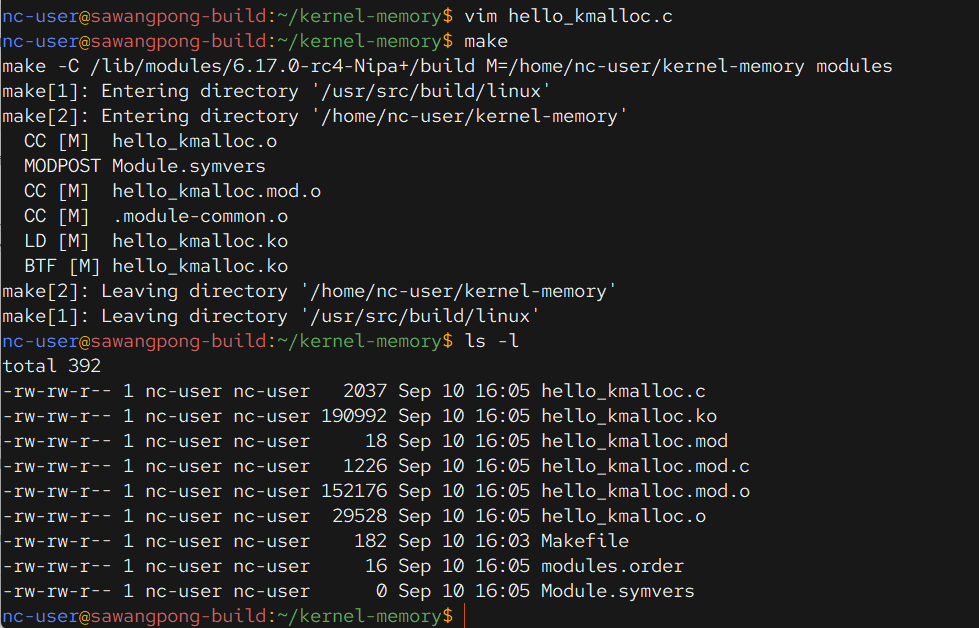
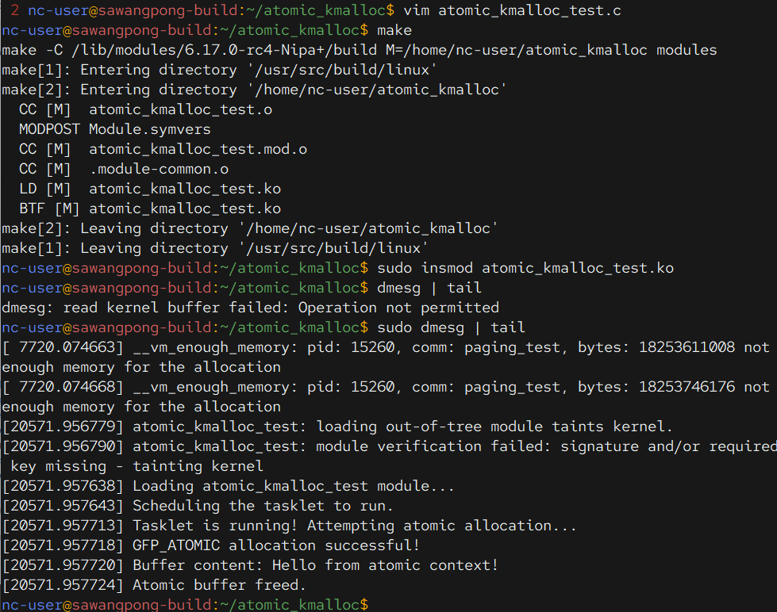
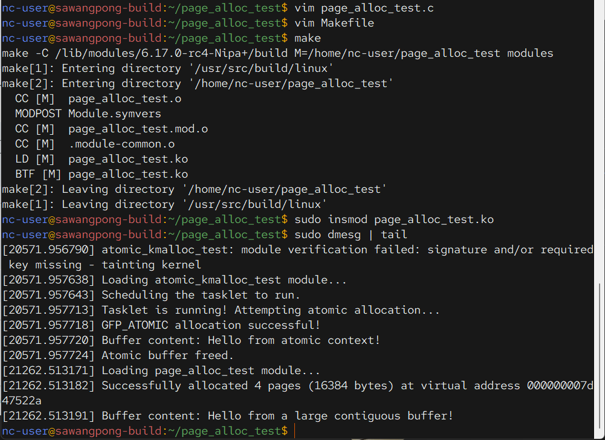
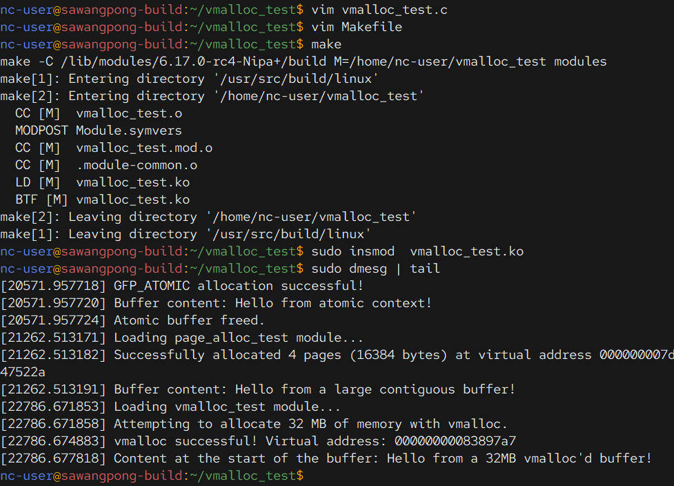
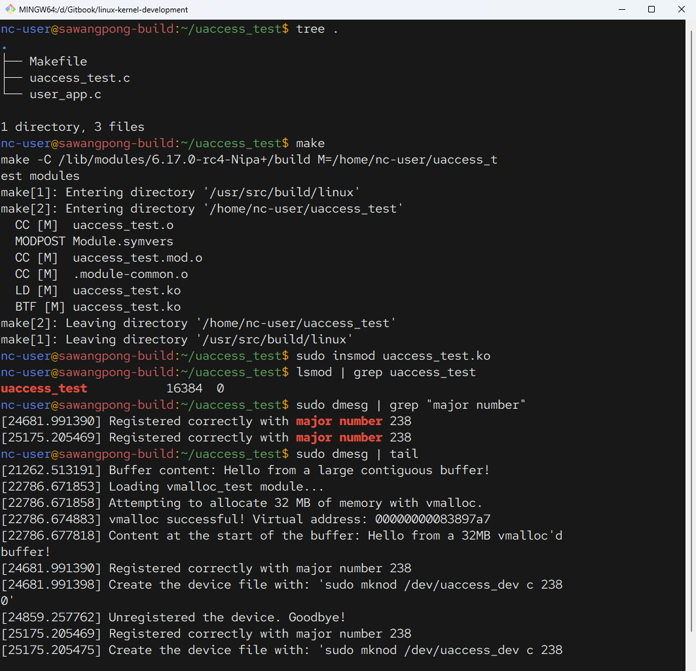
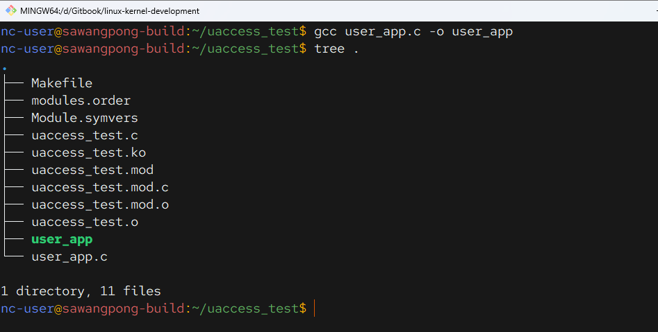
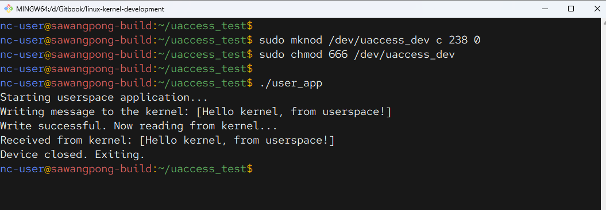

# 02 Basic Linux memory Management


## หัวใจของการจัดการหน่วยความจำใน Kernel

ก่อนจะไปดูโค้ดตัวอย่าง เราต้องเข้าใจภาพใหญ่ก่อนครับ Kernel มีหน้าที่จัดสรรทรัพยากรที่มีจำกัดที่สุดอย่างหนึ่ง นั่นคือ **RAM** ให้กับทุกส่วนของระบบได้อย่างมีประสิทธิภาพและปลอดภัยที่สุด

การจัดการหน่วยความจำใน Kernel แบ่งเป็น 2 ระดับหลักๆ:

1.  **Physical Page Allocator: Buddy Algorithm** เป็นผู้จัดการ "หน่วยความจำทั้งหมด" ทั้งหมดในระบบ จัดการหน่วยความจำในหน่วยที่เรียกว่า **Page** (ปกติขนาด 4KB บน x86-64) ทำหน้าที่หา "บล็อก" ของหน่วยความจำกายภาพ (Physical Memory) ที่อยู่ติดกันจริงๆ  
  
🌐 [https://en.wikipedia.org/wiki/Buddy_memory_allocation](https://en.wikipedia.org/wiki/Buddy_memory_allocation)

1.  **Slab Allocator (SLUB/SLAB/SLOB):** เป็นผู้จัดการ "พื้นที่ย่อย" ที่มาขอหน่วยความจำจาก (Pages) จาก Buddy System เมื่อมี Process มาร้องขอ  แล้วซอยแบ่งเป็น "พื้นเล็กๆ" มีขนาด 2<sup>k</sup> , k จำนวนยกกำลัง   หรือ อ็อบเจกต์ขนาดเท่าๆ กัน เพื่อให้ Kernel process ส่วนอื่นๆ มาเบิกใช้ได้อย่างรวดเร็ว ไม่ต้องไปรบกวน ``Buddy Algorithm`` บ่อยๆ ฟังก์ชันอย่าง `kmalloc` ทำงานอยู่บนชั้นนี้ครับ  
   
🌐 [https://en.wikipedia.org/wiki/Slab_allocation](https://en.wikipedia.org/wiki/Slab_allocation)

## **Workshop Memory** ในบทนี้ เริ่มกันทีละขั้นตอน จากง่ายไปซับซ้อน ผ่าน 10 ตัวอย่างนี้ เพื่อเรียนรู้กันครับ

[อ่าน kmalloc() docs](https://litux.nl/mirror/kerneldevelopment/0672327201/ch11lev1sec4.html)
- https://litux.nl/mirror/kerneldevelopment/0672327201/ch11lev1sec4.html
-----

!!! info "function การจัดการ memory"
    What is different functions: malloc() and kmalloc()? They differ only in that:  
    - the **malloc()** can be called in user-space and kernel-space, and it allocates a physically fragmented memory area  
    - but **kmalloc()** can be called only in kernel-space, and it allocates physically contiguous memory chunk
  
### 1. การจองหน่วยความจำพื้นฐานที่สุด: `kmalloc`

```
mkdir kernel-memory
cd kernel-memory
```

`kmalloc` คือฟังก์ชันที่คุณจะได้ใช้บ่อยที่สุด มันเป็นการขอหน่วยความจำขนาดเล็กถึงปานกลาง (ไม่กี่ไบต์ถึงสองสามเพจ) จาก Slab Allocator

  * **คุณสมบัติเด่น:** หน่วยความจำที่ได้ **รับประกันว่าอยู่ติดกันในหน่วยความจำกายภาพ (Physically Contiguous)** ซึ่งจำเป็นมากสำหรับอุปกรณ์ฮาร์ดแวร์ (DMA)

**ตัวอย่าง:**

```c title="hello_kmalloc.c"
#include <linux/init.h>
#include <linux/module.h>
#include <linux/kernel.h>
#include <linux/slab.h>    // สำหรับ kmalloc, kfree
#include <linux/string.h>  // สำหรับ strcpy

MODULE_LICENSE("GPL");
MODULE_AUTHOR("Your Name");
MODULE_DESCRIPTION("A simple kernel module to test kmalloc");

// ประกาศตัวแปร global เพื่อให้ฟังก์ชัน exit เข้าถึงได้
static char *my_buffer;
static size_t buffer_size = 128;

// ฟังก์ชันที่จะทำงานเมื่อโหลดโมดูล (insmod)
static int __init hello_kmalloc_init(void) {
    pr_info("Loading hello_kmalloc module...\n");

    // GFP_KERNEL คือ flag มาตรฐาน บอกให้ allocator รอ (sleep) ได้ถ้าหน่วยความจำไม่ว่าง
    my_buffer = kmalloc(buffer_size, GFP_KERNEL);
    if (!my_buffer) {
        // การจัดการ error สำคัญเสมอ!
        pr_err("Failed to allocate memory\n");
        return -ENOMEM; // ENOMEM = Out of Memory
    }

    // ตอนนี้ my_buffer ชี้ไปยังหน่วยความจำ 128 bytes ที่ใช้งานได้
    strcpy(my_buffer, "Hello from the kernel!");
    pr_info("Allocated buffer contains: %s\n", my_buffer);

    return 0; // โหลดสำเร็จ
}

// ฟังก์ชันที่จะทำงานเมื่อนำโมดูลออก (rmmod)
static void __exit hello_kmalloc_exit(void) {
    // kfree เป็นคำสั่งคู่กับ kmalloc, ต้องเรียกเสมอเพื่อคืนหน่วยความจำ
    if (my_buffer) {
        kfree(my_buffer);
        pr_info("Memory freed. Exiting module.\n");
    }
}

// ลงทะเบียนฟังก์ชัน init และ exit กับเคอร์เนล
module_init(hello_kmalloc_init);
module_exit(hello_kmalloc_exit);
```

```makefile title="Makefile"
# ระบุชื่อ object file ที่ต้องการสร้างจากไฟล์ .c ของเรา
obj-m += hello_kmalloc.o

# ตัวแปร KDIR ชี้ไปยัง source code ของ kernel ที่ติดตั้งไว้
# ทำให้ make รู้ว่าต้องใช้เครื่องมือและ header file จากที่ไหน
KDIR := /lib/modules/$(shell uname -r)/build

# ตัวแปร PWD คือตำแหน่งปัจจุบัน (pwd)
PWD := $(shell pwd)

# คำสั่ง default ที่จะทำงานเมื่อพิมพ์ make
# มันจะเรียก make อีกครั้งโดยชี้ไปยัง Makefile หลักของเคอร์เนล
default:
	$(MAKE) -C $(KDIR) M=$(PWD) modules

# คำสั่งสำหรับล้างไฟล์ที่คอมไพล์แล้ว (พิมพ์ make clean)
clean:
	$(MAKE) -C $(KDIR) M=$(PWD) clean
```

```
insmod hello_kmalloc.ko
lsmod | grep hello_kmalloc 
dmesg | tail
rmmod hello_kmalloc
```


**ข้อควรรู้:** `kmalloc` คือเครื่องมือหลักสำหรับงานส่วนใหญ่ แต่มีขนาดจำกัด (ปกติไม่เกิน 4MB)

**Options: ของ kmalloc**  

- GFP_USER - Allocate memory on behalf of user. May sleep.  
- GFP_KERNEL - Allocate normal kernel ram. May sleep.  
- GFP_ATOMIC - Allocation will not sleep. May use emergency pools. For example, use this inside interrupt handlers.  
- GFP_HIGHUSER - Allocate pages from high memory.  
- GFP_NOIO - Do not do any I/O at all while trying to get memory.  
- GFP_NOFS - Do not make any fs calls while trying to get memory.  
- GFP_NOWAIT - Allocation will not sleep.  
- GFP_THISNODE - Allocate node-local memory only.  
- GFP_DMA - Allocation suitable for DMA. Should only be used for kmalloc caches. Otherwise, use a slab created with SLAB_DMA.  


-----

###  2. การคืนหน่วยความจำ: `kfree`

กฎเหล็กของ Kernel คือ **"จองอะไรไว้ ต้องคืนเสมอ"** การลืมคืนหน่วยความจำ (Memory Leak) ใน Kernel เป็นเรื่องร้ายแรงกว่าใน Userspace มาก เพราะมันจะอยู่กับระบบไปจนกว่าจะรีบูต

**ตัวอย่าง:**

```c
// ... หลังจากใช้ my_buffer เสร็จแล้ว
kfree(my_buffer);
my_buffer = NULL; // เป็น practice ที่ดี ที่จะเซ็ตเป็น NULL หลัง free
```

**ข้อควรรู้:** `kmalloc` คู่กับ `kfree` เสมอ ห้ามใช้ `kfree` กับหน่วยความจำที่จองมาจากฟังก์ชันอื่น

-----

###  3. โลกแห่ง Context: `GFP_` Flags

`GFP` (Get Free Page) flags คือตัวกำหนด "พฤติกรรม" ของ Allocator ตอนที่คุณเรียก `kmalloc` หรือฟังก์ชันอื่นๆ สองตัวที่สำคัญที่สุดคือ:

  * **`GFP_KERNEL`**: ใช้ใน **Process Context** (เช่น ตอนทำงานใน System Call) อนุญาตให้ Kernel "หลับ" (sleep) หรือพักการทำงานของ Process ปัจจุบัน เพื่อรอให้มีหน่วยความจำว่าง
  * **`GFP_ATOMIC`**: ใช้ใน **Interrupt Context** หรือในโค้ดที่ห้ามหลับเด็ดขาด (เช่น ขณะที่ถือ spinlock อยู่) การจองแบบนี้ **ห้ามหลับ** และจะพยายามจองจากหน่วยความจำสำรองฉุกเฉิน ถ้าไม่มีก็ล้มเหลวทันที

**ตัวอย่าง:**

```bash title="command"
mkdir atomic_kmalloc
cd atomic_kmalloc
vim atommic_kmalloc_test.c
vim Makefile
```

```c title="atommic_kmalloc_test.c"
#include <linux/init.h>
#include <linux/module.h>
#include <linux/kernel.h>
#include <linux/slab.h>         // For kmalloc/kfree
#include <linux/interrupt.h>    // For tasklets

MODULE_LICENSE("GPL");
MODULE_AUTHOR("Your Name");
MODULE_DESCRIPTION("Corrected example of kmalloc with GFP_ATOMIC");

// Forward declare the tasklet function
static void my_tasklet_func(struct tasklet_struct *t);

// 1. Declare the tasklet struct with a name
static struct tasklet_struct my_tasklet;

// This is the function that will be executed by the tasklet.
// Note the function signature has changed to accept a 'struct tasklet_struct *'
static void my_tasklet_func(struct tasklet_struct *t)
{
    void *atomic_buffer;
    size_t buffer_size = 64;

    pr_info("Tasklet is running! Attempting atomic allocation...\n");

    atomic_buffer = kmalloc(buffer_size, GFP_ATOMIC);
    if (!atomic_buffer) {
        pr_warn("Atomic allocation failed. This can happen under memory pressure.\n");
        return;
    }

    pr_info("GFP_ATOMIC allocation successful!\n");
    
    strcpy(atomic_buffer, "Hello from atomic context!");
    pr_info("Buffer content: %s\n", (char*)atomic_buffer);

    kfree(atomic_buffer);
    pr_info("Atomic buffer freed.\n");
}

// Function to run when the module is loaded (insmod)
static int __init atomic_test_init(void)
{
    pr_info("Loading atomic_kmalloc_test module...\n");
    
    // 2. Initialize the tasklet, linking it to its function
    tasklet_setup(&my_tasklet, my_tasklet_func);
    
    pr_info("Scheduling the tasklet to run.\n");
    tasklet_schedule(&my_tasklet);
    
    return 0; // Success
}

// Function to run when the module is unloaded (rmmod)
static void __exit atomic_test_exit(void)
{
    tasklet_kill(&my_tasklet);
    pr_info("Tasklet killed. Module unloaded.\n");
}

module_init(atomic_test_init);
module_exit(atomic_test_exit);
```

```makefile title="Makefile"
# The object file to build from our C source
obj-m += atomic_kmalloc_test.o

# Kernel source directory
KDIR := /lib/modules/$(shell uname -r)/build

# Current directory
PWD := $(shell pwd)

# Default command to build the module
default:
	$(MAKE) -C $(KDIR) M=$(PWD) modules

# Command to clean up compiled files
clean:
	$(MAKE) -C $(KDIR) M=$(PWD) clean
```

```
make 
sudo insmod atomic_kmalloc_test.ko
sudo dmesg | tail
sudo rmmod atomic_kmalloc_test
```

```bash title="output"
[20571.956779] atomic_kmalloc_test: loading out-of-tree module taints kernel.
[20571.956790] atomic_kmalloc_test: module verification failed: signature and/or required key missing - tainting kernel
[20571.957638] Loading atomic_kmalloc_test module...
[20571.957643] Scheduling the tasklet to run.
[20571.957713] Tasklet is running! Attempting atomic allocation...
[20571.957718] GFP_ATOMIC allocation successful!
[20571.957720] Buffer content: Hello from atomic context!
[20571.957724] Atomic buffer freed.
```



**ข้อควรรู้:** การเลือกใช้ GFP Flag ผิดประเภทเป็นสาเหตุของบั๊กที่อันตรายมาก ถ้าไม่แน่ใจ ให้เริ่มจาก `GFP_KERNEL`

-----

###  4. การจองหน่วยความจำขนาดใหญ่ระดับ Page: `alloc_pages`

เมื่อ `kmalloc` ไม่พอ (ต้องการหน่วยความจำเยอะๆ) เราต้องลงไปคุยกับ Buddy System โดยตรงผ่าน `alloc_pages` ซึ่งจะจองหน่วยความจำเป็นจำนวนยกกำลังสองของ Page

**ตัวอย่าง:**

```bash title="command"
mkdir page_alloc_test
cd page_alloc_test
vim page_alloc_test.c
vim Makefile
```

```c title="page_alloc_test.c"
#include <linux/init.h>
#include <linux/module.h>
#include <linux/kernel.h>
#include <linux/gfp.h>      // For alloc_pages and GFP flags
#include <linux/mm.h>       // For page_address and PAGE_SIZE
#include <linux/string.h>   // For memset

MODULE_LICENSE("GPL");
MODULE_AUTHOR("Your Name");
MODULE_DESCRIPTION("Full example of page allocation with alloc_pages");

// Global variables to hold the page pointer and order
// They are global so the exit function can access them to free the memory.
static struct page *my_pages;
static unsigned int order = 2; // order is log base 2 of the number of pages (2^2 = 4 pages)

// Function to run when the module is loaded (insmod)
static int __init page_alloc_init(void)
{
    void *my_large_buffer;
    size_t buffer_size;

    pr_info("Loading page_alloc_test module...\n");

    // The result is a 'struct page*', not a virtual address.
    my_pages = alloc_pages(GFP_KERNEL, order);
    if (!my_pages) {
        pr_err("Failed to allocate pages.\n");
        return -ENOMEM;
    }

    // Convert the 'struct page*' to a virtual address so the CPU can use it.
    my_large_buffer = page_address(my_pages);

    buffer_size = (1 << order) * PAGE_SIZE;

    pr_info("Successfully allocated %zu pages (%zu bytes) at virtual address %p\n",
            (size_t)(1 << order), buffer_size, my_large_buffer);

    // Now my_large_buffer is a buffer of size 4 * 4096 = 16384 bytes.
    // Let's write something to it to show it's usable.
    memset(my_large_buffer, 0, buffer_size);
    strcpy(my_large_buffer, "Hello from a large contiguous buffer!");
    pr_info("Buffer content: %s\n", (char*)my_large_buffer);

    return 0; // Success
}

// Function to run when the module is unloaded (rmmod)
static void __exit page_alloc_exit(void)
{
    // It's crucial to free the pages when the module is unloaded.
    // __free_pages is the corresponding function for alloc_pages.
    if (my_pages) {
        __free_pages(my_pages, order);
        pr_info("Successfully freed allocated pages. Module unloaded.\n");
    } else {
        pr_info("No pages were allocated. Module unloaded.\n");
    }
}

module_init(page_alloc_init);
module_exit(page_alloc_exit);
```

```makefile title="Makefile"
# The object file to build from our C source
obj-m += page_alloc_test.o

# Kernel source directory
KDIR := /lib/modules/$(shell uname -r)/build

# Current directory
PWD := $(shell pwd)

# Default command to build the module
default:
	$(MAKE) -C $(KDIR) M=$(PWD) modules

# Command to clean up compiled files
clean:
	$(MAKE) -C $(KDIR) M=$(PWD) clean
```

```
make 
sudo insmod page_alloc_test.ko
sudo dmesg | tail
sudo rmmod page_alloc_test
```

```bash title="outout"
sudo dmesg | tail
[20571.956790] atomic_kmalloc_test: module verification failed: signature and/or required key missing - tainting kernel
[20571.957638] Loading atomic_kmalloc_test module...
[20571.957643] Scheduling the tasklet to run.
[20571.957713] Tasklet is running! Attempting atomic allocation...
[20571.957718] GFP_ATOMIC allocation successful!
[20571.957720] Buffer content: Hello from atomic context!
[20571.957724] Atomic buffer freed.
[21262.513171] Loading page_alloc_test module...
[21262.513182] Successfully allocated 4 pages (16384 bytes) at virtual address 000000007d47522a
[21262.513191] Buffer content: Hello from a large contiguous buffer!

```



**ข้อควรรู้:** `alloc_pages` เหมาะกับการจองหน่วยความจำขนาดใหญ่ที่ต้องอยู่ติดกันจริงๆ (Physically Contiguous)

-----

###  5. การคืนหน่วยความจำระดับ Page: `free_pages`

เช่นเดียวกับ `kmalloc`/`kfree`, `alloc_pages` ก็มีคู่ของมัน

**ตัวอย่าง:**

```c
// เราส่งคืนโดยใช้ struct page* และ order เดิม
free_pages(my_pages, order);
```

**ข้อควรรู้:** ต้องใช้ `struct page*` และ `order` ที่ถูกต้องในการคืนหน่วยความจำ

-----

###  6. หน่วยความจำเสมือนที่อยู่ติดกัน: `vmalloc`

บางครั้งเราต้องการหน่วยความจำขนาดใหญ่มาก แต่**ไม่จำเป็น**ต้องอยู่ติดกันใน Physical RAM ก็ได้ `vmalloc` คือคำตอบ

  * **การทำงาน:** `vmalloc` จะไปขอ Page จาก Buddy System มาทีละหน้า (ซึ่งอาจจะกระจัดกระจายกันอยู่ใน RAM) แล้วนำมาเรียงต่อกันใน **Virtual Address Space** ของ Kernel ให้ดูเหมือนว่ามันอยู่ติดกัน

**ตัวอย่าง:**
```
mkdir vmalloc_test
cd vmalloc_test
vim vmalloc_test.c
vim Makefile
```

```c title="vmalloc_test.c"
#include <linux/init.h>
#include <linux/module.h>
#include <linux/kernel.h>
#include <linux/vmalloc.h>  // For vmalloc and vfree
#include <linux/string.h>   // For memset and strcpy

MODULE_LICENSE("GPL");
MODULE_AUTHOR("Your Name");
MODULE_DESCRIPTION("Full example of large memory allocation with vmalloc");

// Global pointer for the buffer so the exit function can free it.
static char *v_buffer;
static size_t huge_size = 32 * 1024 * 1024; // 32 MB

// Function to run when the module is loaded (insmod)
static int __init vmalloc_test_init(void)
{
    pr_info("Loading vmalloc_test module...\n");
    pr_info("Attempting to allocate %zu MB of memory with vmalloc.\n", huge_size / (1024*1024));

    v_buffer = vmalloc(huge_size);
    if (!v_buffer) {
        pr_err("Failed to allocate memory with vmalloc.\n");
        return -ENOMEM;
    }

    pr_info("vmalloc successful! Virtual address: %p\n", v_buffer);
    
    // ... use v_buffer like a normal buffer ...
    // Let's clear it and write a small message at the beginning.
    memset(v_buffer, 0, huge_size);
    strcpy(v_buffer, "Hello from a 32MB vmalloc'd buffer!");
    
    pr_info("Content at the start of the buffer: %s\n", v_buffer);

    return 0; // Success
}

// Function to run when the module is unloaded (rmmod)
static void __exit vmalloc_test_exit(void)
{
    // It's crucial to free the memory when the module is unloaded.
    // vfree is the corresponding function for vmalloc.
    if (v_buffer) {
        vfree(v_buffer);
        pr_info("vfree called. Memory has been freed.\n");
    }
    pr_info("vmalloc_test module unloaded.\n");
}

module_init(vmalloc_test_init);
module_exit(vmalloc_test_exit);
```

```makefile title="Makefile"
# The object file to build from our C source
obj-m += vmalloc_test.o

# Kernel source directory
KDIR := /lib/modules/$(shell uname -r)/build

# Current directory
PWD := $(shell pwd)

# Default command to build the module
default:
	$(MAKE) -C $(KDIR) M=$(PWD) modules

# Command to clean up compiled files
clean:
	$(MAKE) -C $(KDIR) M=$(PWD) clean
```

```bash title="output"
$ sudo dmesg | tail
[20571.957718] GFP_ATOMIC allocation successful!
[20571.957720] Buffer content: Hello from atomic context!
[20571.957724] Atomic buffer freed.
[21262.513171] Loading page_alloc_test module...
[21262.513182] Successfully allocated 4 pages (16384 bytes) at virtual address 000000007d47522a
[21262.513191] Buffer content: Hello from a large contiguous buffer!
[22786.671853] Loading vmalloc_test module...
[22786.671858] Attempting to allocate 32 MB of memory with vmalloc.
[22786.674883] vmalloc successful! Virtual address: 00000000083897a7
[22786.677818] Content at the start of the buffer: Hello from a 32MB vmalloc'd buffer!
```




**ข้อควรรู้:** `vmalloc` ช้ากว่า `kmalloc` และไม่เหมาะกับงานที่ต้องใช้ DMA แต่เหมาะกับการสร้าง buffer ขนาดใหญ่มากๆ สำหรับซอฟต์แวร์

-----

###  7. การคืนหน่วยความจำเสมือน: `vfree`

`vmalloc` ก็ต้องคู่กับ `vfree`

**ตัวอย่าง:**

```c
// คืนหน่วยความจำที่จองโดย vmalloc
vfree(v_buffer);
```

**ข้อควรรู้:** ห้ามใช้ `kfree` กับ `vmalloc` และห้ามใช้ `vfree` กับ `kmalloc` เด็ดขาด\!

-----

###  8. กำแพงกั้นที่ปลอดภัย: `copy_from_user`

Kernel **ห้าม** เข้าถึง Pointer จาก Userspace โดยตรงเด็ดขาด เพราะ Userspace อาจส่ง Pointer ที่เป็น NULL, ชี้ไปยังหน่วยความจำของ Kernel เอง (เพื่อโจมตี) หรือหน้าที่ยังไม่มีอยู่จริง (ทำให้เกิด Page Fault)

`copy_from_user` คือฟังก์ชันที่ทำหน้าที่เป็น "ด่านตรวจ" คัดลอกข้อมูลจาก Userspace มายัง Kernel อย่างปลอดภัย


**ตัวอย่าง (ในฟังก์ชัน `write` ของ Character Device):**

```
mkdir uaccess_test
cd uaccess_test
vim uaccess_test.c
vim user_app.c
vim Makefile
```

```c title="uaccess_test.c"
#include <linux/init.h>
#include <linux/module.h>
#include <linux/kernel.h>
#include <linux/fs.h>       // For character device functions
#include <linux/uaccess.h>  // For copy_from_user/copy_to_user

MODULE_LICENSE("GPL");
MODULE_AUTHOR("Your Name");
MODULE_DESCRIPTION("Example of copy_from_user");

#define DEVICE_NAME "uaccess_dev"
#define BUF_LEN 32

static int major_num;
static char k_buf[BUF_LEN] = "Initial kernel message.\n";

// --- Function Prototypes for File Operations ---
static int dev_open(struct inode *, struct file *);
static int dev_release(struct inode *, struct file *);
static ssize_t dev_read(struct file *, char *, size_t, loff_t *);
static ssize_t dev_write(struct file *, const char *, size_t, loff_t *);

// Structure that maps file operations to our functions
static struct file_operations fops = {
    .open = dev_open,
    .release = dev_release,
    .read = dev_read,
    .write = dev_write,
};

// --- Module Init and Exit ---
static int __init uaccess_init(void) {
    major_num = register_chrdev(0, DEVICE_NAME, &fops);
    if (major_num < 0) {
        pr_alert("Failed to register a major number\n");
        return major_num;
    }
    pr_info("Registered correctly with major number %d\n", major_num);
    pr_info("Create the device file with: 'sudo mknod /dev/%s c %d 0'\n", DEVICE_NAME, major_num);
    return 0;
}

static void __exit uaccess_exit(void) {
    unregister_chrdev(major_num, DEVICE_NAME);
    pr_info("Unregistered the device. Goodbye!\n");
}

// --- File Operation Implementations ---
static int dev_open(struct inode *inodep, struct file *filep) {
    pr_info("Device has been opened\n");
    return 0;
}

static int dev_release(struct inode *inodep, struct file *filep) {
    pr_info("Device successfully closed\n");
    return 0;
}

static ssize_t dev_write(struct file *filep, const char *buf, size_t len, loff_t *offset) {
    // buf is the pointer that comes from userspace
    // copy_from_user will check everything before copying
    if (copy_from_user(k_buf, buf, len)) {
        // If it returns non-zero, it means an error occurred
        pr_err("Failed to copy data from user\n");
        return -EFAULT;
    }

    // Now the data in k_buf is safe to use
    pr_info("Received from user: %s\n", k_buf);
    return len;
}

static ssize_t dev_read(struct file *filep, char *buf, size_t len, loff_t *offset) {
    // To make it a two-way test, let's copy our kernel buffer back to the user
    if (copy_to_user(buf, k_buf, BUF_LEN)) {
         pr_err("Failed to copy data to user\n");
         return -EFAULT;
    }
    return BUF_LEN;
}

module_init(uaccess_init);
module_exit(uaccess_exit);
```

```c title="user_app.c"
#include <stdio.h>
#include <stdlib.h>
#include <string.h>
#include <fcntl.h>
#include <unistd.h>

#define DEVICE_PATH "/dev/uaccess_dev"
#define MSG_TO_KERNEL "Hello kernel, from userspace!"

int main() {
    int fd;
    char receive_buf[32];

    printf("Starting userspace application...\n");

    // Open the device
    fd = open(DEVICE_PATH, O_RDWR);
    if (fd < 0) {
        perror("Failed to open the device file");
        return EXIT_FAILURE;
    }

    printf("Writing message to the kernel: [%s]\n", MSG_TO_KERNEL);
    
    // Write to the device
    if (write(fd, MSG_TO_KERNEL, strlen(MSG_TO_KERNEL)) < 0) {
        perror("Failed to write the message to the device");
        return EXIT_FAILURE;
    }

    printf("Write successful. Now reading from kernel...\n");
    
    // Read back from the device
    if (read(fd, receive_buf, sizeof(receive_buf)) < 0) {
        perror("Failed to read the message from the device");
        return EXIT_FAILURE;
    }
    
    printf("Received from kernel: [%s]\n", receive_buf);

    // Close the device
    close(fd);
    printf("Device closed. Exiting.\n");
    
    return EXIT_SUCCESS;
}
```

```makefile title="Makefile"
obj-m += uaccess_test.o

KDIR := /lib/modules/$(shell uname -r)/build
PWD := $(shell pwd)

default:
	$(MAKE) -C $(KDIR) M=$(PWD) modules

clean:
	$(MAKE) -C $(KDIR) M=$(PWD) clean
```

**วิธีการ Run**
- 1. Build และ Insmod module
  
```bash title="command"
-- build kernel
make
sudo insmod uaccess_test.ko
lsmod | grep uaccess_test

-- list major numper (ต้องเอาไปใช้ตอนสร้าง Device)
sudo dmesg | grep "major number"

sudo dmesg | tail
```

```bash title="output"
sudo dmesg | tail
[20571.957718] GFP_ATOMIC allocation successful!
[20571.957720] Buffer content: Hello from atomic context!
[20571.957724] Atomic buffer freed.
[21262.513171] Loading page_alloc_test module...
[21262.513182] Successfully allocated 4 pages (16384 bytes) at virtual address 000000007d47522a
[21262.513191] Buffer content: Hello from a large contiguous buffer!
[22786.671853] Loading vmalloc_test module...
[22786.671858] Attempting to allocate 32 MB of memory with vmalloc.
[22786.674883] vmalloc successful! Virtual address: 00000000083897a7
[22786.677818] Content at the start of the buffer: Hello from a 32MB vmalloc'd buffer!
```



```bash title="build userapp"
-- build userapp
gcc user_app.c -o user_app
```




1. สร้าง Device file ด้วยคำสั่ง ``mknod``
```bash title="create device"
sudo mknod /dev/uaccess_dev c 238 0
sudo chmod 666 /dev/uaccess_dev
```

1. ขั้นตอนรัน user app , Exec โปรแกรม
```bash title="run user app"
./user_app
```



- แก้ปัญหา
```bash title="clean device"
# (Optional) Remove the old one first
sudo rm /dev/uaccess_dev

# Create the new one
sudo mknod /dev/uaccess_dev c 240 0

# Set permissions
sudo chmod 666 /dev/uaccess_dev
```
-----


###  9. ส่งข้อมูลกลับอย่างปลอดภัย: `copy_to_user`

ในทางกลับกัน เมื่อ Kernel ต้องการส่งข้อมูลกลับไปให้ Userspace ก็ต้องใช้ `copy_to_user`

**ตัวอย่าง (ในฟังก์ชัน `read` ของ Character Device):**

```c
char k_buf[] = "Data from kernel";
size_t len = sizeof(k_buf);

// to คือ pointer ปลายทางใน userspace
if (copy_to_user(to, k_buf, len)) {
    return -EFAULT;
}
```

**ข้อควรรู้:** `copy_from/to_user` คือกฎที่ต้องปฏิบัติตามอย่างเคร่งครัดเมื่อมีการสื่อสารข้ามกำแพง Kernel/User


