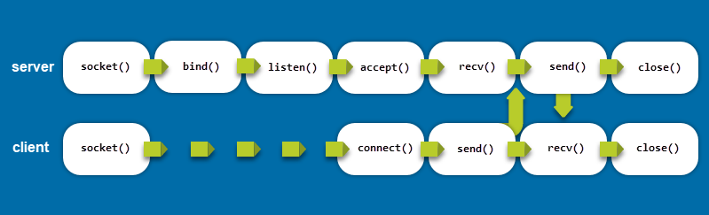
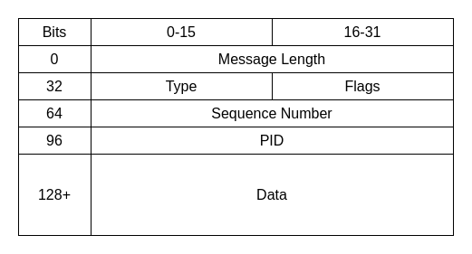
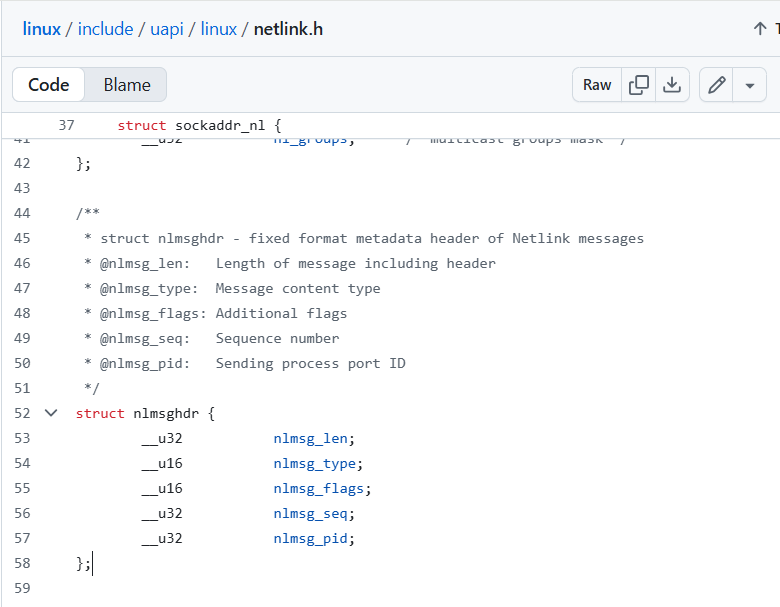

# 02 Basic Netlink Concept และตัวอย่าง

## Netlink คืออะไร? ทำไมเราถึงต้องใช้มัน?

Netlink คือกลไกการสื่อสารระหว่างโปรเซส (IPC) ของเคอร์เนลลินุกซ์ ซึ่งทำหน้าที่สื่อสารระหว่างพื้นที่เคอร์เนล (kernel space) และโปรเซสในพื้นที่ผู้ใช้ (user-space) โดยใช้ API ของซ็อกเก็ตแบบ BSD (BSD socket API) แบบคลาสสิก

**คุณสมบัติเฉพาะของเน็ตเวิร์กซ็อกเก็ต:**
- ใช้งานได้บน `localhost` เท่านั้น และจะไม่เปิดเผยการเชื่อมต่อออกสู่ภายนอก
- รองรับ API ของ Berkeley Sockets (เช่น `bind`, `listen`, `accept`, `connect`)
- ประกอบด้วยแฟมิลี (families) ที่มีโครงสร้างชัดเจน ทำให้มีความยืดหยุ่นและสามารถขยายความสามารถได้
- รองรับกลุ่มมัลติคาสต์ (multicast groups) เพื่อจัดการกับอีเวนต์ต่างๆ
- มีเครื่องมือสำหรับใช้ในการดีบัก (debugging)

API Specification ฟังก์ชันต่างๆ ในการเขียนโปรแกรมซ็อกเก็ต (socket programming):

## ฝั่งเซิร์ฟเวอร์ (Server Side)

* `bind()` - **ผูก**ซ็อกเก็ตเข้ากับที่อยู่เครือข่าย (network address) และหมายเลขพอร์ต (port number) ที่ต้องการ
* `listen()` - **สั่งให้เซิร์ฟเวอร์รอฟัง**การเชื่อมต่อที่เข้ามายังตำแหน่งเครือข่ายที่ระบุไว้
* `accept()` - **ยอมรับ**การเชื่อมต่อจากไคลเอนต์ เมื่อมีการเชื่อมต่อเข้ามา ฟังก์ชันนี้จะสร้างซ็อกเก็ตใหม่สำหรับการสื่อสารกับไคลเอนต์นั้นๆ
* `read()` และ `write()` - **ใช้อ่านและเขียนข้อมูล**เพื่อสื่อสารกับไคลเอนต์ผ่านซ็อกเก็ตที่สร้างขึ้นใหม่หลังจาก `accept()` สำเร็จ

***

## ฝั่งไคลเอนต์ (Client Side)

* `connect()` - **เชื่อมต่อไปยังเซิร์ฟเวอร์** โดยระบุที่อยู่ของซ็อกเก็ตฝั่งเซิร์ฟเวอร์เป็นพารามิเตอร์
* `send()` และ `recv()` - **ใช้สำหรับส่งและรับข้อมูล**ตามลำดับ
* `close()` - **ปิดการเชื่อมต่อ**ระหว่างไคลเอนต์และเซิร์ฟเวอร์




## การสื่อสารกับ Kernel ทำได้อย่างไรบ้าง:

  - **System Calls:** เป็นวิธีมาตรฐาน แต่เราจะเพิ่ม System Call ใหม่ๆ เข้าไปใน Kernel ไม่ได้ง่ายๆ
  - **`ioctl`:** ย่อมาจาก Input/Output Control เป็นวิธีที่ยืดหยุ่น แต่ก็ใช้ยาก จัดการข้อมูลซับซ้อนลำบาก และอาจไม่ปลอดภัยถ้าเขียนไม่ดี
  - **`procfs`/`sysfs`:** เป็นการสร้างไฟล์เสมือนใน `/proc` หรือ `/sys` ให้ Userspace อ่าน/เขียนข้อมูลได้ วิธีนี้ดีสำหรับข้อมูลที่ไม่ซับซ้อน แต่ถ้าจะส่งข้อมูลไปกลับแบบ Real-time มันจะช้าและไม่เหมาะ
  - **Netlink** สื่อสารแบบ **Socket** ที่ออกแบบมาโดยเฉพาะสำหรับการสื่อสารสองทาง (Bi-directional) ระหว่าง Kernel และ Userspace

!!! note
    Netlink คือ "เครือข่ายส่วนตัว" ภายในเครื่องคอมพิวเตอร์ของคุณเอง ที่มี Kernel เป็น Server หลัก และโปรแกรมต่างๆ ใน Userspace เป็น Client มันรวดเร็ว ยืดหยุ่น และเป็นมาตรฐานที่ใช้กันอย่างแพร่หลายใน Linux Kernel สมัยใหม่ (เช่น ระบบ Network, Firewall, udev ล้วนใช้ Netlink ทั้งสิ้น)

## Netlink Families คืออะไร?

**Netlink families** เปรียบเสมือน "ช่องทาง" หรือ "แผนก" เฉพาะทางภายใน Linux kernel ที่เราสามารถสื่อสารด้วยได้ผ่าน Netlink socket แต่ละ family จะรับผิดชอบการจัดการระบบย่อย (subsystem) ที่แตกต่างกันไป ทำให้โปรแกรมใน user-space (เช่น เครื่องมือตั้งค่าเน็ตเวิร์ก) สามารถส่งคำสั่งเพื่อขอข้อมูลหรือเปลี่ยนแปลงการตั้งค่าของ kernel ในเรื่องนั้นๆ ได้

การมี families ช่วยให้การสื่อสารเป็นระเบียบและขยายความสามารถได้ง่าย เมื่อมีเทคโนโลยีเครือข่ายใหม่ๆ เกิดขึ้น ก็สามารถเพิ่ม family ใหม่เข้าไปใน kernel ได้โดยไม่กระทบกับส่วนอื่นๆ

---

###  Netlink Families 
Docs:
[https://docs.kernel.org/networking/netlink_spec/index.html](https://docs.kernel.org/networking/netlink_spec/index.html)

[https://docs.kernel.org/userspace-api/netlink/intro.html](https://docs.kernel.org/userspace-api/netlink/intro.html)


####  Routing tables (ตารางเส้นทาง)
* **Family:** `NETLINK_ROUTE`
* **หน้าที่:** เป็น family ที่ใช้จัดการทุกอย่างที่เกี่ยวกับการตั้งค่าเครือข่ายพื้นฐาน เช่น:
    * **การดูและแก้ไข Routing Table:** เพิ่ม, ลบ, หรือเปลี่ยนแปลงเส้นทางที่ packet จะวิ่งไปในเครือข่าย (เหมือนการใช้คำสั่ง `ip route`)
    * **การจัดการ Network Interfaces:** เปิด/ปิดการ์ดแลน (NICs), ตั้งค่า IP address, เปลี่ยน MAC address
    * **การตั้งค่าเพื่อนบ้าน (Neighbor setup):** จัดการ ARP table (สำหรับ IPv4) และ Neighbor Discovery (สำหรับ IPv6)

#### Netfilter and conntrack (ตัวกรองแพ็กเก็ตและติดตามการเชื่อมต่อ)
* **Family:** `NETLINK_NETFILTER`
* **หน้าที่:** เป็นช่องทางสำหรับสื่อสารกับ **Netfilter framework** ซึ่งเป็นหัวใจของไฟร์วอลล์ใน Linux ใช้สำหรับ:
    * **Packet Filtering:** สร้างกฎเพื่ออนุญาตหรือบล็อก packet ที่วิ่งเข้า-ออกเครื่อง (เป็นสิ่งที่ `iptables` และ `nftables` ใช้เบื้องหลัง)
    * **NAT (Network Address Translation):** แปลง IP address ภายในเป็นภายนอก
    * **Connection Tracking (conntrack):** ติดตามสถานะของการเชื่อมต่อ TCP/UDP ทำให้สามารถสร้างไฟร์วอลล์แบบ "stateful" ได้ (เช่น รู้ว่า packet นี้เป็นส่วนหนึ่งของการเชื่อมต่อที่เคยอนุญาตไปแล้ว)

#### IPsec (โปรโตคอลความปลอดภัย)
* **Family:** `NETLINK_XFRM` (ย่อมาจาก transform)
* **หน้าที่:** ใช้สำหรับจัดการและกำหนดค่านโยบายความปลอดภัยของ **IPsec** ซึ่งเป็นโปรโตคอลที่ใช้สร้างการเชื่อมต่อที่ปลอดภัย (เข้ารหัสและยืนยันตัวตน) ในระดับ IP มักใช้ในการทำ VPN แบบ Site-to-Site

#### WireGuard (โปรโตคอล VPN)
* **Family:** `NETLINK_GENERIC`
* **หน้าที่:** WireGuard ไม่ได้มี family เป็นของตัวเองโดยตรง แต่จะใช้ family กลางที่ชื่อว่า **Generic Netlink (`NETLINK_GENERIC`)** ในการสื่อสาร ซึ่งเป็น family ที่ออกแบบมาเพื่อให้ง่ายต่อการเพิ่มโปรโตคอลใหม่ๆ เข้าไป เครื่องมืออย่าง `wg` จะใช้ช่องทางนี้เพื่อสร้างอินเทอร์เฟซของ WireGuard, ตั้งค่า public/private key, และกำหนดค่า peer (เครื่องปลายทาง) ที่จะเชื่อมต่อด้วย

#### L2TP tunnels (อุโมงค์ L2TP)
* **การทำงาน:** L2TP (Layer 2 Tunneling Protocol) มักจะถูกจัดการโดยโปรแกรม (daemon) ใน user-space ซึ่งโปรแกรมเหล่านี้จะใช้ Netlink families หลายตัวร่วมกัน โดยเฉพาะ `NETLINK_ROUTE` เพื่อสร้าง virtual network interface สำหรับอุโมงค์ และกำหนดเส้นทาง (route) ที่จำเป็นเพื่อให้ข้อมูลวิ่งผ่านอุโมงค์ L2TP ได้

#### Crypto engines (กลไกการเข้ารหัส)
* **Family:** `NETLINK_CRYPTO`
* **หน้าที่:** เป็นช่องทางที่ให้โปรแกรมใน user-space สามารถสื่อสารกับ **Kernel Crypto API** ได้โดยตรง เพื่อ:
    * สอบถามว่า kernel รองรับอัลกอริทึมการเข้ารหัสอะไรบ้าง (เช่น AES, SHA-256)
    * กำหนดค่าและใช้งานกลไกการเข้ารหัสเหล่านั้น
  
-----

## NetLink message format



จาก diagram ของ netlink packet format กำหนด อยู่ ใน ``linux/netlink.h``

```
// The structure can be found in
// https://github.com/torvalds/linux/blob/master/include/uapi/linux/netlink.h 

struct nlmsghdr {
	__u32		nlmsg_len;	
	__u16		nlmsg_type;
	__u16		nlmsg_flags;
	__u32		nlmsg_seq;
	__u32		nlmsg_pid;
};
```

[https://github.com/torvalds/linux/blob/master/include/uapi/linux/netlink.h](https://github.com/torvalds/linux/blob/master/include/uapi/linux/netlink.h)



## Workshop Linux Netlink เชื่อมโยงกับ Kernel

ผมจะแบ่งกระบวนการสร้าง Kernel Module และ Userspace App ที่คุยกันผ่าน Netlink ออกเป็น 10 ขั้นตอน/ตัวอย่างย่อยๆ เพื่อให้เห็นภาพรวมและเข้าใจการทำงานร่วมกันตั้งแต่ต้นจนจบนะครับ

**เป้าหมายของเรา:** สร้าง Kernel Module ที่เมื่อได้รับข้อความ "Hello Kernel" จาก Userspace จะตอบกลับไปด้วยข้อความว่า "Hello Userspace"

### 🎯 ขั้นตอนที่ 1: กำหนด Protocol ของเรา

Netlink มี Protocol สำเร็จรูปอยู่หลายตัว (เช่น `NETLINK_ROUTE` สำหรับจัดการ Network Route) แต่เราจะสร้าง Protocol ของเราเองเพื่อใช้งานส่วนตัว ในที่นี้เราจะใช้ Protocol หมายเลข 31 ซึ่งเป็นหมายเลขที่ยังว่างอยู่

```c
// ใช้ในทั้ง Kernel และ Userspace
#define NETLINK_USER_PROTOCOL 31
```

- ``NETLINK_USER_PROTOCOL 31``  ไม่สามารถกำหนดให้มากกว่า 31, ถ้ามากกว่า 31 จะทำให้เกิด error "insmod: ERROR: could not insert module netlink_kernel.ko: No child processes"


นี่คือกฎข้อแรกของการสื่อสาร: ทั้งสองฝั่งต้องรู้ว่าจะคุยกันผ่านช่องทางไหน

-----

### 🎯 ขั้นตอนที่ 2: (Kernel) การสร้าง Netlink Socket ใน Module

เมื่อ Module ของเราถูกโหลด (`insmod`) เราต้องสร้าง Socket ฝั่ง Kernel เพื่อรอรับการเชื่อมต่อจาก Userspace เราจะใช้ฟังก์ชัน `netlink_kernel_create`

```c
// ในไฟล์ kernel module (.c)
#include <net/sock.h> // สำหรับ netlink_kernel_create

static struct sock *nl_sk = NULL; // ตัวแปรสำหรับเก็บ socket ของเรา

static void nl_recv_msg(struct sk_buff *skb); // ประกาศฟังก์ชัน callback ไว้ก่อน

static int __init nl_example_init(void) {
    printk("Initializing Netlink Example Module\n");

    // เตรียม config สำหรับสร้าง socket
    struct netlink_kernel_cfg cfg = {
        .input = nl_recv_msg, // <-- นี่คือหัวใจ! บอกว่าถ้ามีข้อมูลเข้ามา ให้เรียกฟังก์ชันนี้
    };

    // สร้าง socket
    nl_sk = netlink_kernel_create(&init_net, NETLINK_USER_PROTOCOL, &cfg);

    if (!nl_sk) {
        printk(KERN_ALERT "Error creating socket.\n");
        return -10;
    }
    return 0;
}
```

**จากตัวอย่าง:** การจะเปิด "ประตู" ในฝั่ง Kernel เราต้องบอก 2 อย่างคือ 1) จะใช้ Protocol หมายเลขอะไร (`NETLINK_USER_PROTOCOL`) และ 2) ถ้ามีคนมาเคาะประตู (ส่งข้อมูลมา) จะให้ใครไปจัดการ (`.input = nl_recv_msg`) การสื่อสารอยู่ในรูปแบบ Callback เนื่องจาก kernel ไม่สามารถ loop check จึงต้องใช้การสือสารแบบ Callback 


## มาลองทำความเข้าใจ Callback การเขียนโปรแกรมเชิงเหตุการณ์ (Event-Driven)

ใน Kernel เราไม่สามารถเขียนโค้ดให้ทำงานวนลูปเพื่อรออะไรบางอย่างได้ (เช่น `while(true) { check_for_message(); }`) เพราะมันจะกิน CPU ไปทั้งหมดและทำให้ทั้งระบบค้าง

ดังนั้น แทนที่เราจะเป็นฝ่าย "วิ่งไปเช็ค" ว่ามีข้อมูลมาหรือยัง เราจะเปลี่ยนมาใช้วิธีบอกกับระบบว่า:

!!! note "สรุปทำความเข้าใจ"
    "นี่คือฟังก์ชันของฉัน (`nl_recv_msg`) ฝากไว้ก่อนนะ ถ้ามีข้อมูล Netlink วิ่งเข้ามาเมื่อไหร่ **ช่วยเรียก (Call Back)** ฟังก์ชันนี้ให้ฉันที พร้อมกับเอาข้อมูลนั้น (`skb`) มาด้วย"

### ลองเปรียบเทียบง่ายๆ 💡

เช่นเราสั่งอาหารเดลิเวอรี่แล้วให้เบอร์โทรศัพท์ไว้กับร้านค้า:
* คุณไม่ได้โทรไปถามร้านทุกๆ 5 นาทีว่า "อาหารเสร็จยัง?" (Active Polling)
* แต่คุณบอกร้านว่า "ถ้าอาหารเสร็จแล้ว **โทรกลับ (Callback)** มาที่เบอร์นี้นะ"

ในโค้ดของเรา:
* **คุณ**: คือ Kernel Module ของเรา
* **ร้านค้า**: คือ Netlink Subsystem ของ Kernel
* **เบอร์โทรศัพท์**: คือ Function Pointer `.input = nl_recv_msg`
* **"อาหารเสร็จแล้ว"**: คือเหตุการณ์ (Event) ที่มีข้อมูล Netlink ส่งมาจาก Userspace

นี่คือ Design Pattern ที่เจอบ่อยมากๆ ในการเขียนโค้ด Kernel ไม่ว่าจะเป็นการจัดการกับ Interrupt จาก Hardware, การจัดการ File Operations (open, read, write) หรือการรับข้อมูลจาก Network ทั้งหมดล้วนใช้ Callback เป็นพื้นฐานครับ

**คุณเข้าใจถูกทางแล้วครับ** การมองเห็น Concept นี้ออกถือเป็นก้าวสำคัญมากในการทำความเข้าใจโค้ดระดับล่างเลย

!!! note
    ดูโครงสร้างข้อมูล [Ref: Struct netlink_kernel_cfg](./ref01_netlink_kernel_cfg.md)
-----

### 🎯 ขั้นตอนที่ 3: (Kernel) ฟังก์ชันรับข้อมูล (Callback Function)

ฟังก์ชัน `nl_recv_msg` ที่เราผูกไว้ในขั้นตอนที่แล้ว คือตัวที่จะทำงานเมื่อมีข้อมูลเข้ามา ข้อมูลจะถูกห่อหุ้มมาในโครงสร้างข้อมูลที่สำคัญที่สุดในระบบ Network ของ Linux นั่นคือ `struct sk_buff` (หรือ `skb`)

```c
#include <linux/netlink.h> // สำหรับ struct nlmsghdr

static void nl_recv_msg(struct sk_buff *skb) {
    struct nlmsghdr *nlh;
    char *msg;

    printk(KERN_INFO "Entering: %s\n", __FUNCTION__);

    // ดึง header ของ Netlink message ออกมาจาก skb
    nlh = (struct nlmsghdr *)skb->data;
    // ดึงข้อมูล (payload) ที่ต่อท้าย header ออกมา
    msg = (char *)nlmsg_data(nlh);

    // พิมพ์ข้อความที่ได้รับ และ PID ของโปรแกรมที่ส่งมา
    printk(KERN_INFO "Netlink received msg payload: %s\n", msg);
    printk(KERN_INFO "Message sent from PID: %u\n", nlh->nlmsg_pid);

    // เดี๋ยวเราจะเพิ่มโค้ดส่งข้อมูลกลับตรงนี้...
}
```

**ตัวอย่างนี้สอนอะไร:** ข้อมูลที่วิ่งใน Netlink ไม่ใช่แค่ข้อความเปล่าๆ มันมี "หัวจดหมาย" (`nlmsghdr`) แปะมาด้วยเสมอ ซึ่งในหัวจดหมายนี้จะมีข้อมูลสำคัญ เช่น Process ID (PID) ของผู้ส่ง ทำให้เรารู้ว่าจะตอบจดหมายกลับไปหาใคร

-----

### 🎯 ขั้นตอนที่ 4: (Kernel) การเตรียมและส่งข้อมูลกลับ

หลังจากได้รับข้อความแล้ว เราจะส่งข้อความกลับไปหา Userspace เดิม โดยใช้ PID ที่เราได้มาจาก `nlh->nlmsg_pid`

```c
// เพิ่มเข้าไปในฟังก์ชัน nl_recv_msg จากขั้นตอนที่ 3
static void nl_recv_msg(struct sk_buff *skb) {
    struct nlmsghdr *nlh;
    int pid;
    struct sk_buff *skb_out;
    char *msg_to_user = "Hello Userspace";
    int msg_size;

    nlh = (struct nlmsghdr *)skb->data;
    pid = nlh->nlmsg_pid; // เก็บ PID ของผู้ส่ง

    /* ... โค้ดรับข้อมูลเหมือนเดิม ... */

    // --- ส่วนของการส่งกลับ ---
    msg_size = strlen(msg_to_user);

    // 1. สร้าง skb ใหม่สำหรับส่งข้อมูลออกไป
    skb_out = nlmsg_new(msg_size, 0);
    if (!skb_out) {
        printk(KERN_ERR "Failed to allocate new skb\n");
        return;
    }

    // 2. สร้าง header และใส่ข้อมูลของเราลงไปใน skb ใหม่
    nlh = nlmsg_put(skb_out, 0, 0, NLMSG_DONE, msg_size, 0);
    // 3. คัดลอกข้อความของเราไปใส่ใน payload
    strncpy(nlmsg_data(nlh), msg_to_user, msg_size);

    // 4. ส่งข้อมูลกลับไปยัง Process ที่มี PID ตรงกัน (Unicast)
    nlmsg_unicast(nl_sk, skb_out, pid);
    printk(KERN_INFO "Sent message back to PID %d\n", pid);
}
```

**ตัวอย่างนี้สอนอะไร:** การส่งข้อมูลกลับก็เหมือนการเขียนจดหมายใหม่ คือต้องสร้างซอง (`nlmsg_new`) เขียนหัวจดหมาย (`nlmsg_put`) ใส่เนื้อหา (`nlmsg_data`) แล้วส่งไปที่อยู่ของผู้รับที่ถูกต้อง (`nlmsg_unicast` โดยใช้ `pid`)

-----

### 🎯 ขั้นตอนที่ 5: (Kernel) การปิด Socket เมื่อ Module ถูกถอด

เมื่อ Module ถูกถอดออก (`rmmod`) เราต้องทำความสะอาดทรัพยากรที่เราใช้ไป นั่นคือการปิด Netlink Socket

```c
static void __exit nl_example_exit(void) {
    printk(KERN_INFO "Exiting Netlink Example Module\n");
    netlink_kernel_release(nl_sk); // ปิด socket ของเรา
}
```

**ตัวอย่างนี้สอนอะไร:** การจัดการทรัพยากรเป็นเรื่องสำคัญใน Kernel Programmingเสมอ เปิดอะไรไว้ ต้องปิดด้วย

-----

### 🎯 ขั้นตอนที่ 6: (Userspace) การสร้าง Socket

ตอนนี้เรามาดูฝั่ง Userspace บ้าง โปรแกรมของเราก็ต้องสร้าง Socket เหมือนกัน แต่เป็น Socket family `AF_NETLINK`

```c
// ในไฟล์ userspace application (.c)
#include <sys/socket.h>
#include <linux/netlink.h>

int sock_fd;
struct sockaddr_nl src_addr;

sock_fd = socket(AF_NETLINK, SOCK_RAW, NETLINK_USER_PROTOCOL);
if (sock_fd < 0) {
    perror("socket");
    return -1;
}
```

**ตัวอย่างนี้สอนอะไร:** การสร้าง Socket ใน Userspace ก็เหมือนการสร้าง Socket ทั่วไป แต่ระบุ Family และ Protocol ให้ตรงกับที่ Kernel รออยู่

-----

### 🎯 ขั้นตอนที่ 7: (Userspace) การ Bind Socket

Kernel ต้องรู้ว่าจะส่งข้อมูลกลับมาที่ Process ไหน เราจึงต้อง `bind` Socket ของเราเข้ากับ Process ID ของโปรแกรมเราเอง

```c
// ต่อจากขั้นตอนที่ 6
memset(&src_addr, 0, sizeof(src_addr));
src_addr.nl_family = AF_NETLINK;
src_addr.nl_pid = getpid(); // <-- สำคัญมาก! ใช้ PID ของตัวเองเป็นที่อยู่

if (bind(sock_fd, (struct sockaddr *)&src_addr, sizeof(src_addr)) < 0) {
    perror("bind");
    close(sock_fd);
    return -1;
}
```

**ตัวอย่างนี้สอนอะไร:** `bind` คือการ "ลงทะเบียนที่อยู่" ของโปรแกรมเรากับ Kernel โดยใช้ PID ของเราเองเป็นบ้านเลขที่

-----

### 🎯 ขั้นตอนที่ 8: (Userspace) การเตรียม Message ที่จะส่ง

เหมือนฝั่ง Kernel เราต้องสร้าง Message ที่มีทั้ง Header (`nlmsghdr`) และ Payload

```c
#define MAX_PAYLOAD 1024

struct nlmsghdr *nlh;
// จองหน่วยความจำสำหรับ Header + Payload
nlh = (struct nlmsghdr *)malloc(NLMSG_SPACE(MAX_PAYLOAD));
memset(nlh, 0, NLMSG_SPACE(MAX_PAYLOAD));

nlh->nlmsg_len = NLMSG_LENGTH(strlen("Hello Kernel"));
nlh->nlmsg_pid = getpid(); // ใส่ PID ของเราลงใน Header
nlh->nlmsg_flags = 0;

// คัดลอกข้อความของเราไปใส่ใน payload
strcpy(NLMSG_DATA(nlh), "Hello Kernel");
```

**ตัวอย่างนี้สอนอะไร:** การเตรียมข้อมูลต้องทำตาม Format ของ Netlink เสมอ โดยมี `nlmsghdr` เป็นส่วนหัว และมี `NLMSG_DATA` เป็นส่วนของข้อมูลที่เราต้องการส่งจริงๆ

-----

### 🎯 ขั้นตอนที่ 9: (Userspace) การส่งข้อมูลไปยัง Kernel

เมื่อเตรียม Message เสร็จแล้ว เราก็ส่งมันออกไปผ่าน Socket โดยระบุปลายทางคือ Kernel (ซึ่งมี `pid` เป็น 0)

```c
struct sockaddr_nl dest_addr;
struct iovec iov;
struct msghdr msg;

// ระบุปลายทางคือ Kernel
memset(&dest_addr, 0, sizeof(dest_addr));
dest_addr.nl_family = AF_NETLINK;
dest_addr.nl_pid = 0; // 0 หมายถึง Kernel
dest_addr.nl_groups = 0; // Unicast

iov.iov_base = (void *)nlh; // ชี้ไปยัง message ที่เราสร้าง
iov.iov_len = nlh->nlmsg_len;

memset(&msg, 0, sizeof(msg));
msg.msg_name = (void *)&dest_addr;
msg.msg_namelen = sizeof(dest_addr);
msg.msg_iov = &iov;
msg.msg_iovlen = 1;

printf("Sending message to kernel\n");
sendmsg(sock_fd, &msg, 0);
```

**ตัวอย่างนี้สอนอะไร:** การส่งข้อมูลใช้ `sendmsg` ซึ่งเป็นวิธีที่ยืดหยุ่น เราต้องระบุทั้ง "จดหมาย" (`iov`) และ "ที่อยู่ผู้รับ" (`dest_addr`) ซึ่งในที่นี้ก็คือ Kernel (`nl_pid = 0`)

-----

### 🎯 ขั้นตอนที่ 10: (Userspace) การรอรับข้อมูลตอบกลับจาก Kernel

หลังจากส่งไปแล้ว โปรแกรมของเราก็จะรอฟังที่ Socket เดิมเพื่อรอรับข้อความตอบกลับจาก Kernel

```c
// รอรับข้อความตอบกลับ
printf("Waiting for message from kernel...\n");
recvmsg(sock_fd, &msg, 0); // ใช้ msghdr เดิมมารับข้อมูลได้

// พิมพ์ข้อความที่ได้รับจาก kernel
printf("Received message payload: %s\n", (char *)NLMSG_DATA(nlh));

// ปิด socket และคืน memory
close(sock_fd);
free(nlh);
```

**ตัวอย่างนี้สอนอะไร:** การสื่อสารเป็นแบบสองทาง เมื่อส่งไปแล้ว เราสามารถใช้ Socket เดิมเพื่อรอรับการตอบกลับได้ทันทีด้วย `recvmsg`

-----

## สรุปโค้ดทั้งหมดและการใช้งาน

เพื่อให้เห็นภาพรวม ผมได้รวมโค้ดทั้งหมดไว้ให้แล้ว

**`nl_example.c` (Kernel Module)**

```c
#include <linux/module.h>
#include <linux/kernel.h>
#include <linux/init.h>
#include <net/sock.h>
#include <linux/netlink.h>
#include <linux/skbuff.h>

#define NETLINK_USER_PROTOCOL 31

static struct sock *nl_sk = NULL;

static void nl_recv_msg(struct sk_buff *skb) {
    struct nlmsghdr *nlh;
    int pid;
    struct sk_buff *skb_out;
    char *msg_payload;
    char *msg_to_user = "Hello Userspace";
    int res;

    printk(KERN_INFO "Entering: %s\n", __FUNCTION__);

    nlh = (struct nlmsghdr *)skb->data;
    msg_payload = (char *)nlmsg_data(nlh);
    printk(KERN_INFO "Netlink received msg payload: %s\n", msg_payload);
    pid = nlh->nlmsg_pid; // PID ของ userspace process

    skb_out = nlmsg_new(strlen(msg_to_user), 0);
    if (!skb_out) {
        printk(KERN_ERR "Failed to allocate new skb\n");
        return;
    }

    nlh = nlmsg_put(skb_out, 0, 0, NLMSG_DONE, strlen(msg_to_user), 0);
    strncpy(nlmsg_data(nlh), msg_to_user, strlen(msg_to_user));

    res = nlmsg_unicast(nl_sk, skb_out, pid);
    if (res < 0)
        printk(KERN_INFO "Error while sending back to user\n");
}

static int __init nl_example_init(void) {
    printk("Initializing Netlink Example Module\n");
    struct netlink_kernel_cfg cfg = {
        .input = nl_recv_msg,
    };
    nl_sk = netlink_kernel_create(&init_net, NETLINK_USER_PROTOCOL, &cfg);
    if (!nl_sk) {
        printk(KERN_ALERT "Error creating socket.\n");
        return -10;
    }
    return 0;
}

static void __exit nl_example_exit(void) {
    printk(KERN_INFO "Exiting Netlink Example Module\n");
    netlink_kernel_release(nl_sk);
}

module_init(nl_example_init);
module_exit(nl_example_exit);

MODULE_LICENSE("GPL");
```

**`Makefile` (สำหรับ Compile Kernel Module)**

```makefile
obj-m += nl_example.o

all:
	make -C /lib/modules/$(shell uname -r)/build M=$(PWD) modules

clean:
	make -C /lib/modules/$(shell uname -r)/build M=$(PWD) clean
```

**`user_app.c` (Userspace Application)**

```c
#include <sys/socket.h>
#include <unistd.h>
#include <string.h>
#include <stdio.h>
#include <stdlib.h>
#include <linux/netlink.h>

#define NETLINK_USER_PROTOCOL 31
#define MAX_PAYLOAD 1024

int main() {
    int sock_fd;
    struct sockaddr_nl src_addr, dest_addr;
    struct nlmsghdr *nlh = NULL;
    struct iovec iov;
    struct msghdr msg;

    sock_fd = socket(AF_NETLINK, SOCK_RAW, NETLINK_USER_PROTOCOL);
    if (sock_fd < 0) {
        perror("socket");
        return -1;
    }

    memset(&src_addr, 0, sizeof(src_addr));
    src_addr.nl_family = AF_NETLINK;
    src_addr.nl_pid = getpid();

    if (bind(sock_fd, (struct sockaddr *)&src_addr, sizeof(src_addr)) < 0) {
        perror("bind");
        close(sock_fd);
        return -1;
    }

    memset(&dest_addr, 0, sizeof(dest_addr));
    dest_addr.nl_family = AF_NETLINK;
    dest_addr.nl_pid = 0; // For Kernel
    dest_addr.nl_groups = 0; // unicast

    nlh = (struct nlmsghdr *)malloc(NLMSG_SPACE(MAX_PAYLOAD));
    memset(nlh, 0, NLMSG_SPACE(MAX_PAYLOAD));
    nlh->nlmsg_len = NLMSG_LENGTH(strlen("Hello Kernel"));
    nlh->nlmsg_pid = getpid();
    nlh->nlmsg_flags = 0;

    strcpy(NLMSG_DATA(nlh), "Hello Kernel");

    iov.iov_base = (void *)nlh;
    iov.iov_len = nlh->nlmsg_len;
    
    memset(&msg, 0, sizeof(msg));
    msg.msg_name = (void *)&dest_addr;
    msg.msg_namelen = sizeof(dest_addr);
    msg.msg_iov = &iov;
    msg.msg_iovlen = 1;

    printf("Sending message to kernel\n");
    sendmsg(sock_fd, &msg, 0);

    printf("Waiting for message from kernel...\n");
    recvmsg(sock_fd, &msg, 0);
    printf("Received message payload: %s\n", (char *)NLMSG_DATA(nlh));

    close(sock_fd);
    free(nlh);
    return 0;
}
```

**วิธีใช้งาน:**
```makefile title="Makefile"

# Compiler ที่จะใช้ (ปกติคือ gcc)
CC = gcc

# Flags สำหรับ Compiler
# -Wall  -> เปิดการแจ้งเตือน (Warning) ทั้งหมดที่สำคัญ
# -Wextra -> เปิดการแจ้งเตือนเพิ่มเติม
# -g     -> ใส่ข้อมูลสำหรับ Debugging (เพื่อให้ใช้กับ gdb ได้)
# -O2    -> ระดับการ Optimize โค้ด
CFLAGS = -Wall -Wextra -g -O2

# ชื่อไฟล์โปรแกรมผลลัพธ์ (Executable)
TARGET = user_app

# ชื่อไฟล์ซอร์สโค้ด (.c)
SRCS = user_app.c

# --- Targets ---

# Target แรกสุดคือ default target เมื่อรัน "make" เฉยๆ
# บอกว่าเป้าหมายหลัก (all) คือการสร้างไฟล์ $(TARGET)
all: $(TARGET)

# กฎสำหรับสร้างไฟล์ $(TARGET)
# $(TARGET) จะถูกสร้างขึ้นมาจาก $(SRCS)
$(TARGET): $(SRCS)
	# คำสั่งที่จะใช้สร้างคือ: gcc [flags] -o [output] [input]
	$(CC) $(CFLAGS) -o $(TARGET) $(SRCS)

# Target สำหรับลบไฟล์ที่ถูกสร้างขึ้น
clean:
	# คำสั่ง rm -f คือลบไฟล์โดยไม่ต้องถามและไม่แสดง error ถ้าไม่มีไฟล์
	rm -f $(TARGET)

# ประกาศว่า all และ clean เป็น "phony" targets
# คือเป็นแค่ชื่อคำสั่ง ไม่ใช่ชื่อไฟล์จริงๆ
.PHONY: all clean

```

1.  **Compile Kernel Module:** `make`
2.  **Compile Userspace App:** `gcc user_app.c -o user_app`
3.  **เปิด Terminal 2 หน้าต่าง**
4.  **Terminal 1:** ดู Log ของ Kernel: `sudo dmesg -w`
5.  **Terminal 2:**
      * โหลด Module: `sudo insmod ./nl_example.ko`
      * (ใน Terminal 1 จะเห็นข้อความ "Initializing Netlink Example Module")
      * รันโปรแกรม Userspace: `./user_app`
      * (ใน Terminal 2 จะเห็น "Sending message..." และ "Received message...")
      * (ใน Terminal 1 จะเห็น Log การรับและส่งข้อความจาก Kernel)
      * ถอด Module: `sudo rmmod nl_example`
      * (ใน Terminal 1 จะเห็นข้อความ "Exiting Netlink Example Module")

นี่คือพื้นฐานที่แข็งแรงที่สุดของการใช้ Netlink แล้วครับ จากจุดนี้คุณสามารถขยายไปสู่การส่งข้อมูลที่ซับซ้อนขึ้น, การใช้ Multicast (Kernel ส่งหาหลายๆโปรแกรมพร้อมกัน), หรือการใช้ Generic Netlink ที่เป็นเวอร์ชันใหม่กว่าได้
