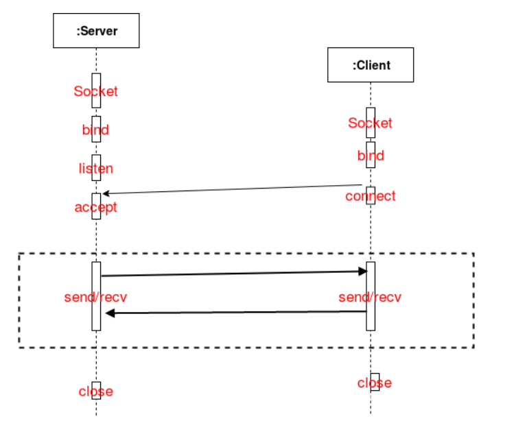
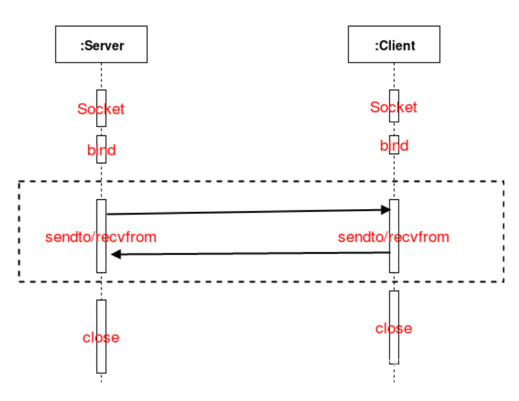
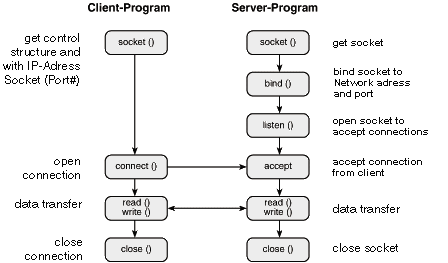

# 03 Linux multiprocess Socket TCP, UDP communication

- Tcp/ip

- udp/ip

[https://cloud.tencent.com/developer/article/1774749](https://cloud.tencent.com/developer/article/1774749)


### ตารางสรุปความแตกต่างระหว่าง Socket แบบ TCP และ UDP

| ขั้นตอน | TCP (Connection-Oriented) | UDP (Connectionless) |
| :--- | :--- | :--- |
| **ฝั่งเซิร์ฟเวอร์ (Server)** | | |
| 1. การสร้างการเชื่อมต่อ | ต้องใช้ `bind()`, `listen()` และ `accept()` เพื่อรอรับการเชื่อมต่อจากไคลเอนต์ | ใช้เพียง `bind()` ไม่จำเป็นต้องใช้ `listen()` และ `accept()` |
| 2. การรับ-ส่งข้อมูล | ใช้ฟังก์ชัน `send()` และ `recv()` | ใช้ฟังก์ชัน `sendto()` และ `recvfrom()` |
| 3. การปิดการเชื่อมต่อ | ต้องปิดการเชื่อมต่อของไคลเอนต์ที่ได้จาก `accept()` ก่อน แล้วจึงปิด Socket ของเซิร์ฟเวอร์ | สามารถปิด Socket (`close(socket)`) ได้โดยตรง |
| **ฝั่งไคลเอนต์ (Client)** | | |
| 1. การสร้างการเชื่อมต่อ | ต้องใช้ `connect()` เพื่อเชื่อมต่อไปยังเซิร์ฟเวอร์ | ไม่จำเป็นต้องใช้ `connect()` |
| 2. การรับ-ส่งข้อมูล | ใช้ฟังก์ชัน `send()` และ `recv()` | ใช้ฟังก์ชัน `sendto()` และ `recvfrom()` |



```bash title="command"
sudo su -

mkdir ipc-communicate
cd ipc-communicate
vim ipc_tcp_server.cpp
vim ipc_tcp_client.cpp
vim ipc_udp_server.cpp
vim ipc_udp_client.cpp
```

```c title="ipc_tcp_server.cpp"
/*************************************************************************
  > File Name: ipc_tcp_server.cpp
  > Author: TianLun Song
  > Mail: songtianlun@frytea.com
  > Blog: https://blog.frytea.com
  > Created Time: Wed 13 Jan 2021 09:53:06 AM CST
 ************************************************************************/
#include <sys/types.h>
#include <sys/socket.h>
#include <sys/un.h>
#include <memory.h>
#include <unistd.h>
#include <stdio.h>
#include <iostream>

using namespace std;
const char* server_file = "/tmp/ipc_tcp_server.sock";

int main(int argc,char** argv)
{
    int socket_fd = socket(AF_UNIX,SOCK_STREAM,0);
    if (socket_fd < 0)
    {
        perror("socket");
        return -1;
    }
    struct sockaddr_un addr;
    memset(&addr,0,sizeof(addr));
    addr.sun_family = AF_UNIX;
    strcpy(addr.sun_path,server_file);
    if (access(addr.sun_path,0) != -1)
    {
        remove(addr.sun_path);
    }
    if (bind(socket_fd,(sockaddr*)&addr,sizeof(addr)) < 0)
    {
        perror("bind");
        return -1;
    }
    /* --------DIFF, ipc tcp only------------ */
    if (listen(socket_fd,12) < 0)
    {
        perror("listen");
        return -1;
    }
    /* ---------------end------------ */
    struct sockaddr_un clientaddr;
    socklen_t addrlen = sizeof(clientaddr);
    char msg_buf[1024];
    /* --------DIFF, ipc tcp only------------ */
    int newcon = -1;
    newcon = accept(socket_fd,(sockaddr*)&clientaddr,&addrlen);
    if (newcon < 0)
    {
        perror("accept");
        return -1;
    }
    /* ---------------end------------ */
    while (1)
    {
        memset(msg_buf,'\0',1024);
        int rsize = recv(newcon,msg_buf,sizeof(msg_buf),0);
        if (rsize < 0)
        {
            perror("server recv error!");
            break;
        }
        cout << "I'm Unix socket(TCP) server, recv a msg:" << msg_buf << " from: " << clientaddr.sun_path << endl;
        strcpy(msg_buf, "OK,I got it!");
        int ssize = send(newcon, msg_buf, sizeof msg_buf, 0);
        if (ssize < 0)
        {
            perror("server send error!");
            break;
        }
        sleep(1);
    }
    /* --------DIFF, ipc tcp only------------ */
    if (close(newcon) < 0)
    {
        perror("close accept");
        return -1;
    }
    /* ---------------end------------ */
    if (close(socket_fd) < 0)
    {
        perror("close socket");
        return -1;
    }
    return 0;
}
```

!!! info "คำอธิบาย ipc_tcp_server.c"
    
    [คำอธิบาย explain_tcp_server.md ](explain_tcp_server.md)


```c title="ipc_tcp_client.cpp"
/*************************************************************************
  > File Name: ipc_tcp_client.cpp
  > Author: TianLun Song
  > Mail: songtianlun@frytea.com
  > Blog: https://blog.frytea.com
  > Created Time: Wed 13 Jan 2021 10:14:09 AM CST
 ************************************************************************/
#include <sys/types.h>
#include <sys/socket.h>
#include <sys/un.h>
#include <memory.h>
#include <unistd.h>
#include <stdio.h>
#include <iostream>

using namespace std;

const char* server_file = "/tmp/ipc_tcp_server.sock";
const char* client_file = "/tmp/ipc_tcp_client.sock";

int main(int argc,char** argv)
{
    int socket_fd = socket(AF_UNIX,SOCK_STREAM,0);
    if (socket_fd < 0)
    {
        perror("client socket");
        return -1;
    }
    struct sockaddr_un client_addr;
    memset(&client_addr,0,sizeof(client_addr));
    client_addr.sun_family = AF_UNIX;
    strcpy(client_addr.sun_path,client_file);

    if (access(client_addr.sun_path,0) != -1)
    {
        remove(client_addr.sun_path);
    }

    if(bind(socket_fd,(sockaddr*)&client_addr,sizeof(client_addr)) < 0)
    {
        perror("client bind");
        return -1;
    }
    struct sockaddr_un serveraddr;
    memset(&serveraddr,0,sizeof(serveraddr));
    socklen_t addrlen = sizeof(serveraddr);
    serveraddr.sun_family = AF_UNIX;
    strcpy(serveraddr.sun_path,server_file);
    char msg_buf[1024];
    /* --------DIFF, ipc tcp only------------ */
    int newcon = -1;
    newcon = connect(socket_fd,(sockaddr*)&serveraddr,addrlen);
    if (newcon < 0){
        perror("client connect");
    }
    /* ---------------end------------ */
    while(1)
    {
        strcpy(msg_buf, "How are you !!!");
        int ssize = send(socket_fd, msg_buf, sizeof msg_buf, 0);
        if (ssize < 0)
        {
            perror("client send");
            continue;
        }
        int rsize = recv(socket_fd, msg_buf, sizeof(msg_buf), 0);
        if (rsize < 0)
        {
            perror("client recv");
            continue;
        }
        cout << "I'm Unix socket(TCP) client，receive a msg :" << msg_buf << endl;
        sleep(1);
    }
    if (close(socket_fd) < 0)
    {
        perror("close");
        return -1;
    }
    return 0;
}
```

!!! info "คำอธิบาย ipc_tcp_client.cpp"
    
    [คำอธิบาย explain_tcp_client.md ](explain_tcp_client.md)


```c title="ipc_udp_server.cpp"
/*************************************************************************
  > File Name: ipc_udp_server.cpp
  > Author: TianLun Song
  > Mail: songtianlun@frytea.com
  > Blog: https://blog.frytea.com
  > Created Time: Wed 13 Jan 2021 09:53:06 AM CST
 ************************************************************************/
#include <sys/types.h>
#include <sys/socket.h>
#include <sys/un.h>
#include <memory.h>
#include <unistd.h>
#include <stdio.h>
#include <iostream>

using namespace std;
const char* server_file = "/tmp/ipc_udp_server.sock";

int main(int argc,char** argv)
{
    int socket_fd = socket(AF_UNIX,SOCK_DGRAM,0);
    if (socket_fd < 0)
    {
        perror("socket");
        return -1;
    }
    struct sockaddr_un addr;
    memset(&addr,0,sizeof(addr));
    addr.sun_family = AF_UNIX;
    strcpy(addr.sun_path,server_file);
    if (access(addr.sun_path,0) != -1)
    {
        remove(addr.sun_path);
    }
    if (bind(socket_fd,(sockaddr*)&addr,sizeof(addr)) < 0)
    {
        perror("bind");
        return -1;
    }
    struct sockaddr_un clientaddr;
    socklen_t addrlen = sizeof(clientaddr);
    char msg_buf[1024];
    while (1)
    {
        memset(msg_buf,'\0',1024);
        int rsize = recvfrom(socket_fd,msg_buf,sizeof(msg_buf),0,(sockaddr*)&clientaddr,&addrlen);
        if (rsize < 0)
        {
            perror("server recv error!");
            break;
        }
        cout << "I'm Unix socket(UDP) server, recv a msg: " << msg_buf  << " from: " << clientaddr.sun_path << endl;
        strcpy(msg_buf, "OK,I got it!");
        int ssize = sendto(socket_fd, msg_buf, sizeof msg_buf,0,(sockaddr*)&clientaddr,addrlen);
        if (ssize < 0)
        {
            perror("server send error!");
            break;
        }
        sleep(1);
    }
    if (close(socket_fd) < 0)
    {
        perror("close socket");
        return -1;
    }
    return 0;
}
```

!!! info "คำอธิบาย ipc_udp_server.cpp"
    
    [คำอธิบาย explain_udp_server.md ](explain_udp_server.md)


```c title="ipc_udp_client.cpp"
/*************************************************************************
  > File Name: ipc_udp_client.cpp
  > Author: TianLun Song
  > Mail: songtianlun@frytea.com
  > Blog: https://blog.frytea.com
  > Created Time: Wed 13 Jan 2021 10:14:09 AM CST
 ************************************************************************/
#include <sys/types.h>
#include <sys/socket.h>
#include <sys/un.h>
#include <memory.h>
#include <unistd.h>
#include <stdio.h>
#include <iostream>

using namespace std;

const char* server_file = "/tmp/ipc_udp_server.sock";
const char* client_file = "/tmp/ipc_udp_client.sock";

int main(int argc,char** argv)
{
    int socket_fd = socket(AF_UNIX,SOCK_DGRAM,0);
    if (socket_fd < 0)
    {
        perror("client socket");
        return -1;
    }
    struct sockaddr_un client_addr;
    memset(&client_addr,0,sizeof(client_addr));
    client_addr.sun_family = AF_UNIX;
    strcpy(client_addr.sun_path,client_file);

    if (access(client_addr.sun_path,0) != -1)
    {
        remove(client_addr.sun_path);
    }

    if(bind(socket_fd,(sockaddr*)&client_addr,sizeof(client_addr)) < 0)
    {
        perror("client bind");
        return -1;
    }
    struct sockaddr_un serveraddr;
    memset(&serveraddr,0,sizeof(serveraddr));
    socklen_t addrlen = sizeof(serveraddr);
    serveraddr.sun_family = AF_UNIX;
    strcpy(serveraddr.sun_path,server_file);
    char msg_buf[1024];
    while(1)
    {
        strcpy(msg_buf, "How are you !!!");
        int ssize = sendto(socket_fd, msg_buf, sizeof msg_buf, 0, (sockaddr*)&serveraddr,addrlen);
        if (ssize < 0)
        {
            perror("client sendto");
            continue;
        }
        int rsize = recvfrom(socket_fd, msg_buf, sizeof(msg_buf), 0,(sockaddr*)&serveraddr, &addrlen);
        if (rsize < 0)
        {
            perror("client recv");
            continue;
        }
        cout << "I'm Unix socket(TCP) client，receive a msg :" << msg_buf << endl;
        sleep(1);
    }
    if (close(socket_fd) < 0)
    {
        perror("close");
        return -1;
    }
    return 0;
}
```

!!! info "คำอธิบาย ipc_udp_client.cpp"
    
    [คำอธิบาย explain_udp_client.md ](explain_udp_client.md)


## ให้ทำการทดสอบดังนี้ 👨‍💻

เปิดหน้าต่างเทอร์มินัล (Terminal) สองหน้าต่างแยกกัน หน้าต่างหนึ่งสำหรับรันโปรแกรมฝั่ง Server และอีกหน้าต่างสำหรับรันโปรแกรมฝั่ง Client

-----

## 1\. การคอมไพล์ (Compile)

เราจะใช้คอมไพเลอร์ `g++` (เนื่องจากในโค้ดมีการใช้ `iostream` และ `using namespace std;` ซึ่งเป็นส่วนของ C++) คำสั่งจะเหมือนกันสำหรับทั้ง TCP และ UDP แค่เปลี่ยนชื่อไฟล์เท่านั้นครับ

รันคำสั่งเหล่านี้ในเทอร์มินัลเพื่อสร้างไฟล์โปรแกรม (executable files):

```bash
# install g++

sudo apt install g++

# คอมไพล์ TCP Server
g++ ipc_tcp_server.cpp -o ipc_tcp_server

# คอมไพล์ TCP Client
g++ ipc_tcp_client.cpp -o ipc_tcp_client

# คอมไพล์ UDP Server
g++ ipc_udp_server.cpp -o ipc_udp_server

# คอมไพล์ UDP Client
g++ ipc_udp_client.cpp -o ipc_udp_client
```
Screen:


หลังจากรันคำสั่งเหล่านี้ คุณจะได้ไฟล์ใหม่ 4 ไฟล์คือ `ipc_tcp_server`, `ipc_tcp_client`, `ipc_udp_server`, และ `ipc_udp_client`

[อ่าน เปรียบเทียบ gcc และ g++](./explan_gcc_g++.md)
-----

## 2\. การทดสอบ (Testing)

### การทดสอบแบบ TCP (SOCK\_STREAM)

1.  **เทอร์มินัลที่ 1 (Server):**

      * รันโปรแกรม Server ก่อน เพื่อให้มันสร้าง socket file และรอการเชื่อมต่อ

    <!-- end list -->

    ```bash
    ./ipc_tcp_server
    ```

      * คุณจะเห็นว่าเทอร์มินัลนี้จะหยุดรอ ไม่แสดงผลอะไรออกมา

2.  **เทอร์มินัลที่ 2 (Client):**

      * รันโปรแกรม Client เพื่อเชื่อมต่อไปยัง Server

    <!-- end list -->

    ```bash
    ./ipc_tcp_client
    ```

**ผลลัพธ์ที่คาดหวัง:**

  * **ฝั่ง Server** จะแสดงผลข้อความที่ได้รับจาก Client ทุกๆ 1 วินาที:
    ```
    I'm Unix socket(TCP) server, recv a msg:How are you !!! from: /tmp/ipc_tcp_client.sock
    ```
  * **ฝั่ง Client** จะแสดงผลข้อความตอบกลับจาก Server ทุกๆ 1 วินาที:
    ```
    I'm Unix socket(TCP) client，receive a msg :OK,I got it!
    ```

ในการหยุดโปรแกรม ให้กด `Ctrl + C` ในแต่ละหน้าต่างเทอร์มินัล

Screen:


### การทดสอบแบบ UDP (SOCK\_DGRAM)

ขั้นตอนจะคล้ายกับ TCP แต่ใช้ไฟล์โปรแกรมของ UDP แทน

1.  **เทอร์มินัลที่ 1 (Server):**

      * รันโปรแกรม UDP Server

    <!-- end list -->

    ```bash
    ./ipc_udp_server
    ```

      * เทอร์มินัลจะหยุดรอรับข้อมูล

2.  **เทอร์มินัลที่ 2 (Client):**

      * รันโปรแกรม UDP Client

    <!-- end list -->

    ```bash
    ./ipc_udp_client
    ```

**ผลลัพธ์ที่คาดหวัง:**

  * **ฝั่ง Server** จะแสดงผลข้อความที่ได้รับจาก Client ทุกๆ 1 วินาที:
    ```
    I'm Unix socket(UDP) server, recv a msg: How are you !!! from: /tmp/ipc_udp_client.sock
    ```
  * **ฝั่ง Client** จะแสดงผลข้อความตอบกลับจาก Server ทุกๆ 1 วินาที (สังเกตว่าในโค้ด client ต้นฉบับพิมพ์ว่า TCP แต่การทำงานเป็น UDP):
    ```
    I'm Unix socket(TCP) client，receive a msg :OK,I got it!
    ```

ในการหยุดโปรแกรม ให้กด `Ctrl + C` ในแต่ละหน้าต่างเทอร์มินัลเช่นกันครับ

Screen:
