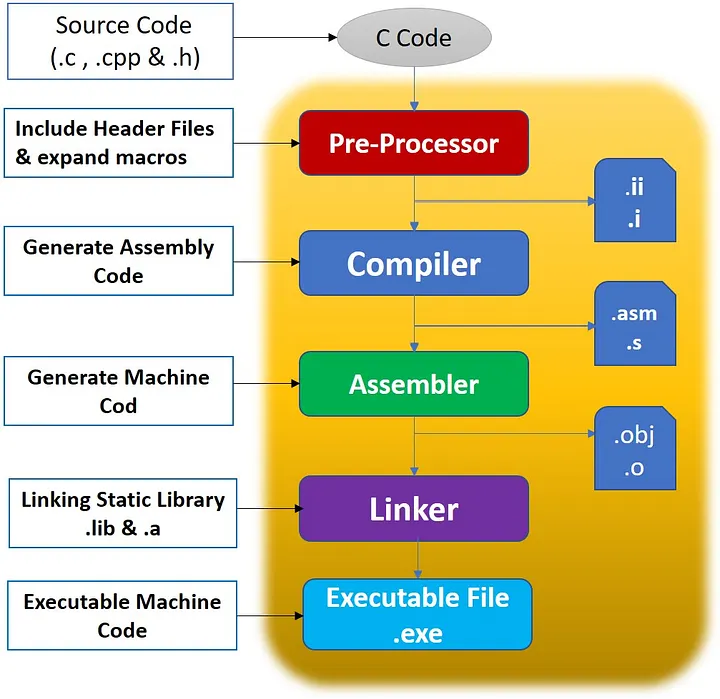
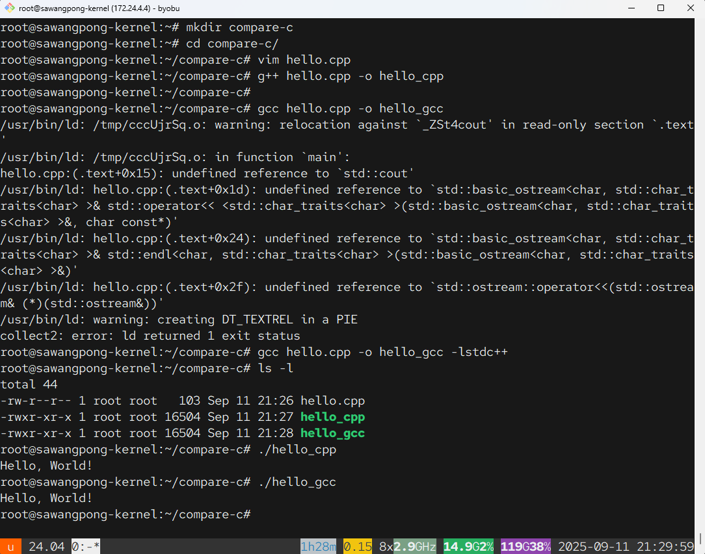

# ความแตกต่างระหว่าง gcc และ g++


```bash title="installation"
sudo apt install gcc g++
```

`gcc` และ `g++` มีความแตกต่างหลักอยู่ที่ **`g++` จะทำการลิงก์ C++ Standard Library `-lstdc++` ให้โดยอัตโนมัติ** ในขณะที่ `gcc` จะไม่ทำครับ

นี่คือสาเหตุที่เมื่อคุณคอมไพล์โค้ดที่มี `#include <iostream>` ด้วย `gcc` ตรงๆ แล้วมักจะเกิด error เพราะ `iostream` และคำสั่งอย่าง `std::cout` เป็นส่วนหนึ่งของ C++ Standard Library ที่ `gcc` ไม่ได้ผูกเข้ามาให้เป็นค่าเริ่มต้น



-----

## สรุปความแตกต่างหลัก 👨‍💻

| คุณสมบัติ | `gcc` (GNU C Compiler) | `g++` (GNU C++ Compiler) |
| :--- | :--- | :--- |
| **ภาษาหลัก** | ภาษา C | ภาษา C++ |
| **การลิงก์ Library** | ลิงก์ C Standard Library (`libc`) อัตโนมัติ | ลิงก์ C++ Standard Library (`libstdc++`) **และ** C Standard Library อัตโนมัติ |
| **การทำงาน** | เหมาะสำหรับคอมไพล์โปรแกรมภาษา C | เป็นเครื่องมือที่ถูกต้องและสะดวกที่สุดสำหรับคอมไพล์โปรแกรมภาษา C++ |

-----

## ตัวอย่างที่เห็นภาพชัดเจน

สมมติว่าเรามีไฟล์ C++ ง่ายๆ ชื่อ `hello.cpp` ดังนี้:
```
mkdir compare-c
cd compare-c
vim hello.cpp
```

```cpp title="hello.cpp"
#include <iostream>

int main() {
    std::cout << "Hello, World!" << std::endl;
    return 0;
}
```

### 1\. คอมไพล์ด้วย `g++` (วิธีที่ถูกต้อง) ✅

คำสั่งนี้จะทำงานได้สำเร็จทันที เพราะ `g++` รู้ว่าโค้ดนี้คือ C++ และจะไปเรียกใช้ C++ Standard Library `-lstdc++`  ที่มี `iostream` และ `cout` อยู่มาลิงก์ให้เอง

```bash
g++ hello.cpp -o hello_gpp
```

ผลลัพธ์: ได้ไฟล์โปรแกรม `hello_gpp` ที่ทำงานได้ปกติ

### 2\. คอมไพล์ด้วย `gcc` (วิธีที่มักจะเกิดปัญหา) ❌

คำสั่งนี้มักจะล้มเหลวในขั้นตอน **"การลิงก์" (Linking)** ไม่ใช่ขั้นตอนการคอมไพล์

```bash
gcc hello.cpp -o hello_gcc
```

ผลลัพธ์: คุณจะเจอ error ที่หน้าตาคล้ายๆ แบบนี้ ซึ่งแปลว่า "หา `std::cout` และฟังก์ชันที่เกี่ยวข้องไม่เจอ"

```
undefined reference to `std::cout'
undefined reference to `std::basic_ostream<char, std::char_traits<char> >& std::endl<char, std::char_traits<char> >(std::basic_ostream<char, std::char_traits<char> >&)'
undefined reference to `std::ios_base::Init::Init()'
...
```

### 3\. ทำให้ `gcc` คอมไพล์ผ่าน (วิธีแก้ไข) 💡

เราสามารถสั่งให้ `gcc` คอมไพล์โค้ด C++ ได้ โดยการบอกให้มันไปลิงก์ C++ Standard Library เพิ่มเติมด้วยตัวเองผ่าน flag **`-lstdc++`**

```bash
gcc hello.cpp -o hello_gcc_fixed -lstdc++
```

ผลลัพธ์: ได้ไฟล์โปรแกรม `hello_gcc_fixed` ที่ทำงานได้เหมือนกับใช้ `g++`

-----
output


## สรุปและข้อแนะนำ

  * **เขียนโค้ดภาษา C (ไฟล์ `.c`)** 👉 ใช้ **`gcc`**
  * **เขียนโค้ดภาษา C++ (ไฟล์ `.cpp`)** 👉 ใช้ **`g++`**

แม้ว่า `gcc` จะสามารถคอมไพล์ C++ ได้ถ้าใส่ flag เพิ่ม แต่ **`g++` คือเครื่องมือที่ถูกออกแบบมาสำหรับ C++ โดยเฉพาะ** ทำให้ใช้งานได้ง่ายและตรงไปตรงมาที่สุดครับ