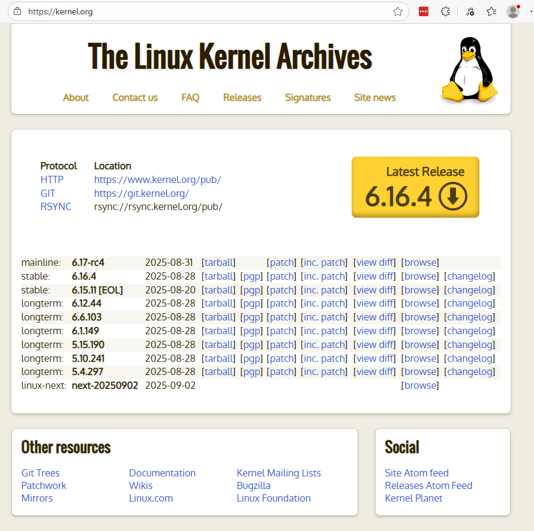
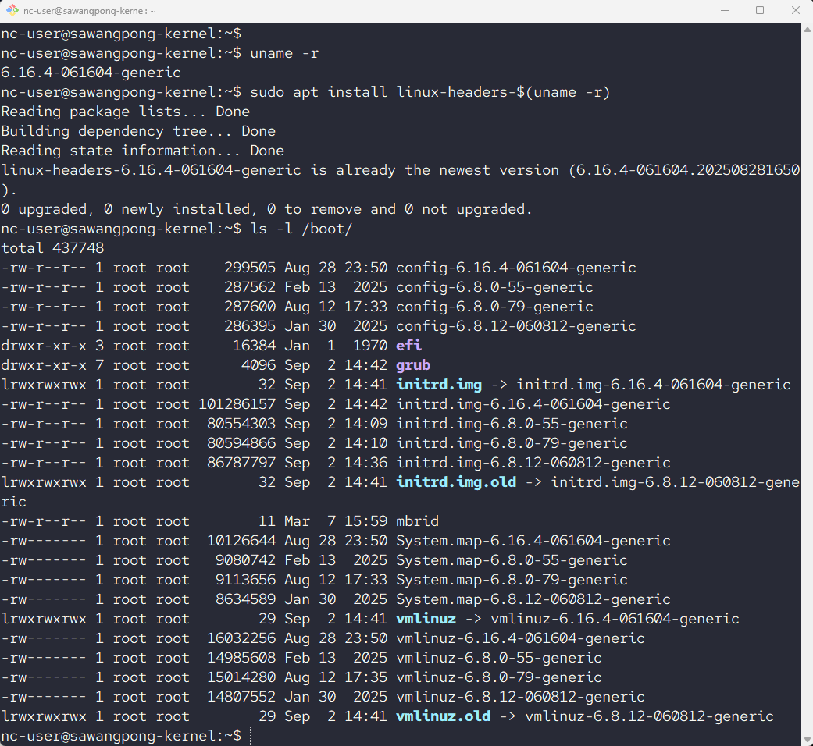

# Update Kernel


[https://kernel.org/](https://kernel.org/)

## Ubuntu 24.04

### Step 1: Check Current kernel Version
```
$ uname -r
6.8.0-55-generic
```

### Step 2: Update Package list
```
sudo apt update -y
```

### Step 3: Upgrade Package
```
sudo apt upgrade -y

sudo apt  install pkexec -y
uname -r
```

### Step 4: Reboot
```
$ sudo reboot
```

### Step 5: Install mainline kernel in Ubuntu โดย ติดตั้งจาก unofficial PPA
```
sudo add-apt-repository ppa:cappelikan/ppa
sudo apt update && sudo apt install mainline
```

```
$ mainline check
$ sudo mainline install-latest
```

- **Reboot**
```
sudo reboot
```

### Step6 Check Version
```
$ uname -r
$ sudo apt install linux-headers-$(uname -r)
```

### Step 7 



---
## Build Kernel

```
$ sudo apt install -y build-essential libncu
rses-dev bison flex libssl-dev libelf-dev fakeroot
$ sudo apt install -y dwarves
```

### Clone และ บริหารจัดการ Branch จาก Git
```
cd ~
git clone git clone git://git.kernel.org/pub/scm/linux/kernel/git/torvalds/linux.git
cd linux
git tag -l  | grep v6

git checkout -b v6.15
git branch

uname -r

cp /boot/config-`uname -r` .config
```

### ยอมรับ Old Config สำหรับการ Build kernel
```
make oldconfig
```

```
make menuconfig
make clean
```

### Compile kernel
```
echo "y" | make -j$(nproc)
sudo make modules_install
sudo make install
```

### update bootloader สำหรับการยอมรับ Kernel ใหม่
```
sudo update-grub
```

---

สรุปสั้นๆ คือ `modules_install` เป็นการติดตั้ง **"ไดรเวอร์และส่วนประกอบเสริม"** ส่วน `install` เป็นการติดตั้ง **"แกนหลักของเคอร์เนลและตั้งค่าการบูต"** ครับ

---

### **1. `sudo make modules_install` (ติดตั้งส่วนประกอบเสริม)**

คำสั่งนี้มีหน้าที่นำ **โมดูล (Modules)** ทั้งหมดที่คอมไลพ์เสร็จแล้วไปติดตั้งในไดเรกทอรีของระบบ (`/lib/modules/<เวอร์ชันเคอร์เนลใหม่>`)

* **โมดูลคืออะไร?** เปรียบเสมือน **ไดรเวอร์** สำหรับอุปกรณ์ต่างๆ เช่น ไดรเวอร์การ์ดจอ, Wi-Fi, Bluetooth, เสียง หรือระบบไฟล์ต่างๆ
* **ทำไมต้องติดตั้ง?** เพื่อให้เคอร์เนลตัวใหม่ที่คุณกำลังจะใช้งาน สามารถเรียกใช้ไดรเวอร์เหล่านี้เพื่อสื่อสารกับฮาร์ดแวร์ในเครื่องคอมพิวเตอร์ของคุณได้

**สรุปหน้าที่:** คัดลอกไฟล์ไดรเวอร์ทั้งหมดไปไว้ในที่ที่ระบบปฏิบัติการพร้อมเรียกใช้งาน

---

### **2. `sudo make install` (ติดตั้งแกนหลัก)**

หลังจากติดตั้งส่วนประกอบเสริมแล้ว คำสั่งนี้จะทำการติดตั้ง **แกนหลัก (core) ของเคอร์เนล** และทำให้ระบบพร้อมที่จะบูตเข้าเคอร์เนลตัวใหม่นี้ได้

โดยคำสั่งนี้จะทำงานหลักๆ 2-3 อย่าง:
1.  **คัดลอกไฟล์เคอร์เนลหลัก:** นำไฟล์เคอร์เนลที่คอมไพล์เสร็จแล้ว (เช่น `vmlinuz-...`) ไปไว้ที่ไดเรกทอรี `/boot` ซึ่งเป็นที่เก็บไฟล์สำหรับบูตเครื่อง
2.  **คัดลอกไฟล์ที่เกี่ยวข้อง:** นำไฟล์อื่นๆ ที่จำเป็น เช่น `System.map` และ `.config` ไปไว้ที่ `/boot` ด้วย
3.  **อัปเดต Bootloader:** ขั้นตอนที่สำคัญที่สุดคือ **สั่งอัปเดต GRUB (Bootloader) โดยอัตโนมัติ** เพื่อเพิ่มรายชื่อเคอร์เนลตัวใหม่เข้าไปในเมนูตอนเปิดเครื่อง

**สรุปหน้าที่:** ติดตั้งไฟล์เคอร์เนลตัวหลักและอัปเดตเมนูบูตเพื่อให้คุณสามารถเลือกใช้งานเคอร์เนลใหม่ตอนเปิดเครื่องได้


### **เปรียบเทียบง่ายๆ**

ถ้าการคอมไพล์เคอร์เนลเหมือนการ **"สร้างรถยนต์คันใหม่"**:
* `make modules_install` คือการ **"ติดตั้งอุปกรณ์เสริม"** เช่น ระบบเครื่องเสียง, แอร์, GPS เข้าไปในรถ
* `make install` คือการ **"นำรถไปจอดในโรงรถและทำกุญแจให้"** เพื่อให้คุณพร้อมที่จะสตาร์ทและขับรถคันนั้นได้

